---
## Front matter
lang: ru-RU
title: Установка OC Rocky
subtitle: Часть 1
author:
  - Славинский В.В.
institute:
  - Российский университет дружбы народов, Москва, Россия Россия
date: 6 сентября 2025

## i18n babel
babel-lang: russian
babel-otherlangs: english

## Formatting pdf
toc: false
toc-title: Содержание
slide_level: 2
aspectratio: 169
section-titles: true
theme: metropolis
header-includes:
 - \metroset{progressbar=frametitle,sectionpage=progressbar,numbering=fraction}
---

# Информация

## Докладчик

:::::::::::::: {.columns align=center}
::: {.column width="70%"}

  * Славинский Владислав Вадимович
  * Студент
  * Российский университет дружбы народов
  * [1132246169@pfur.ru]

:::
::: {.column width="30%"}

# Вводная часть

## Установка операционной системы

 Первым делом добавим образ Rocky в VirtualBox

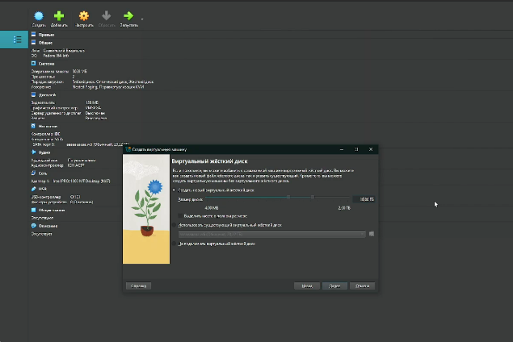

## Установка

Перейдем к установке операционной системе Rocky.

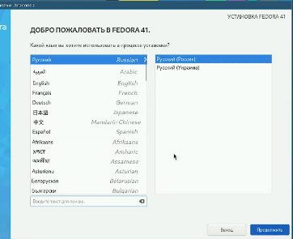

## Язык интерфейса

Сделаем язык интерфейса английским.

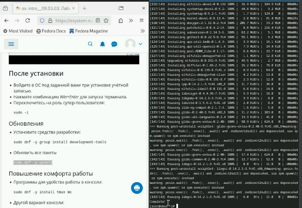

## Настройки выбора программ

Откроем настройки установки: выбор программ.

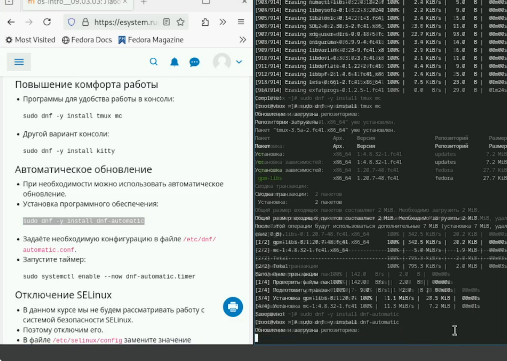

## Отключение KDUMP

Отключим функцию KDUMP.

## Включение сетевого соединения

Нам нужно включить сетевое соединение и в качестве имени узла установим свое имя пользователя.

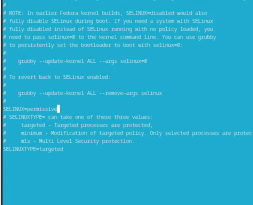

## Установка root пароля

Далее нам требуется установить пароль для root при использовании SSH, установим его.

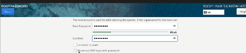

## Права администратора

Затем зададим локального пользователя с правами администратора и зададим пароль.

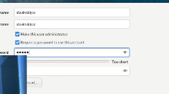

## Установка

Запустим установку.

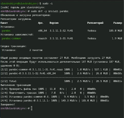

## Подключение образа диска дополнений

Нам нужно подключить образ диска дополнений гостевой OC. Подключим.

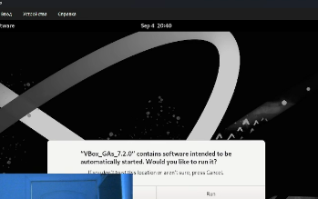

## Вывод команды

Посмотрим вывод команды dmesg | less.

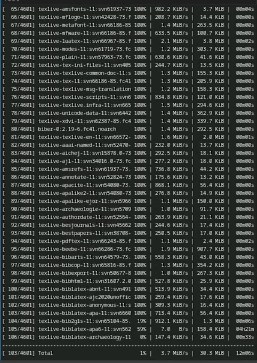

## Вывод версии ядра

А с помощью команды dmesg | grep -i, можно найти то, что хотим найти. Давайте посмотрим версию ядра Linux.

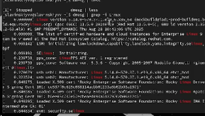

## Вывод частоты процессора

Посмотрим частоту процессора.

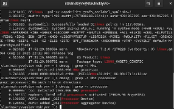

## Вывод модели процессора

Далее посмотрим модель процессора. 

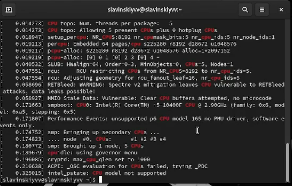

## Вывод доступной ОЗУ

Посмотрим объем доступной оперативной памяти.

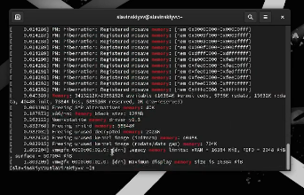

## Вывод гипервизора

Тип обноруженного гипервизора.

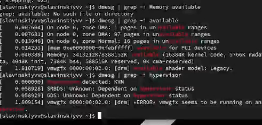

## Вывод тип файловой системы и последовательности монтирования

И в конце посмотрим тип файловой системы и последовательность монтирования файловых систем

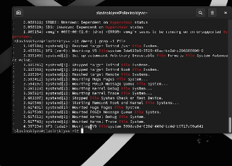

