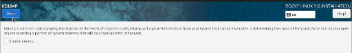
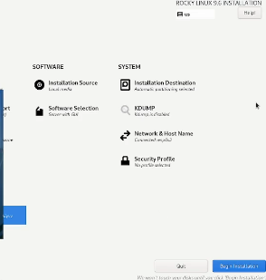

---
## Front matter
lang: ru-RU
title: Структура научной презентации
subtitle: Простейший шаблон
author:
  - Славинский Владислав Вадимович.
institute:
  - Российский университет дружбы народов, Москва, Россия
  - Объединённый институт ядерных исследований, Дубна, Россия
date: 01 января 1970

## i18n babel
babel-lang: russian
babel-otherlangs: english

## Formatting pdf
toc: false
toc-title: Содержание
slide_level: 2
aspectratio: 169
section-titles: true
theme: metropolis
header-includes:
 - \metroset{progressbar=frametitle,sectionpage=progressbar,numbering=fraction}
---

# Информация

## Докладчик

:::::::::::::: {.columns align=center}
::: {.column width="70%"}

  * Славинский Владислав Вадимович
  * Студент первого курса НПИбд-03-24
  * Российский университет дружбы народов
  * [1132246169@pfur.ru](mailto:1132246169@pfur.ru)

# Цель работы

Целью данной работы является приобретение практических навыков установки операционной системы на виртуальную машину, настройки минимально необходимых для дальнейшей работы сервисов.

# Задание

Установка Linux на Virtualbox
Установка операционной системы
Обновления
Повышение комфорта работы
Автоматическое обновление
Отключение SELinux
Настройка раскладки клавиатуры
Установка имени пользователя и названия хоста
Установка программного обеспечения для создания документации
Контрольные вопросы

# Выполнение лабораторной работы

Добавление образа в VirtualBox (рис. [-@fig:001])

{#fig:001 width=70%}

Устанавливаем Fedora (рис. [-@fig:002])

{#fig:002 width=70%}

Установка средств разработки и обновление всех пакетов (рис. [-@fig:003])

{#fig:003 width=70%}

Команда для удобства работы в консоли, и введем команду для автоматических обновлений (рис. [-@fig:004])

{#fig:004 width=70%}

Запустим таймер (рис. [-@fig:005])

{#fig:005 width=70%}

Отключаем SELinux (рис. [-@fig:006])

{#fig:006 width=70%}

Отредактировал файл с конфигом для настройки клавиатуры  (рис. [-@fig:007])

{#fig:007 width=70%}

Задал имя пользователя и хоста (рис. [-@fig:008])

{#fig:008 width=70%}

Далее установим pandoc (рис. [-@fig:009])

{#fig:009 width=70%}
 
Распаковал файлы pandoc-crossref и перекинул их в нужную папку (рис. [-@fig:010])

{#fig:010 width=70%}

Установка texlive (рис. [-@fig:011])

{#fig:011 width=70%}

# Выводы

В ходе выполнения лабораторной работы я приобрел практические навыки по установке операционной системы на виртуальную машину. 

# Ответы на контрольные вопросы

1. Учётная запись пользователя в операционной системе содержит следующую информацию: логин, пароль, uid, домашний каталог, настройки окружнения, права доступа к файлам и каталогам

2. Команды терминала

    Получение справки по команде:
Команда: man <команда>
Пример: man ls (открывает справку по команде ls)

    Перемещение по файловой системе:
Команда: cd <путь>
Пример: cd /home/user/Documents (переход в каталог Documents)

    Просмотр содержимого каталога:
Команда: ls
Пример: ls -l (выводит содержимое каталога в длинном формате)

    Определение объёма каталога:
Команда: du
Пример: du -sh /home/user/Documents (показывает общий размер каталога Documents)

    Создание / удаление каталогов / файлов:
Создание каталога: mkdir <имя_каталога>
 Пример: mkdir new_folder (создаёт новый каталог new_folder)
Удаление каталога: rmdir <имя_каталога>
Пример: rmdir old_folder (удаляет каталог old_folder)
Создание файла: touch <имя_файла>
Пример: touch new_file.txt (создаёт новый файл new_file.txt)
Удаление файла: rm <имя_файла>
Пример: rm old_file.txt (удаляет файл old_file.txt)

Задание определённых прав на файл / каталог:
Команда: chmod
Пример: chmod 755 script.sh (устанавливает права на выполнение для владельца и чтение/выполнение для группы и остальных)

    Просмотр истории команд: Команда: history
Пример: history | grep <команда> (поиск в истории команд)

3. Файловая система — это способ организации и хранения данных на носителе информации. Она определяет, как данные хранятся, именуются и извлекаются. Примеры файловых систем: FAT32, NTFS, ext4.
1.FAT32 Широко используется на USB-накопителях и в системах с низкими требованиями к безопасности.
2.NTFS Используется в Windows.Поддерживает большие файлы, права доступа, шифрование и другие функции.
3.ext4-Широко используется в Linux.Поддерживает большие объемы данных и улучшенную производительность.

4. Как посмотреть, какие файловые системы подмонтированы в ОС?
 Команда: df -h Пример: df -h (выводит список всех подмонтированных файловых систем с их размерами и использованием)

5. Как удалить зависший процесс?
Для удаления зависшего процесса можно использовать команду kill или killall:
Найдите PID (идентификатор процесса) с помощью команды ps или top.
Пример: ps aux | grep <имя_процесса>
Удалите процесс:
Команда: kill <PID>
Пример: kill 1234 (где 1234 — это PID зависшего процесса)
Если процесс не реагирует, можно использовать более жесткий вариант:
Команда: kill -9 <PID>
Пример: kill -9 1234 (принудительное завершение процесса)

