---
## Front matter
lang: ru-RU
title: Управление пользователями и группами
subtitle: Часть 1
author:
  - Славинский В.В.
institute:
  - Российский университет дружбы народов, Москва, Россия Россия
date: 13 сентября 2025

## i18n babel
babel-lang: russian
babel-otherlangs: english

## Formatting pdf
toc: false
toc-title: Содержание
slide_level: 2
aspectratio: 169
section-titles: true
theme: metropolis
header-includes:
 - \metroset{progressbar=frametitle,sectionpage=progressbar,numbering=fraction}
---

# Информация

## Докладчик

:::::::::::::: {.columns align=center}
::: {.column width="70%"}

  * Славинский Владислав Вадимович
  * Студент
  * Российский университет дружбы народов
  * [1132246169@pfur.ru]

:::
::: {.column width="30%"}

# Вводная часть

## Определение учетной записи

Войдем в систему как обычный пользователь и определим, какую учетную запись пользователя мы используем с помощью команды whoami

## Вывод подробной информации

Выведем на экран более подробную информацию, используя команду id. У нас есть идентификатор пользователя, идентификатор основной группы, и то что пользователь slavinskiyvv состоит в двух группах, основная "slavinskiyvv" и дополнительная "wheel"

## Команда id для root 

Используем команду su для переключения к учётной записи root и наберем id. В этом случае, у нас везде стоит 0, так как индентификаторы gid и uid используются в Linux по умолчанию.

## Просмотр файла

Просмотрим в безопасном режиме файл /etc/sudoers, используя редактор visudo. Для работы с файлом sudoers мы используем именно visudo для предотвращения блокировки системы, visudo делает так, чтобы изменения записывались только если они синтаксически корректны, если обнаружены ошибки, то изменения не применяются, а показывается сообщение об ошибке.

## Проверка строки

Проверим, присутствует ли в файле строка %wheel ALL=(ALL) ALL. Строка %wheel ALL=(ALL) ALL означает: wheel применяется ко всем пользователям, входящим в группу wheel, ALL разрешает выполнение команд на всех хостах, (ALL) разрешает выполнение команд от имени любого пользователя, последнее ALL разрешает выполение любых команд.

## Новый пользователь

Создадим пользователя alice, входящего в группу wheel.

## Проверка группы пользователя

Убедимся, что пользователь alice добавлен в группу wheel, введя команду id alice.

## Пароль для пользователя

Зададим пароль для пользователя alice.

## Переключение на другую учетную запись

Переключимся на учётную запись пользователя alice.

## Создание нового пользователя

Создадим пользователя bob.

## Пароль пользователя bob

Установим пароль для пользователя bob.

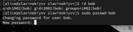

## Группы пользователя

Посмотрим, в какие группы входит пользователь bob. Пользователь входит в свою собственную группу bob.

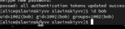

## Открытие конфига

Переключимся в терминале на учётную запись пользователя root, откроем файл конфигурации.

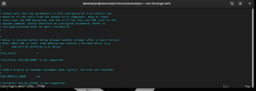

## Изменение параметров

Изменим несколько параметров CREATE_HOME и USERGROUPS_ENAB. Это нам позволит не добавлять нового пользователя в группу с тем же именем, что и пользователь, а использовать группу users. 

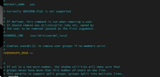

## Создание каталогов

Создадим каталоги Documents и Pictures в каталоге /etc/skel. Это позволит добавить эти каталоги по умолчанию во все домашние каталоги пользователей.

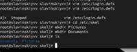

## Изменение файла

Изменим содержимое файла .bashrc. Текстовый редактор vim будет установлен по умолчанию для инструментов, которые нуждаются в изменении текстовых файлов.

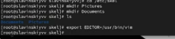

## Переключение на alice

Переключимся в терминале на учётную запись пользователя alice.

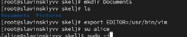

## Создание пользователя carol

Используя утилиту useradd, создадим пользователя carol.

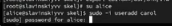

## Установка пароля для carol

Установим пароль для пользователя carol.

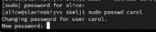

## Информация пользователя

Посмотрим информацию про carol.Теперь мы видим, что carol находится в группе users, а не в собственной группе. Так же каталоги Documents и Pictures были созданы.

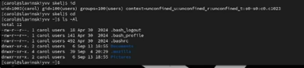

## Переключение на alice

Переключимся в терминале на учётную запись пользователя alice.

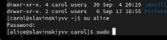

## Информация в строке

В файле  /etc/shadow есть цифры, например 20344 это дата последнего имезениния пароля, 0-это минимальный срок жизни пароля, а 9999-это максимальный срок жизни пароля. Все что идет до цифр, это использование алгоритма SHA-512, защита от атак и результат хеширования. Просмотрели мы при помощи команды sudo cat /etc/shadow | grep carol.

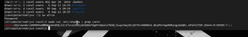

## Изменение пароля

Изменим свойства пароля пользователя carol с помощью команды:sudo passwd -n 30 -w 3 -x 90 carol.

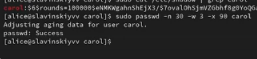

## Проверка изменений

Проверим наши изменения с помощью команды sudo cat /etc/shadow | grep carol.

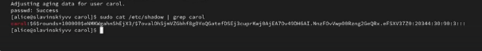

## Проверка

Убедимся, что идентификатор alice существует во всех трёх файлах: etc/passwd /etc/shadow /etc/group.

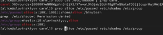

## Идентификатор carol

Но идентификатор carol состоит  не во всех.

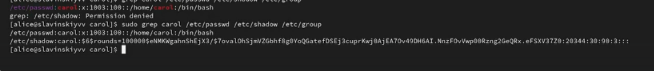

## Создание групп

Находясь под учётной записью пользователя alice, создадим группы main и third.

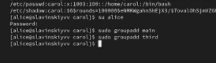

## Добавление пользователей в группы

Используем usermod для добавления пользователей alice и bob в группу main,
а carol-в группу third.

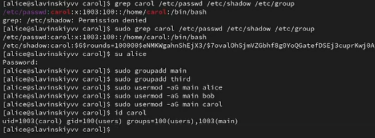

## Группы пользователя carol

Пользователь carol был добавлен в группу third. Получается он состоит в основной группе users и вторичной third.

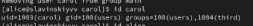

## Группы у остальных пользователей

Пользователь alice состоит в основной группе alice, в группе wheel и во вторичной группе main.Пользователь bob состоит в группе bob и во вторичной группе, main.

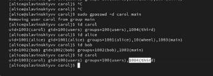

