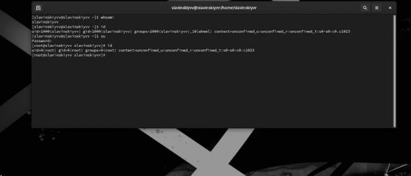
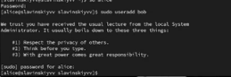

---
## Front matter
lang: ru-RU
title: Структура научной презентации
subtitle: Отчет
author:
  - Славинский Владислав Вадимович.
institute:
  - Российский университет дружбы народов, Москва, Россия

## i18n babel
babel-lang: russian
babel-otherlangs: english

## Formatting pdf
toc: false
toc-title: Содержание
slide_level: 2
aspectratio: 169
section-titles: true
theme: metropolis
header-includes:
 - \metroset{progressbar=frametitle,sectionpage=progressbar,numbering=fraction}
---

# Информация

## Докладчик

:::::::::::::: {.columns align=center}
::: {.column width="70%"}

  * Славинский Владислав Вадимович
  * Студент первого курса НПИбд-03-24
  * Российский университет дружбы народов
  * [1132246169@pfur.ru](mailto:1132246169@pfur.ru)
---

# Цель работы

Изучить Идеологию и применение средств контроля версий. Освоить умения по работе с git.

# Задание

Установка git
Установка gh
Базовая настройка git
Создание ключей ssh и pgp
Настройка github
Добавление pgp ключа в github
Настройка автоматический подписей коммитов git
Настройка gh
Сознание репозитория курса на основе шаблона
Настройка каталога курса
Контрольные вопросы

# Выполнение лабораторной работы

В начале установим git (рис. [-@fig:001])

{#fig:001 width=70%}

Установим gh (рис. [-@fig:002])

{#fig:002 width=70%}

Задал имя и email своего репозитория (рис. [-@fig:003])

{#fig:003 width=70%}

Настройка utf-8, задал имя начальной ветки, ввел параметр autocrlf и safecrlf (рис. [-@fig:004])

{#fig:004 width=70%}

Создал ключи ssh (рис. [-@fig:005])

{#fig:005 width=70%}

Добавление ssh ключа на git (рис. [-@fig:006])

{#fig:006 width=70%}

Настройка автоматических подписей коммитов git (рис. [-@fig:007])

{#fig:007 width=70%}

Настройка gh (рис. [-@fig:008])

{#fig:008 width=70%}

Произвел операции над сознанием рабочего пространства (рис. [-@fig:009])

{#fig:009 width=70%}
 
Настроил каталог курса, удалил лишние файлы, создал необходимые каталоги и отправил их на сервер (рис. [-@fig:010])

{#fig:010 width=70%}

# Выводы

В ходе выполнения лабораторной работы был установлен git, его настройка, были созданы ключи для авторизации и подписи. Был создан репозиторий. 

# Ответы на контрольные вопросы

1. VCS-это инструменты для отслеживания изменений в файлах и управления проектами, позволяющие сохранять версии и координировать работу.

2. Хранилище-место хранения файлов и их истории.
Commit-сохранение изменений в хранилище.
История-последовательность всех коммитов, отражающая изменения в проекте.
Рабочая копия-локальная версия файлов, с которой работает разработчик.

3. Централизованные: имеют одно центральное хранилище, к которому подключаются все пользователи.
Децентрализованные каждый разработчик имеет полную копию хранилища, включая всю историю.

4. Создание хранилища.
Внесение изменений в рабочую копию.
Выполнение команды commit для сохранения изменений.
Просмотр истории изменений.

5. Клонирование удаленного репозитория.
Внесение изменений и создание коммитов.
Синхронизация с удаленным репозиторием (pull/push).
Разрешение конфликтов, если они возникают.

6. Отслеживание изменений в коде.
Восстановление предыдущих версий.
Совместная работа над проектами.
Управление ветвями.

7. git init: инициализация нового репозитория.
git clone: клонирование удаленного репозитория.
git add: добавление изменений в индекс.
git commit: сохранение изменений в хранилище.
git push: отправка изменений в удаленный репозиторий.
git pull: получение изменений из удаленного репозитория.
git branch: управление ветвями.
git merge: слияние ветвей.

8. Локальный репозиторий: git init, git add ., git commit -m "Initial commit".
Удаленный репозиторий: git clone <url>, git push origin main.

9. Ветви позволяют создавать параллельные линии разработки, что упрощает работу над новыми функциями или исправлениями, не затрагивая основную ветвь

10. Файлы можно игнорировать с помощью файла .gitignore, чтобы исключить их из коммитов (например, временные файлы, конфигурации среды), что помогает поддерживать чистоту репозитория.
