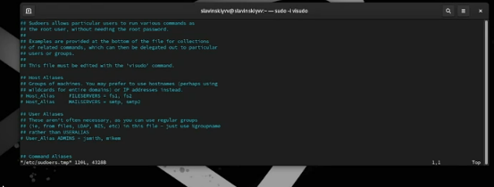
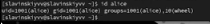
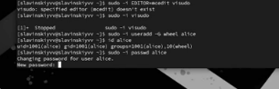

---
## Front matter
title: "Лабараторная работа №2"
subtitle: "Отчет"
author: "Славинский Владислав Вадимович"

## Generic otions
lang: ru-RU
toc-title: "Содержание"

## Bibliography
bibliography: bib/cite.bib
csl: pandoc/csl/gost-r-7-0-5-2008-numeric.csl

## Pdf output format
toc: true # Table of contents
toc-depth: 2
lof: true # List of figures
lot: true # List of tables
fontsize: 12pt
linestretch: 1.5
papersize: a4
documentclass: scrreprt
## I18n polyglossia
polyglossia-lang:
  name: russian
  options:
	- spelling=modern
	- babelshorthands=true
polyglossia-otherlangs:
  name: english
## I18n babel
babel-lang: russian
babel-otherlangs: english
## Fonts
mainfont: IBM Plex Serif
romanfont: IBM Plex Serif
sansfont: IBM Plex Sans
monofont: IBM Plex Mono
mathfont: STIX Two Math
mainfontoptions: Ligatures=Common,Ligatures=TeX,Scale=0.94
romanfontoptions: Ligatures=Common,Ligatures=TeX,Scale=0.94
sansfontoptions: Ligatures=Common,Ligatures=TeX,Scale=MatchLowercase,Scale=0.94
monofontoptions: Scale=MatchLowercase,Scale=0.94,FakeStretch=0.9
mathfontoptions:
## Biblatex
biblatex: true
biblio-style: "gost-numeric"
biblatexoptions:
  - parentracker=true
  - backend=biber
  - hyperref=auto
  - language=auto
  - autolang=other*
  - citestyle=gost-numeric
## Pandoc-crossref LaTeX customization
figureTitle: "Рис."
tableTitle: "Таблица"
listingTitle: "Листинг"
lofTitle: "Список иллюстраций"
lotTitle: "Список таблиц"
lolTitle: "Листинги"
## Misc options
indent: true
header-includes:
  - \usepackage{indentfirst}
  - \usepackage{float} # keep figures where there are in the text
  - \floatplacement{figure}{H} # keep figures where there are in the text
---

# Цель работы

Научиться управлять пользователями и группами.

# Выполнение лабораторной работы

Войдем в систему как обычный пользователь и определим, какую учетную запись пользователя мы используем с помощью команды whoami (рис. [-@fig:001])

{#fig:001 width=70%}

Выведем на экран более подробную информацию, используя команду id. У нас есть идентификатор пользователя, идентификатор основной группы, и то что пользователь slavinskiyvv состоит в двух группах, основная "slavinskiyvv" и дополнительная "wheel". (рис. [-@fig:002])

{#fig:002 width=70%}

Используем команду su для переключения к учётной записи root и наберем id. В этом случае, у нас везде стоит 0, так как индентификаторы gid и uid используются в Linux по умолчанию. (рис. [-@fig:003])

{#fig:003 width=70%}

Просмотрим в безопасном режиме файл /etc/sudoers, используя редактор visudo. Для работы с файлом sudoers мы используем именно visudo для предотвращения блокировки системы, visudo делает так, чтобы изменения записывались только если они синтаксически корректны, если обнаружены ошибки, то изменения не применяются, а показывается сообщение об ошибке.   (рис. [-@fig:004])
 
{#fig:004 width=70%}

Проверим, присутствует ли в файле строка %wheel ALL=(ALL) ALL. Строка %wheel ALL=(ALL) ALL означает: wheel применяется ко всем пользователям, входящим в группу wheel, ALL разрешает выполнение команд на всех хостах, (ALL) разрешает выполнение команд от имени любого пользователя, последнее ALL разрешает выполение любых команд. (рис. [-@fig:005])

{#fig:005 width=70%}

Создадим пользователя alice, входящего в группу wheel. (рис. [-@fig:006])

{#fig:006 width=70%}

Убедимся, что пользователь alice добавлен в группу wheel, введя команду id alice. (рис. [-@fig:007])

{#fig:007 width=70%}

Зададим пароль для пользователя alice. (рис. [-@fig:008])

{#fig:008 width=70%}

Переключимся на учётную запись пользователя alice(рис. [-@fig:009])

{#fig:009 width=70%}
 
Создадим пользователя bob. (рис. [-@fig:010])

{#fig:010 width=70%}

Установим пароль для пользователя bob. (рис. [-@fig:011])

{#fig:011 width=70%}

Посмотрим, в какие группы входит пользователь bob. Пользователь входит в свою собственную группу bob. (рис. [-@fig:012])

{#fig:012 width=70%}

Переключимся в терминале на учётную запись пользователя root, откроем файл конфигурации /etc/login.defs для редактирования, используя vim (vim /etc/login.defs). (рис. [-@fig:013])

{#fig:013 width=70%}

Изменим несколько параметров, а именно CREATE_HOME , но поскольку он уже стоит на значении yes, то ничего менять не надо, и USERGROUPS_ENAB no. Это нам позволит не добавлять нового пользователя в группу с тем же именем, что и пользователь, а использовать группу users.(рис. [-@fig:014])

{#fig:014 width=70%}

Создадим каталоги Documents и Pictures в каталоге /etc/skel. Это позволит добавить эти каталоги по умолчанию во все домашние каталоги пользователей.(рис. [-@fig:015])

{#fig:015 width=70%}

Изменим содержимое файла .bashrc, добавив строку export EDITOR=/usr/bin/vim. Это означает, что текстовый редактор vim будет установлен по умолчанию для инструментов, которые нуждаются в изменении текстовых файлов.(рис. [-@fig:016])

{#fig:016 width=70%}

Переключимся в терминале на учётную запись пользователя alice.(рис. [-@fig:017])

{#fig:017 width=70%}

Используя утилиту useradd, создадим пользователя carol.(рис. [-@fig:018])

{#fig:018 width=70%}

Установим пароль для пользователя carol.(рис. [-@fig:019])

{#fig:019 width=70%}

Посмотрим информацию про carol.Теперь мы видим, что carol находится в группе users, а не в собственной группе. Так же каталоги Documents и Pictures были созданы.(рис. [-@fig:020])

{#fig:020 width=70%}

Переключимся в терминале на учётную запись пользователя alice.(рис. [-@fig:021])

{#fig:021 width=70%}

В файле  /etc/shadow есть цифры, например 20344 это дата последнего имезениния пароля, 0-это минимальный срок жизни пароля, а 9999-это максимальный срок жизни пароля. Все что идет до цифр, это использование алгоритма SHA-512, защита от атак и результат хеширования. Просмотрели мы при помощи команды sudo cat /etc/shadow | grep carol.(рис. [-@fig:022])

{#fig:022 width=70%}

Изменим свойства пароля пользователя carol с помощью команды:sudo passwd -n 30 -w 3 -x 90 carol.(рис. [-@fig:023])

{#fig:023 width=70%}

Убедимся в изменении в строке с данными о пароле пользователя carol в файле /etc/shadow с помощью команды sudo cat /etc/shadow | grep carol. Как видим, изменения сохранились.(рис. [-@fig:024])

{#fig:024 width=70%}

Убедимся, что идентификатор alice существует во всех трёх файлах: etc/passwd /etc/shadow /etc/group.(рис. [-@fig:025])

{#fig:025 width=70%}

Но идентификатор carol состоит  не во всех.(рис. [-@fig:026])

{#fig:026 width=70%}

Находясь под учётной записью пользователя alice, создадим группы main и third.(рис. [-@fig:027])

{#fig:027 width=70%}

Используем usermod для добавления пользователей alice и bob в группу main,
а carol-в группу third.(рис. [-@fig:028])

{#fig:028 width=70%}

Пользователь carol был добавлен в группу third. Получается он состоит в основной группе users и вторичной third(рис. [-@fig:029])

{#fig:029 width=70%}

Пользователь alice состоит в основной группе alice, в группе wheel и во вторичной группе main.Пользователь bob состоит в группе bob и во вторичной группе, main.(рис. [-@fig:030])

{#fig:030 width=70%}

# Выводы

В ходе выполнения лабораторной работы было освоено управление пользователями и группами.

# Ответы на контрольные вопросы

1. С помощью команды id.

2. Uid пользователей root всегда 0.

3. Команда su полностью переключает на другого пользователя и по умолчанию преключает на root. Sudo выполняет одну команду с привилегиями другого пользователя. Требует пароль от текущего пользователя.

4. В файле /etc/sudoers.

5. Использовать команду visudo.

6. Он должен быть членом группы wheel.

7. /etc/login.defs, /etc/skel/. Примеры настроек: CREATE_HOME yes, SHA_CRYPT_MAX_ROUNDS 100000,  USERGPOUPS_ENAB no

8. Хранится в /etc/passwd и в /etc/group. ...x:1001:1001::... первичная группа gid 1001(в /etc/password). Через /etc/group wheel, alice (wheel:x:10:..., alice:x:1001:)

9. Можно использовать passwd, chage username, chage -l username.

10. Команда usermod -aG group user . Не следует редактировать напрямую потому, что может возникнуть нарушение целостности файлов, риск синтаксических ошибок, в отсутствии блокировки файла.
