---
## Front matter
lang: ru-RU
title: Настройки прав доступа
subtitle: Часть 1
author:
  - Славинский В.В.
institute:
  - Российский университет дружбы народов, Москва, Россия Россия
date: 20 сентября 2025

## i18n babel
babel-lang: russian
babel-otherlangs: english

## Formatting pdf
toc: false
toc-title: Содержание
slide_level: 2
aspectratio: 169
section-titles: true
theme: metropolis
header-includes:
 - \metroset{progressbar=frametitle,sectionpage=progressbar,numbering=fraction}
---

# Информация

## Докладчик

:::::::::::::: {.columns align=center}
::: {.column width="70%"}

  * Славинский Владислав Вадимович
  * Студент
  * Российский университет дружбы народов
  * [1132246169@pfur.ru]

:::
::: {.column width="30%"}

# Вводная часть

## Открытие терминала с root

Откроем терминал с учетой записью root.

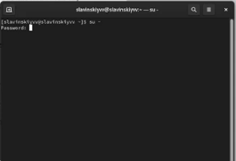

## Создание каталогов main и third

В корневом каталоге создадим каталоги /data/main и /data/third с помощью mkdir.

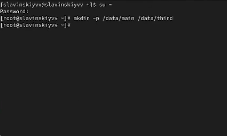

## Владелец каталогов

Посмотрим, кто является владельцем этих каталогов, для этого используем команду ls -Al /data. Владельцем каталогов является root.

## Смена владельцев

Изменим владельцев этих каталогов с root на main и third и посмотрим изменения.

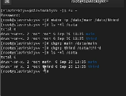

## Установка разрешений]

Установим разрешения, позволяющие владельцам каталогов записывать файлы в эти
каталоги и запрещающие доступ к содержимому каталогов всем другим пользователям
и группам. Проверяем изменения, как видим, у нас все применилось.

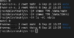

## Переход на учетную запись bob

Далее перейдем на учетную запись bob.

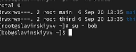

## Создание файла под пользователем bob в каталоге /data/main

Под пользователем bob попробуем перейти в каталог /data/main и создать файл
emptyfile в этом каталоге. Видим, что владельцем является bob и группа тоже bob. 

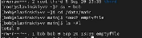

## Создание файла в каталоге /data/third

Под пользователем bob попробуем перейти в каталог /data/third и создать файл emptyfile в этом каталоге. Как видим, нам выводится Permission denied или же отказано в доступе, все из-за того, что пользователь bob входил в группу main, а не в группе third.

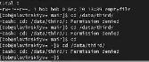

## Переключение на другую учетную запись

Переключимся на учётную запись пользователя alice.

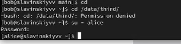

## Создание alice1, alice2

Перейдем в каталог /data/main и создадим два файла, владельцем которых является alice.

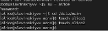

## Переход на пользователя bob

Перейдем под учётную запись пользователя bob.

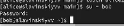

## Удаление файлов

Перейдем в каталог /data/main. Введем команду ls -l, чтобы увидеть файлы alice, и попробуем удалить файлы. Как видим, через пользователя bob, мы смогли удалить файлы alice в каталоге main.

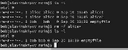

## Создание bob1,bob2

Создадим два файла, которые принадлежат пользователю bob.

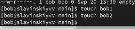

## Установка бит идентификатора группы и stiky-бит для общего каталога группы

Под пользователем root установим для каталога /data/main бит идентификатора группы, а также stiky-бит для разделяемого (общего) каталога группы.

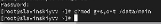

## Создание файлов

Под пользователем alice создадим в каталоге /data/main файлы alice3 и alice4. Здесь мы видим, что два этих файла принадлежать групппе main

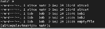

## Проверка защиты sticky-bit

Под пользователем alice попробуем удалить файлы, принадлежащиепользователю bob с помощью команды: rm -rf bob*. Sticky-bit предотварил удаление, поскольку alice не является создателем файлов, но alice является создателем каталога, поэтому все равно alice сможет все удалить.

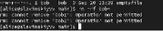

## Переключимся на пользователя root

Переключимся в терминале на учётную запись пользователя root

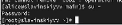

## Установка прав на чтение и выполнение

Установим права на чтение и выполнение в каталоге /data/main для группы third и права на чтение и выполнение для группы main в каталоге /data/third.

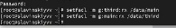

## Проверка разрешений

Используем команду getfacl, чтобы убедиться в правильности установки разрешений. Как видим, в каталоге main высвечивается third, а для third-main.

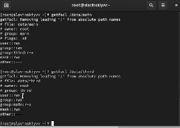

## Полномочия  файла newfile1

Создадим новый файл с именем newfile1 в каталоге /data/main и используем getfacl /data/main/newfile1 для проверки текущих назначений полномочий. Видим, что для пользователя у нас полномочия для записи и чтения, а для группы только для чтения. Так же владельцами являются пользователь root и группа main.

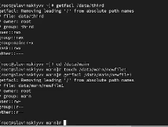

## Полномочия файла newfile1 в каталоге third

Сделаем тоже самое, только в каталоге /data/third и видим, что владелец группы является уже не third, а root.

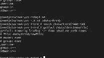

## Установка ACL для каталога /data/main

Установим ACL по умолчанию для каталога /data/main.

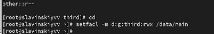

## Добавление ACL для каталога /data/third

Добавим ACL по умолчанию для каталога /data/third.

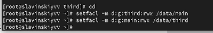

## Проверка настроек

Убедимся, что настройки ACL работают, добавив новый файл в каталог /data/main. Видим, что что настройки работают, полномочия для third тоже есть.

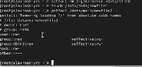

## Проверка настроек

Сделаем те же действия только для каталога /data/third. Теперь у группы third есть полномочия в каталоге main.

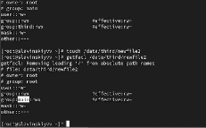

## Вход в учетную запись carol

Для проверки полномочий группы third войдем под учётной записью члена группы third.

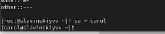

## Проверка операций с файлами

Попробуем удалить newfile1 и newfile2 и осуществить запись в эти файлы. Как видим, удалось записать только в newfile2, поскольку мы применили настройки для newfile2 для записи и чтения, а для newfile1 только для чтения.

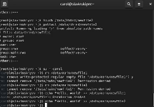

