---
## Front matter
title: "Лабараторная работа №3"
subtitle: "Отчет"
author: "Славинский Владислав Вадимович"

## Generic otions
lang: ru-RU
toc-title: "Содержание"

## Bibliography
bibliography: bib/cite.bib
csl: pandoc/csl/gost-r-7-0-5-2008-numeric.csl

## Pdf output format
toc: true # Table of contents
toc-depth: 2
lof: true # List of figures
lot: true # List of tables
fontsize: 12pt
linestretch: 1.5
papersize: a4
documentclass: scrreprt
## I18n polyglossia
polyglossia-lang:
  name: russian
  options:
	- spelling=modern
	- babelshorthands=true
polyglossia-otherlangs:
  name: english
## I18n babel
babel-lang: russian
babel-otherlangs: english
## Fonts
mainfont: IBM Plex Serif
romanfont: IBM Plex Serif
sansfont: IBM Plex Sans
monofont: IBM Plex Mono
mathfont: STIX Two Math
mainfontoptions: Ligatures=Common,Ligatures=TeX,Scale=0.94
romanfontoptions: Ligatures=Common,Ligatures=TeX,Scale=0.94
sansfontoptions: Ligatures=Common,Ligatures=TeX,Scale=MatchLowercase,Scale=0.94
monofontoptions: Scale=MatchLowercase,Scale=0.94,FakeStretch=0.9
mathfontoptions:
## Biblatex
biblatex: true
biblio-style: "gost-numeric"
biblatexoptions:
  - parentracker=true
  - backend=biber
  - hyperref=auto
  - language=auto
  - autolang=other*
  - citestyle=gost-numeric
## Pandoc-crossref LaTeX customization
figureTitle: "Рис."
tableTitle: "Таблица"
listingTitle: "Листинг"
lofTitle: "Список иллюстраций"
lotTitle: "Список таблиц"
lolTitle: "Листинги"
## Misc options
indent: true
header-includes:
  - \usepackage{indentfirst}
  - \usepackage{float} # keep figures where there are in the text
  - \floatplacement{figure}{H} # keep figures where there are in the text
---

# Цель работы

Получение навыков настройки базовых и специальных прав доступа для групп пользователей в операционной системе типа Linux.

# Выполнение лабораторной работы

Откроем терминал с учетой записью root(рис. [-@fig:001])

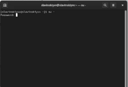{#fig:001 width=70%}

В корневом каталоге создадим каталоги /data/main и /data/third с помощью mkdir. (рис. [-@fig:002])

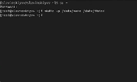{#fig:002 width=70%}

Посмотрим, кто является владельцем этих каталогов, для этого используем команду ls -Al /data. Владельцем каталогов является root. (рис. [-@fig:003])

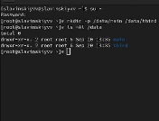{#fig:003 width=70%}

Изменим владельцев этих каталогов с root на main и third и посмотрим изменения.   (рис. [-@fig:004])
 
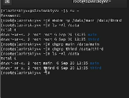{#fig:004 width=70%}

Установим разрешения, позволяющие владельцам каталогов записывать файлы в эти
каталоги и запрещающие доступ к содержимому каталогов всем другим пользователям
и группам. Проверяем изменения, как видим, у нас все применилось. (рис. [-@fig:005])

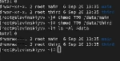{#fig:005 width=70%}

Далее перейдем на учетную запись bob. (рис. [-@fig:006])

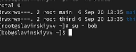{#fig:006 width=70%}

Под пользователем bob попробуем перейти в каталог /data/main и создать файл
emptyfile в этом каталоге. Видим, что владельцем является bob и группа тоже bob. (рис. [-@fig:007])

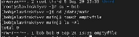{#fig:007 width=70%}

Под пользователем bob попробуем перейти в каталог /data/third и создать файл emptyfile в этом каталоге. Как видим, нам выводится Permission denied или же отказано в доступе, все из-за того, что пользователь bob входил в группу main, а не в группе third. (рис. [-@fig:008])

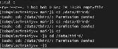{#fig:008 width=70%}

Переключимся на учётную запись пользователя alice(рис. [-@fig:009])

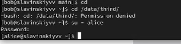{#fig:009 width=70%}
 
Перейдем в каталог /data/main и создадим два файла, владельцем которых является alice. (рис. [-@fig:010])

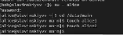{#fig:010 width=70%}

Перейдем под учётную запись пользователя bob. (рис. [-@fig:011])

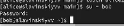{#fig:011 width=70%}

Перейдем в каталог /data/main. Введем команду ls -l, чтобы увидеть файлы alice, и попробуем удалить файлы. Как видим, через пользователя bob, мы смогли удалить файлы alice в каталоге main (рис. [-@fig:012])

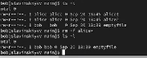{#fig:012 width=70%}

Создадим два файла, которые принадлежат пользователю bob. (рис. [-@fig:013])

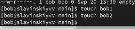{#fig:013 width=70%}

Под пользователем root установим для каталога /data/main бит идентификатора группы, а также stiky-бит для разделяемого (общего) каталога группы.(рис. [-@fig:014])

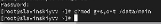{#fig:014 width=70%}

Под пользователем alice создадим в каталоге /data/main файлы alice3 и alice4. Здесь мы видим, что два этих файла принадлежать групппе main(рис. [-@fig:015])

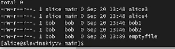{#fig:015 width=70%}

Под пользователем alice попробуем удалить файлы, принадлежащиепользователю bob с помощью команды: rm -rf bob*. Sticky-bit предотварил удаление, поскольку alice не является создателем файлов, но alice является создателем каталога, поэтому все равно alice сможет все удалить.(рис. [-@fig:016])

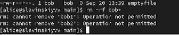{#fig:016 width=70%}

Переключимся в терминале на учётную запись пользователя root.(рис. [-@fig:017])

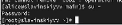{#fig:017 width=70%}

Установим права на чтение и выполнение в каталоге /data/main для группы third и права на чтение и выполнение для группы main в каталоге /data/third.(рис. [-@fig:018])

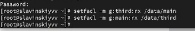{#fig:018 width=70%}

Используем команду getfacl, чтобы убедиться в правильности установки разрешений. Как видим, в каталоге main высвечивается third, а для third-main.(рис. [-@fig:019])

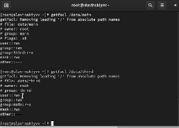{#fig:019 width=70%}

Создадим новый файл с именем newfile1 в каталоге /data/main и используем getfacl /data/main/newfile1 для проверки текущих назначений полномочий. Видим, что для пользователя у нас полномочия для записи и чтения, а для группы только для чтения. Так же владельцами являются пользователь root и группа main.(рис. [-@fig:020])

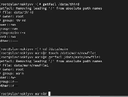{#fig:020 width=70%}

Сделаем тоже самое, только в каталоге /data/third и видим, что владелец группы является уже не third, а root.(рис. [-@fig:021])

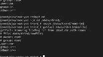{#fig:021 width=70%}

Установим ACL по умолчанию для каталога /data/main.(рис. [-@fig:022])

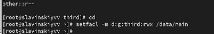{#fig:022 width=70%}

Добавим ACL по умолчанию для каталога /data/third.(рис. [-@fig:023])

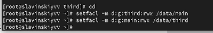{#fig:023 width=70%}

Убедимся, что настройки ACL работают, добавив новый файл в каталог /data/main. Видим, что что настройки работают, полномочия для third тоже есть. (рис. [-@fig:024])

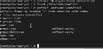{#fig:024 width=70%}

Сделаем те же действия только для каталога /data/third. Теперь у группы third есть полномочия в каталоге main.(рис. [-@fig:025])

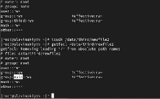{#fig:025 width=70%}

Для проверки полномочий группы third войдем под учётной записью члена группы third.(рис. [-@fig:026])

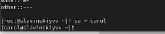{#fig:026 width=70%}

Попробуем удалить newfile1 и newfile2 и осуществить запись в эти файлы. Как видим, удалось записать только в newfile2, поскольку мы применили настройки для newfile2 для записи и чтения, а для newfile1 только для чтения.(рис. [-@fig:027])

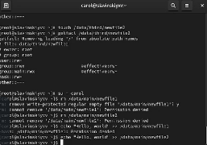{#fig:027 width=70%}

# Выводы

В ходе выполнения лабораторной работы были получены навыки настройки базовых и специальных прав доступа для групп пользователей в операционной системе типа Linux.
# Ответы на контрольные вопросы

1. chown :main /data/main/report.txt

2. find /data -user alice

3. chmod -R ug=rwx,o= /data.

4. chmod +x /data/main/script.sh.

5. chmod g+s /data/main.

6. chmod +t /data/main.

7. setfacl -R -m g:third:r /data/main

8. setfacl -R -m g:main:rx /data/third - для файлов, которые уже есть
setfacl -R -m d:g:main:rx /data/main - для будущих файлов

9. Значение umask должно быть 007. Пример: umask 007, touch /data/main/1.txt. В этом случае файл будет иметь разрешение 660, и другие пользователи не смогут получать разрешения на новые файлы.

10. chmod a-w /data/main/2.txt.
