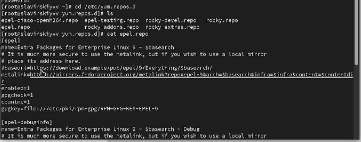
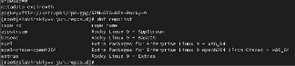

---
## Front matter
lang: ru-RU
title: Структура научной презентации
subtitle: Отчет
author:
  - Славинский Владислав Вадимович.
institute:
  - Российский университет дружбы народов, Москва, Россия

## i18n babel
babel-lang: russian
babel-otherlangs: english

## Formatting pdf
toc: false
toc-title: Содержание
slide_level: 2
aspectratio: 169
section-titles: true
theme: metropolis
header-includes:
 - \metroset{progressbar=frametitle,sectionpage=progressbar,numbering=fraction}
---

# Информация

## Докладчик

:::::::::::::: {.columns align=center}
::: {.column width="70%"}

  * Славинский Владислав Вадимович
  * Студент первого курса НПИбд-03-24
  * Российский университет дружбы народов
  * [1132246169@pfur.ru](mailto:1132246169@pfur.ru)
---

# Цель работы

Получение навыков правильной работы с репозиториями git.

# Задание

Установка программного обеспечения
Установка git-flow
Установка Node.js
Настройка Node.js
Общепринятые коммиты
Практический сценарий использования git
Создание репозитория git
Работа с репозиторием git

# Выполнение лабораторной работы

Установка Gitflow (рис. [-@fig:001])

{#fig:001 width=70%}

Установка Node.js (рис. [-@fig:002])

{#fig:002 width=70%}

Настройка Node.js (рис. [-@fig:003])

{#fig:003 width=70%}

Подключение репозитория к Github (рис. [-@fig:004])

{#fig:004 width=70%}

Редактируем конфиг общепринятых коммитов (рис. [-@fig:005])

{#fig:005 width=70%}

Инициализируем Gitflow (рис. [-@fig:006])

{#fig:006 width=70%}

Загрузил весь репозиторий в хранилище  (рис. [-@fig:007])

{#fig:007 width=70%}

Создание релиза с версией 1.0.0 и создание журнала изменений. (рис. [-@fig:008])

{#fig:008 width=70%}

Залил релизную ветку в основную ветку и отправил на данные на гит (рис. [-@fig:009])

{#fig:009 width=70%}
 
Создание ветки для функциональности (рис. [-@fig:010])

{#fig:010 width=70%}

Создадим релиз с версией 1.2.3(рис. [-@fig:011])

{#fig:011 width=70%}

Создание журнала изменений и добавление журнала в индекс(рис. [-@fig:012])

{#fig:012 width=70%}

Зальем релизную ветку в основную ветку.Отправим данные на Github. Создадим релиз на github с комментарием из журнала изменений (рис. [-@fig:013])

{#fig:013 width=70%}

# Выводы

В ходе выполнения лабораторной работы я приобрел навыки правильной работы с репозиториями git. 

