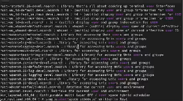
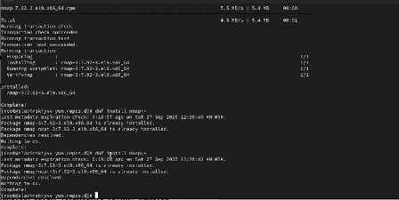

---
## Front matter
lang: ru-RU
title: Работа с программными пакетами
subtitle: Часть 1
author:
  - Славинский В.В.
institute:
  - Российский университет дружбы народов, Москва, Россия Россия
date: 27 сентября 2025

## i18n babel
babel-lang: russian
babel-otherlangs: english

## Formatting pdf
toc: false
toc-title: Содержание
slide_level: 2
aspectratio: 169
section-titles: true
theme: metropolis
header-includes:
 - \metroset{progressbar=frametitle,sectionpage=progressbar,numbering=fraction}
---

# Информация

## Докладчик

:::::::::::::: {.columns align=center}
::: {.column width="70%"}

  * Славинский Владислав Вадимович
  * Студент
  * Российский университет дружбы народов
  * [1132246169@pfur.ru]

:::
::: {.column width="30%"}

# Вводная часть

## Переход в режим суперпользователя

В консоли перейдем в режим работы суперпользователя, используя команду su -.

## Изучение содержания каталога и файлов

Перейдем в каталог /etc/yum.repos.d и изучим содержание каталога и файлов репозиториев с помощью команд: cd /etc/yum.repos, ls, и изучим cat epel.repo.

## Вывод списка репозиториев

Выведем на экран список репозиториев через команду dnf repolist. Нам вывелось следующее: appstream, baseoc, epel, epel-cisco-openh264 и extras. Репозиторий appstream включает в себе современное программное обеспечение, не входящее в бьазовую систему. Репозиторий baseoc - это основной репозиторий операционной системы, который содержит важные системные пакеты, ядро, системные утилиты. Epel содержит популярное ПО, не включенное в официальные репозитории. Epel-cisco-openh264 решает проблемы с воспроизведением видео в приложениях и предоставляет проприетарный видео-кодек H.264 для браузеров. Extras содержит в себе обновления и дополнения к базовой системе.

## Вывод списка пакетов

Выведем на экран список пакетов, в названии или описании которых есть слово user через команду dnf search user. Эта команда выводит название пакета и краткое описание этого пакета.

## Установка nmap

Установим nmap, предварительно изучив информацию по имеющимся пакетам через команды dnf search nmap, dnf info nmap, dnf install nmap, dnf install nmap\*. Разница между install nmap и install nmap\* в том, что просто nmap устанавливает только основной пакет nmap, а nmap\* устанавливает все пакеты, начинающиеся с "nmap". 

## Удаление nmap

Удалим nmap через команды dnf remove nmap, dnf remove nmap\*.

## Установка группы пакетов RPM Development Tools

Получим список имеющихся групп пакетов, затем установим группу пакетов RPM Development Tools через команды dnf groups list LANG=C, dnf groups list, dnf groups info "RPM Development Tools", dnf groupinstall "RPM Development Tools" 

## Удаление группы пакетов

Для удаления группы пакетов RPM Development Tools мы можем воспользоваться командой dnf groupremove "RPM Development Tools".

## Просмотр истории использования команды dnf

Посмотрим историю использования команды dnf с помощтю комнады dnf history.

## Отмена последнего действия
 
И теперь отменим последнее действие, стоящее на пятнадцатой позиции с помощью команды dnf history undo 15.

## Установка rpm-пакета lynx

Скачаем rpm-пакет lynx: dnf list lynx, dnf install lynx --downloadonly.

## Поиск каталога после загрузки

Найдем каталог, в который был помещён пакет после загрузки с помощью комнды: find /var/cache/dnf/ -name lynx*. Пакет был помещен в каталог /var/cache/dnf/appstream-25485261a76941d3/packages lynx-2.8.9-20.el9.x86_64.rpm.

## Установка rpm-пакета

Перейдем в этот каталог и затем установим rpm-пакет: rpm -Uhv lynx-2.8.9-20.el9.x86_64.rpm. 

## Определение расположения исполняемого файла

Определим расположение исполняемого файла с помощью команды: which lynx.

## Определение по имени файла, к какому пакету принадлежит lynx

Используя rpm, определим по имени файла, к какому пакету принадлежит lynx: rpm -qf $(which lynx).

## Получение дополнительой информации

Получим дополнительную информацию о содержимом пакета, введя: rpm -qi lynx.

## Список всех файлов в пакете

Получим список всех файлов в пакете, используя: rpm -ql lynx.

## Вывод перечня файлов с документацией пакета

Выведем перечень файлов с документацией пакета с помощью команды rpm -qd lynx.

## Просмотр файлов документации через man lynx

Посмотрим файлы документации, применив команду man lynx.

## Вывод перечня и местарасположения конфигурационных файлов пакета

Выведем на экран перечень и месторасположение конфигурационных файлов пакета через команду rpm -qc lynx.

## Вывод расположения и содержания скриптов

Выведем на экран расположение и содержание скриптов, выполняемых при установке пакета: rpm -q --scripts lynx. Скриптов у нас не оказалось.

## Запустим текстовый браузер lynx

В отдельном терминале под своей учётной записью запустим текстовый браузер lynx, чтобы проверить корректность установки пакета.

## Удаление пакета lynx

Вернемся в терминал с учётной записью root и удалим пакет: rpm -e lynx.

## Установка пакета dnsmasq

Установим пакет dnsmasq: dnf list dnsmasq, dnf install dnsmasq.

## Определение расположения исполняемого файла

И определим расположение исполняемого файла с помощью команды which dnsmasq.

## К какому пакету принадлежит dnsmasq

Определим по имени файла, к какому пакету принадлежит dnsmasq: rpm -qf $(which dnsmasq).

## Дополнительная информация о содержимом пакета

Получим дополнительную информацию о содержимом пакета через команду rpm -qi dnsmasq.

## Список всех файлов в пакете

Получим список всех файлов в пакете: rpm -ql dnsmasq.

## Вывод перечня файлов с документацией

Выведем перечень файлов с документацией пакета: rpm -qd dnsmasq.

## Просмотр файлов документации

И посмотрим файлы документации, используя команду man dnsmasq.

## Вывод перечня и местарасположения конфигурационных файлов пакета

Выведием на экран перечень и месторасположение конфигурационных файлов пакета через команду rpm -qc dnsmasq.

## Вывод расположения и содержания скриптов

Выведем на экран расположение и содержание скриптов, выполняемых при установке пакета: rpm -q --scripts dnsmasq. Скрипт предварительно создает пользователей, чтобы rpm мог устанавливать файлы с соответствущем владельцем.

## Удаление пакета dnsmasq

Удалим  пакет dnsmasq: rpm -e dnsmask.

