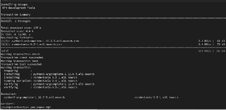
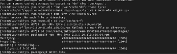

---
## Front matter
title: "Лабараторная работа №4"
subtitle: "Отчет"
author: "Славинский Владислав Вадимович"

## Generic otions
lang: ru-RU
toc-title: "Содержание"

## Bibliography
bibliography: bib/cite.bib
csl: pandoc/csl/gost-r-7-0-5-2008-numeric.csl

## Pdf output format
toc: true # Table of contents
toc-depth: 2
lof: true # List of figures
lot: true # List of tables
fontsize: 12pt
linestretch: 1.5
papersize: a4
documentclass: scrreprt
## I18n polyglossia
polyglossia-lang:
  name: russian
  options:
	- spelling=modern
	- babelshorthands=true
polyglossia-otherlangs:
  name: english
## I18n babel
babel-lang: russian
babel-otherlangs: english
## Fonts
mainfont: IBM Plex Serif
romanfont: IBM Plex Serif
sansfont: IBM Plex Sans
monofont: IBM Plex Mono
mathfont: STIX Two Math
mainfontoptions: Ligatures=Common,Ligatures=TeX,Scale=0.94
romanfontoptions: Ligatures=Common,Ligatures=TeX,Scale=0.94
sansfontoptions: Ligatures=Common,Ligatures=TeX,Scale=MatchLowercase,Scale=0.94
monofontoptions: Scale=MatchLowercase,Scale=0.94,FakeStretch=0.9
mathfontoptions:
## Biblatex
biblatex: true
biblio-style: "gost-numeric"
biblatexoptions:
  - parentracker=true
  - backend=biber
  - hyperref=auto
  - language=auto
  - autolang=other*
  - citestyle=gost-numeric
## Pandoc-crossref LaTeX customization
figureTitle: "Рис."
tableTitle: "Таблица"
listingTitle: "Листинг"
lofTitle: "Список иллюстраций"
lotTitle: "Список таблиц"
lolTitle: "Листинги"
## Misc options
indent: true
header-includes:
  - \usepackage{indentfirst}
  - \usepackage{float} # keep figures where there are in the text
  - \floatplacement{figure}{H} # keep figures where there are in the text
---

# Цель работы

Получить навыки работы с репозиториями и менеджерами пакетов.

# Выполнение лабораторной работы

В консоли перейдем в режим работы суперпользователя, используя команду su -. (рис. [-@fig:001])

{#fig:001 width=70%}

Перейдем в каталог /etc/yum.repos.d и изучим содержание каталога и файлов репозиториев с помощью команд: cd /etc/yum.repos, ls, и изучим cat epel.repo. (рис. [-@fig:002])

{#fig:002 width=70%}

Выведем на экран список репозиториев через команду dnf repolist. Нам вывелось следующее: appstream, baseoc, epel, epel-cisco-openh264 и extras. Репозиторий appstream включает в себе современное программное обеспечение, не входящее в бьазовую систему. Репозиторий baseoc - это основной репозиторий операционной системы, который содержит важные системные пакеты, ядро, системные утилиты. Epel содержит популярное ПО, не включенное в официальные репозитории. Epel-cisco-openh264 решает проблемы с воспроизведением видео в приложениях и предоставляет проприетарный видео-кодек H.264 для браузеров. Extras содержит в себе обновления и дополнения к базовой системе. (рис. [-@fig:003])

{#fig:003 width=70%}

Выведем на экран список пакетов, в названии или описании которых есть слово user через команду dnf search user. Эта команда выводит название пакета и краткое описание этого пакета. (рис. [-@fig:004])
 
{#fig:004 width=70%}

Установим nmap, предварительно изучив информацию по имеющимся пакетам через команды dnf search nmap, dnf info nmap, dnf install nmap, dnf install nmap\*. Разница между install nmap и install nmap\* в том, что просто nmap устанавливает только основной пакет nmap, а nmap\* устанавливает все пакеты, начинающиеся с "nmap".  (рис. [-@fig:005])

{#fig:005 width=70%}

Удалим nmap через команды dnf remove nmap, dnf remove nmap\*. (рис. [-@fig:006])

{#fig:006 width=70%}

Получим список имеющихся групп пакетов, затем установим группу пакетов RPM Development Tools через команды dnf groups list LANG=C, dnf groups list, dnf groups info "RPM Development Tools", dnf groupinstall "RPM Development Tools". (рис. [-@fig:007])

{#fig:007 width=70%}

Для удаления группы пакетов RPM Development Tools мы можем воспользоваться командой dnf groupremove "RPM Development Tools". (рис. [-@fig:008])

{#fig:008 width=70%}

Посмотрим историю использования команды dnf с помощтю комнады dnf history.(рис. [-@fig:009])

{#fig:009 width=70%}
 
И теперь отменим последнее действие, стоящее на пятнадцатой позиции с помощью команды dnf history undo 15. (рис. [-@fig:010])

{#fig:010 width=70%}

Скачаем rpm-пакет lynx: dnf list lynx, dnf install lynx --downloadonly. (рис. [-@fig:011])

{#fig:011 width=70%}

Найдем каталог, в который был помещён пакет после загрузки с помощью комнды: find /var/cache/dnf/ -name lynx*. Пакет был помещен в каталог /var/cache/dnf/appstream-25485261a76941d3/packages lynx-2.8.9-20.el9.x86_64.rpm. (рис. [-@fig:012])

{#fig:012 width=70%}

Перейдем в этот каталог и затем установим rpm-пакет: rpm -Uhv lynx-2.8.9-20.el9.x86_64.rpm. (рис. [-@fig:013])

{#fig:013 width=70%}

Определим расположение исполняемого файла с помощью команды: which lynx.(рис. [-@fig:014])

{#fig:014 width=70%}

Используя rpm, определим по имени файла, к какому пакету принадлежит lynx: rpm -qf $(which lynx).(рис. [-@fig:015])

{#fig:015 width=70%}

Получим дополнительную информацию о содержимом пакета, введя: rpm -qi lynx.(рис. [-@fig:016])

{#fig:016 width=70%}

Получим список всех файлов в пакете, используя: rpm -ql lynx.(рис. [-@fig:017])

{#fig:017 width=70%}

Выведем перечень файлов с документацией пакета с помощью команды rpm -qd lynx.(рис. [-@fig:018])

{#fig:018 width=70%}

Посмотрим файлы документации, применив команду man lynx.(рис. [-@fig:019])

{#fig:019 width=70%}

Выведем на экран перечень и месторасположение конфигурационных файлов пакета через команду rpm -qc lynx.(рис. [-@fig:020])

{#fig:020 width=70%}

Выведем на экран расположение и содержание скриптов, выполняемых при установке пакета: rpm -q --scripts lynx. Скриптов у нас не оказалось.(рис. [-@fig:021])

{#fig:021 width=70%}

В отдельном терминале под своей учётной записью запустим текстовый браузер lynx, чтобы проверить корректность установки пакета.(рис. [-@fig:022])

{#fig:022 width=70%}

Вернемся в терминал с учётной записью root и удалим пакет: rpm -e lynx.(рис. [-@fig:023])

{#fig:023 width=70%}

Установим пакет dnsmasq: dnf list dnsmasq, dnf install dnsmasq.(рис. [-@fig:024])

{#fig:024 width=70%}

И определим расположение исполняемого файла с помощью команды which dnsmasq.(рис. [-@fig:025])

{#fig:025 width=70%}

Определим по имени файла, к какому пакету принадлежит dnsmasq: rpm -qf $(which dnsmasq).(рис. [-@fig:026])

{#fig:026 width=70%}

Получим дополнительную информацию о содержимом пакета через команду rpm -qi dnsmasq.(рис. [-@fig:027])

{#fig:027 width=70%}

Получим список всех файлов в пакете: rpm -ql dnsmasq(рис. [-@fig:028])

{#fig:028 width=70%}

Выведем перечень файлов с документацией пакета: rpm -qd dnsmasq(рис. [-@fig:029])

{#fig:029 width=70%}

И посмотрим файлы документации, используя команду man dnsmasq.(рис. [-@fig:030])

{#fig:030 width=70%}

Выведием на экран перечень и месторасположение конфигурационных файлов пакета через команду rpm -qc dnsmasq.(рис. [-@fig:031])

{#fig:031 width=70%}

Выведем на экран расположение и содержание скриптов, выполняемых при установке пакета: rpm -q --scripts dnsmasq. Скрипт предварительно создает пользователей, чтобы rpm мог устанавливать файлы с соответствущем владельцем. (рис. [-@fig:032])

{#fig:032 width=70%}

Удалим  пакет dnsmasq: rpm -e dnsmask.(рис. [-@fig:033])

{#fig:033 width=70%}

# Выводы

В ходе выполнения лабораторной работы были получены навыки работы с репозиториями и менеджерами пакетов

# Ответы на контрольные вопросы

1. rpm -qf $(which useradd)

2. dnf groups list | grep -i security, dnf groupinfo "Security Tools", LANG=C dnf groups list | grep -i security

3. rpm -Uhv lynx...

4. rpm -q --scripts ...

5. rpm -qd

6. rpm -qf $(which ...)

