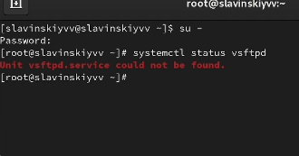
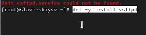
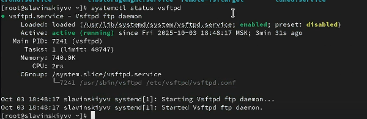
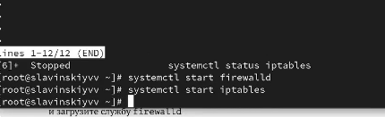

---
## Front matter
lang: ru-RU
title: Управление системными службами
subtitle: Часть 1
author:
  - Славинский В.В.
institute:
  - Российский университет дружбы народов, Москва, Россия Россия
date: 4 октября 2025

## i18n babel
babel-lang: russian
babel-otherlangs: english

## Formatting pdf
toc: false
toc-title: Содержание
slide_level: 2
aspectratio: 169
section-titles: true
theme: metropolis
header-includes:
 - \metroset{progressbar=frametitle,sectionpage=progressbar,numbering=fraction}
---

# Информация

## Докладчик

:::::::::::::: {.columns align=center}
::: {.column width="70%"}

  * Славинский Владислав Вадимович
  * Студент
  * Российский университет дружбы народов
  * [1132246169@pfur.ru]

:::
::: {.column width="30%"}

# Вводная часть

## Переход в режим суперпользователя

В консоли перейдем в режим работы суперпользователя, используя команду su -.

## Проверка статуса службы

Проверим статус службы Very Secure FTP с помощью команды systemctl status vsftpd. Служба отключена, так как она не установлена

## Установка vsftp

Установим службу Very Secure FTP: dnf -y install vsftpd.

## Запуск vsftp

Запустим службу Very Secure FTP: systemctl start vsftpd.

## Проверка статуса службы

Проверим статус службы Very Secure FTP с помощью команды systemctl status vsftpd.

## Добавление в автозапуск

У нас служба работает, но у нас она не будет работать при автоматическом запуске операционной системы, давайте её добавим в автоматический запуск с помощью команды systemctl enable vsftpd. И как видим, служба добавилась в автозапуск.

## Отключение службы

Теперь удалим службу из автозапуска через команду systemctl disable vsftpd. Теперь служба удалилась из автозапуска.

## Вывод символических ссылок

Выведем на экран символические ссылки, ответственные за запуск различных сервисов: ls /etc/systemd/system/multi-user.target.wants. В данном случае мы не видим vsftpd.service.

## Вывод символических ссылок после добавления vsftp в автозапуск

Теперь снова добавим vsftp в автозапуск и проверим, появился ли vsftpd.service. Как видим, у нас vsftpd появился.

## Проверка статуса службы

Снова проверим статус службы Very Secure FTP. У нас служба будет включена после перезапуска системы.

## Вывод списка зависимостей юнита

Выведем на экран список зависимостей юнита: systemctl list-dependencies vsftpd.

## Вывод списка юнитов, которые зависят от данного типа

Выведем на экран список юнитов, которые зависят от данного юнита: systemctl list-dependencies vsftpd --reverse. 

## Установка iptables

Дальше установим iptables: dnf -y install iptables\*.

## Проверка статуса firewalld

Проверим статус firewalld: systemctl status firewalld.

## Проверка статуса iptables

Проверим статус iptables: systemctl status iptables. Здесь мы видим, что служба инактивна, и не запущена а автозапуске.

## Запуск firewalld и iptables

Попробуем запустить firewalld и iptables: systemctl start firewalld,systemctl start iptables.

## Проверка статуса firewalld

Посмотрим статус firewalld. firewalld у нас теперь не запущена.

## Проверка статуса iptables

Посмотрим статус iptables. И тут уже понятно, что одна служба диактивируется, а другая включается, поскольку iptables запустилась.

## Ввод команды для анализа ошибок

Введем cat /usr/lib/systemd/system/firewalld.service, чтобы посмотреть ошибки. И вот мы видим, с чем конфликтует служба firewalld.

## Ввод команды для анализа ошибок

Введем то же самое, только для iptables: cat /usr/lib/systemd/system/iptables.service. Но тут, мы не видим никаких ошибок.

## Выгрузка iptables и загрузка firewalld

Выгрузим службу iptables (на всякий случай, чтобы убедиться, что данная служба не загружена в систему): systemctl stop iptables, и загрзуим службу firewalld systemctl start firewalld.

## Блокировка запуска iptables

Заблокируем запуск iptables, введя команду systemctl mask iptables.

## Запуск itpables

Теперь попробуем запустить iptables. Видим , что у нас ошибка, так как мы эту службу замаскировали.

## Попытка добавления iptables в автозапуск

Попробуем добавить iptables в автозапуск, но сервис будет неактивен, а статус загрузки отобразился как замаскированный.

## Список целей, которые можно изолировать

Дальше перейдем  каталог systemd и найдите список всех целей, которые можно изолировать:cd /usr/lib/systemd/system, grep Isolate *.target.

## Переключение операционной системы в режим восстановления

Переключим операционную систему в режим восстановления: systemctl isolate rescue.target.

## Перезапуск операционной системы с изменениями

Перезапустим операционную систему следующим образом: systemctl isolate reboot.target.

## Вывод цели по умолчанию

Теперь вводим команду systemctl get-default, чтобы узнать установленную по умолчанию цель. Видим, что запускается система по умолчанию в графическом режиме.

## Запуск текстового режима

Для запуска по умолчанию текстового режима введём systemctl set-default multi-user.target и перезагружаем.

## Возвращение на графический режим

Чтобы нам обратно вернуться в графический режим, нужно перейти на root и ввести команду systemctl set-default graphical.target.

## Запуск в графическом режиме

Перезагружаем и видим, мы снова в графическом режиме.

