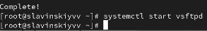
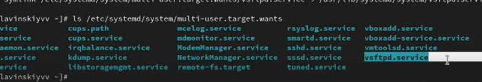
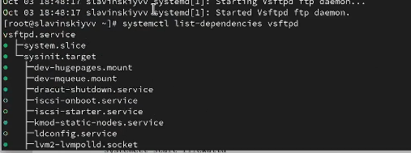
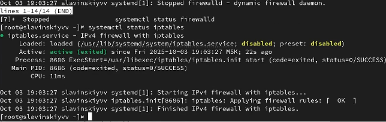
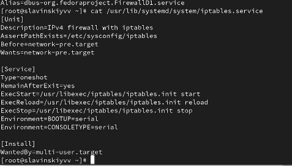
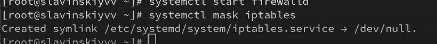

---
## Front matter
title: "Лабараторная работа №5"
subtitle: "Отчет"
author: "Славинский Владислав Вадимович"

## Generic otions
lang: ru-RU
toc-title: "Содержание"

## Bibliography
bibliography: bib/cite.bib
csl: pandoc/csl/gost-r-7-0-5-2008-numeric.csl

## Pdf output format
toc: true # Table of contents
toc-depth: 2
lof: true # List of figures
lot: true # List of tables
fontsize: 12pt
linestretch: 1.5
papersize: a4
documentclass: scrreprt
## I18n polyglossia
polyglossia-lang:
  name: russian
  options:
	- spelling=modern
	- babelshorthands=true
polyglossia-otherlangs:
  name: english
## I18n babel
babel-lang: russian
babel-otherlangs: english
## Fonts
mainfont: IBM Plex Serif
romanfont: IBM Plex Serif
sansfont: IBM Plex Sans
monofont: IBM Plex Mono
mathfont: STIX Two Math
mainfontoptions: Ligatures=Common,Ligatures=TeX,Scale=0.94
romanfontoptions: Ligatures=Common,Ligatures=TeX,Scale=0.94
sansfontoptions: Ligatures=Common,Ligatures=TeX,Scale=MatchLowercase,Scale=0.94
monofontoptions: Scale=MatchLowercase,Scale=0.94,FakeStretch=0.9
mathfontoptions:
## Biblatex
biblatex: true
biblio-style: "gost-numeric"
biblatexoptions:
  - parentracker=true
  - backend=biber
  - hyperref=auto
  - language=auto
  - autolang=other*
  - citestyle=gost-numeric
## Pandoc-crossref LaTeX customization
figureTitle: "Рис."
tableTitle: "Таблица"
listingTitle: "Листинг"
lofTitle: "Список иллюстраций"
lotTitle: "Список таблиц"
lolTitle: "Листинги"
## Misc options
indent: true
header-includes:
  - \usepackage{indentfirst}
  - \usepackage{float} # keep figures where there are in the text
  - \floatplacement{figure}{H} # keep figures where there are in the text
---

# Цель работы

Научиться пользоваться pass и chezmoi

# Задание

Научиться пользоваться программами для управления паролями и настроить OC. 

# Выполнение лабораторной работы

Установка Pass (рис. [-@fig:001])

{#fig:001 width=70%}

Просмотр списка ключей (рис. [-@fig:002])

{#fig:002 width=70%}

Инициализация хранилища (рис. [-@fig:003])

{#fig:003 width=70%}

Синхронизация с git (рис. [-@fig:004])

{#fig:004 width=70%}

Прямые изменения (рис. [-@fig:005])

{#fig:005 width=70%}

Теперь установим browserpass (рис. [-@fig:006])

{#fig:006 width=70%}

Создадим текстовый файл pass.txt, чтобы туда добавить пароль  (рис. [-@fig:007])

{#fig:007 width=70%}

Ввод паролля через команду pass insert pass.txt и отображение его через команду pass pass.txt (рис. [-@fig:008])

{#fig:008 width=70%}

Теперь через команду pass generate --in-place компьютер сгенерирует нам пароль (рис. [-@fig:009])

{#fig:009 width=70%}
 
Установим дополнитель ПО (рис. [-@fig:010])

{#fig:010 width=70%}

Установим шрифты (рис. [-@fig:011])

{#fig:011 width=70%}

Установим бинарный файл (рис. [-@fig:012])

{#fig:012 width=70%}

Создадим свой репозиторий для конфигуарационных файлов на основе шаблона (рис. [-@fig:013])

{#fig:013 width=70%}

Инициализирую chezmoi с моим репозиторием dotfiles (рис. [-@fig:014])

{#fig:014 width=70%}

Проверка изменений и запуск через chezmoi apply -v (рис. [-@fig:015])

{#fig:015 width=70%}

Инициализируем chezmoi и dotfiles на другой виртуальной машине (рис. [-@fig:016])

{#fig:016 width=70%}

Проверим изменения. С помощью команды chezmoi update -v получим и применим последние изменения из нашего репозитория (рис. [-@fig:017])

{#fig:017 width=70%}

Установим dotfiles на новый компьютер с помощью одной команды (рис. [-@fig:018])

{#fig:018 width=70%}

Извлечем изменения из репозитория и применим их (рис. [-@fig:019])

{#fig:019 width=70%}

Извлечем последние  изменения из репозитория, фактически не применяя изменения. Но у нас ничего не изменилось (рис. [-@fig:020])

{#fig:020 width=70%}

Применим изменения (рис. [-@fig:021])

{#fig:021 width=70%}

Автоматически зафиксимурем и отправим изменения в репозиторий (рис. [-@fig:022])

{#fig:022 width=70%}

# Выводы

В ходе выполнения лабораторной работы я настроил программы для управления паролями и приобрел навык синхронизации настроек OC. 

