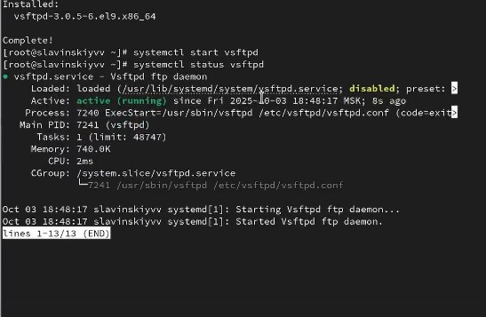
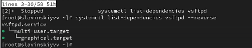
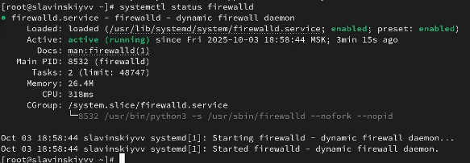

---
## Front matter
title: "Лабараторная работа №5"
subtitle: "Отчет"
author: "Славинский Владислав Вадимович"

## Generic otions
lang: ru-RU
toc-title: "Содержание"

## Bibliography
bibliography: bib/cite.bib
csl: pandoc/csl/gost-r-7-0-5-2008-numeric.csl

## Pdf output format
toc: true # Table of contents
toc-depth: 2
lof: true # List of figures
lot: true # List of tables
fontsize: 12pt
linestretch: 1.5
papersize: a4
documentclass: scrreprt
## I18n polyglossia
polyglossia-lang:
  name: russian
  options:
	- spelling=modern
	- babelshorthands=true
polyglossia-otherlangs:
  name: english
## I18n babel
babel-lang: russian
babel-otherlangs: english
## Fonts
mainfont: IBM Plex Serif
romanfont: IBM Plex Serif
sansfont: IBM Plex Sans
monofont: IBM Plex Mono
mathfont: STIX Two Math
mainfontoptions: Ligatures=Common,Ligatures=TeX,Scale=0.94
romanfontoptions: Ligatures=Common,Ligatures=TeX,Scale=0.94
sansfontoptions: Ligatures=Common,Ligatures=TeX,Scale=MatchLowercase,Scale=0.94
monofontoptions: Scale=MatchLowercase,Scale=0.94,FakeStretch=0.9
mathfontoptions:
## Biblatex
biblatex: true
biblio-style: "gost-numeric"
biblatexoptions:
  - parentracker=true
  - backend=biber
  - hyperref=auto
  - language=auto
  - autolang=other*
  - citestyle=gost-numeric
## Pandoc-crossref LaTeX customization
figureTitle: "Рис."
tableTitle: "Таблица"
listingTitle: "Листинг"
lofTitle: "Список иллюстраций"
lotTitle: "Список таблиц"
lolTitle: "Листинги"
## Misc options
indent: true
header-includes:
  - \usepackage{indentfirst}
  - \usepackage{float} # keep figures where there are in the text
  - \floatplacement{figure}{H} # keep figures where there are in the text
---

# Цель работы

Получить навыки управления системными службами операционной системы посредством systemd.

# Выполнение лабораторной работы

В консоли перейдем в режим работы суперпользователя, используя команду su -. (рис. [-@fig:001])

{#fig:001 width=70%}

Проверим статус службы Very Secure FTP с помощью команды systemctl status vsftpd. Служба отключена, так как она не установлена.(рис. [-@fig:002])

{#fig:002 width=70%}

Установим службу Very Secure FTP: dnf -y install vsftpd. (рис. [-@fig:003])

{#fig:003 width=70%}

Запустим службу Very Secure FTP: systemctl start vsftpd. (рис. [-@fig:004])
 
{#fig:004 width=70%}

Проверим статус службы Very Secure FTP с помощью команды systemctl status vsftpd.  (рис. [-@fig:005])

{#fig:005 width=70%}

У нас служба работает, но у нас она не будет работать при автоматическом запуске операционной системы, давайте её добавим в автоматический запуск с помощью команды systemctl enable vsftpd. И как видим, служба добавилась в автозапуск. (рис. [-@fig:006])

{#fig:006 width=70%}

Теперь удалим службу из автозапуска через команду systemctl disable vsftpd. Теперь служба удалилась из автозапуска. (рис. [-@fig:007])

{#fig:007 width=70%}

Выведем на экран символические ссылки, ответственные за запуск различных сервисов: ls /etc/systemd/system/multi-user.target.wants. В данном случае мы не видим vsftpd.service.(рис. [-@fig:008])

{#fig:008 width=70%}

Теперь снова добавим vsftp в автозапуск и проверим, появился ли vsftpd.service. Как видим, у нас vsftpd появился.(рис. [-@fig:009])

{#fig:009 width=70%}

Снова проверим статус службы Very Secure FTP. У нас служба будет включена после перезапуска системы. (рис. [-@fig:010])

{#fig:010 width=70%}

Выведем на экран список зависимостей юнита: systemctl list-dependencies vsftpd. (рис. [-@fig:011])

{#fig:011 width=70%}

Выведем на экран список юнитов, которые зависят от данного юнита: systemctl list-dependencies vsftpd --reverse. (рис. [-@fig:012])

{#fig:012 width=70%}

Дальше установим iptables: dnf -y install iptables\*. (рис. [-@fig:013])

{#fig:013 width=70%}

Проверим статус firewalld: systemctl status firewalld.(рис. [-@fig:014])

{#fig:014 width=70%}

Проверим статус iptables: systemctl status iptables. Здесь мы видим, что служба инактивна, и не запущена а автозапуске(рис. [-@fig:015])

{#fig:015 width=70%}

Попробуем запустить firewalld и iptables: systemctl start firewalld,systemctl start iptables.(рис. [-@fig:016])

{#fig:016 width=70%}

Посмотрим статус firewalld. firewalld у нас теперь не запущена.(рис. [-@fig:017])

{#fig:017 width=70%}

Посмотрим статус iptables. И тут уже понятно, что одна служба диактивируется, а другая включается, поскольку iptables запустилась.(рис. [-@fig:018])

{#fig:018 width=70%}

Введем cat /usr/lib/systemd/system/firewalld.service, чтобы посмотреть ошибки. И вот мы видим, с чем конфликтует служба firewalld.(рис. [-@fig:019])

{#fig:019 width=70%}

Введем то же самое, только для iptables: cat /usr/lib/systemd/system/iptables.service. Но тут, мы не видим никаких ошибок.(рис. [-@fig:020])

{#fig:020 width=70%}

Выгрузим службу iptables (на всякий случай, чтобы убедиться, что данная служба не загружена в систему): systemctl stop iptables, и загрзуим службу firewalld systemctl start firewalld.(рис. [-@fig:021])

{#fig:021 width=70%}

Заблокируем запуск iptables, введя команду systemctl mask iptables.(рис. [-@fig:022])

{#fig:022 width=70%}

Теперь попробуем запустить iptables. Видим , что у нас ошибка, так как мы эту службу замаскировали.(рис. [-@fig:023])

{#fig:023 width=70%}

Попробуем добавить iptables в автозапуск, но сервис будет неактивен, а статус загрузки отобразился как замаскированный.(рис. [-@fig:024])

{#fig:024 width=70%}

Дальше перейдем  каталог systemd и найдите список всех целей, которые можно изолировать:cd /usr/lib/systemd/system, grep Isolate *.target.(рис. [-@fig:025])

{#fig:025 width=70%}

Переключим операционную систему в режим восстановления: systemctl isolate rescue.target.(рис. [-@fig:026])

{#fig:026 width=70%}

Перезапустим операционную систему следующим образом: systemctl isolate reboot.target.(рис. [-@fig:027])

{#fig:027 width=70%}

Теперь вводим команду systemctl get-default, чтобы узнать установленную по умолчанию цель. Видим, что запускается система по умолчанию в графическом режиме.(рис. [-@fig:028])

{#fig:028 width=70%}

Для запуска по умолчанию текстового режима введём systemctl set-default multi-user.target и перезагружаем.(рис. [-@fig:029])

{#fig:029 width=70%}

Чтобы нам обратно вернуться в графический режим, нужно перейти на root и ввести команду systemctl set-default graphical.target.(рис. [-@fig:030])

{#fig:030 width=70%}

Перезагружаем и видим, мы снова в графическом режиме.(рис. [-@fig:031])

{#fig:031 width=70%}

# Выводы

В ходе выполнения лабораторной работы были получены навыки управления системными службами операционной системы посредством systemd.

# Ответы на контрольные вопросы

1. Юнит- это файл конфигурации с определенным синтаксисом, который описывает системную службу. Примеры: .service, .target, .mount.

2. systemctl is-enabled

3. systemctl list-units --type=service

4. systemctl enable (название юнита)

5. systemctl isolate rescue.target

6. Цель не может быть изолирована, если в её файле конфигурации .target отсутствует или имеет значение no директива AllowIsolate.

7. systemctl list-dependencies (служба) --reverse

