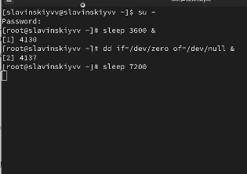
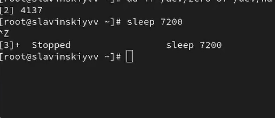
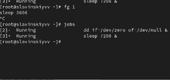
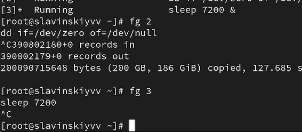
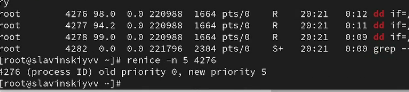
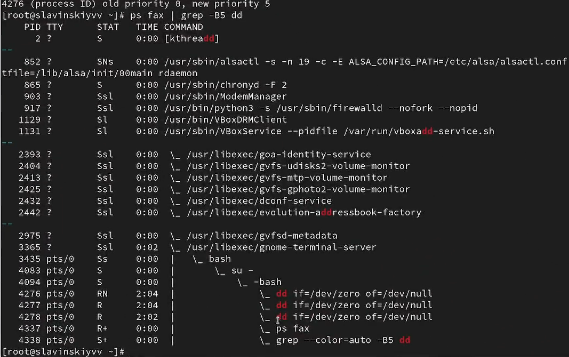

---
## Front matter
lang: ru-RU
title: Управление процессами
subtitle: Часть 1
author:
  - Славинский В.В.
institute:
  - Российский университет дружбы народов, Москва, Россия Россия
date: 11 октября 2025

## i18n babel
babel-lang: russian
babel-otherlangs: english

## Formatting pdf
toc: false
toc-title: Содержание
slide_level: 2
aspectratio: 169
section-titles: true
theme: metropolis
header-includes:
 - \metroset{progressbar=frametitle,sectionpage=progressbar,numbering=fraction}
---

# Информация

## Докладчик

:::::::::::::: {.columns align=center}
::: {.column width="70%"}

  * Славинский Владислав Вадимович
  * Студент
  * Российский университет дружбы народов
  * [1132246169@pfur.ru]

:::
::: {.column width="30%"}

# Вводная часть

## Переход в режим суперпользователя

В консоли перейдем в режим работы суперпользователя, используя команду su -

## Ввод команд

Введем следующие команды: sleep 3600 &, dd if=/dev/zero of=/dev/null & и sleep 7200

## Остановка процесса

Поскольку мы запустили последнюю команду без & у нас есть 2 часа, прежде чем мы снова получите контроль над оболочкой. Введем ctrl+z, чтобы остановить процесс.

## Комада jobs 

Введем команду jobs. Мы видим три процесса, которые мы запустили. Два первых процесса имеют статус running, а последний имеет статус stopped.

## Выполнение задания 3 в фоновом режиме

Для продолжения выполнения задания 3 в фоновом режиме введем bg 3 и посмотрим статус через jobs. Видим, что состояние изменилось на running.

## Отмена задания 1

Для перемещения задания 1 на передний план введем fg 1. После чего отменим задание через ctrl+c и посмотрим статус

## Отмена заданий 2 и 3

Проделаем то же самое с заданиями 2 и 3.

## Ввод команды во втором терминале

Откроем второй терминал и под учётной записью своего пользователя введем в нём: dd if=/dev/zero of=/dev/null & и выйдем из него.

## Запуск top

На другом терминале под учётной записью своего пользователя запустим top. Видим, что задание dd все еще запущено. Выйдем из top через q.

## Завершение задания dd

Вновь запустим top и с помощью k убьем задание dd. Потом выйдем из top с помощью q.

## Ввод команды

Перейдем в режим суперпользователя и введем следующую команду 3 раза dd if=/dev/zero of=/dev/null &.

## Строки, в которых есть буквы dd

Введем ps aux | grep dd. Это показывает все строки, в которых есть буквы dd. Запущенные процессы dd идут
последними.

## Смена приоритета

Используем PID одного из процессов dd, например 4276, чтобы изменить приоритет. Используем renice -n 5 <PID>.

## Параметр -B5

Введем ps fax | grep -B5 dd. Параметр -B5 показывает соответствующие запросу строки, включая пять строк до
этого. Поскольку ps fax показывает иерархию отношений между процессами, мы также увидим оболочку, из которой были запущены все процессы dd, и её PID.

## Удаление корневой оболочки

Найдем PID корневой оболочки (у нас значение 4094), из которой были запущены процессы dd, и введем kill -9 <PID>

## Запуск команды в фоновом значении

Введем три раза команду dd if=/dev/zero of=/dev/null. Нам нужно запустить команду как фоновое значение, поэтому в конце добавляем &.

## Изменение приоритета

Увеличим приоритет одной из этих команд, используя значение приоритета −5. Введем команду renice -n -5 5005

## Изменение приоритета

Изменим приоритет того же процесса ещё раз, но применим на этот раз значение −15. Разница в том, что при приоритете -15 процесс получает гораздо больше процессорного времени, чем при -5. Чем меньше значение, тем выше приоритет.

## Завершение процессов dd

Завершим все процессы dd, которые мы запустили.

## yes в фоновом режиме с подавлением потока вывода

Запустим программу yes в фоновом режиме с подавлением потока вывода с помощью команды yes > /dev/null &.

## yes на переднем плане с подавлением потока вывода

Запустим программу yes на переднем плане с подавлением потока вывода с помощью команды yes > /dev/null. Затем приостоновим программу через crtl+z. Потом заново запустим и завершим процесс через ctrl+c

## yes на переднем плане без подавления потока вывода

Запустим программу yes на переднем плане без подавления потока вывода. Дальше приостановим выполнение программы через ctrl+z. Потом снова её запустим и завершим через ctrl+c

## Состояние заданий

Проверим состояния заданий, воспользовавшись командой jobs.

## Перевод процесса на передний план и его остановка

Переведем процесс, который у нас выполняется в фоновом режиме, на передний план, затем остановим его.

## Перевод процесса в фоновый режим

Переведем второй процесс с подавлением потока вывода в фоновый режим.

## Проверка состояния заданий

Проверим состояние заданий, воспользовавшись командой jobs. И видим, что второй процесс стал выполняться

## Запуск процесса, чтобы продолжал работу после закрытия терминала

Запустим процесс в фоновом режиме таким образом, чтобы он продолжил свою работу даже после отключения от терминала.

## Информация о запущенных в операционной системе процессах

Закроем и откроем заново консоль. Убедимся, что процесс продолжил свою работу. Получим информацию с помощью утилиты top.

## Запуск программ yes в фоновом режиме с подавлением потока вывода

Запустим ещё три программы yes в фоновом режиме с подавлением потока вывода.

## Уничтожение процессов

Убьем два процесса: для одного используйте его PID, а для другого — его идентификатор конкретного задания.

## Послание сигнала 1 процессам

Попробуем послать сигнал 1 (SIGHUP) процессу, запущенному с помощью nohup, и обычному процессу.

## Запуск программ yes в фоновом режиме с подавлением потока вывода

Запустим ещё несколько программ yes в фоновом режиме с подавлением потока вывода.

## Завершение их работы с помощью killall

Завершим их работу одновременно, используя команду killall.

## Запуск двух программ yes, но у одной программы приоритет больше на 5

Запустим программу yes в фоновом режиме с подавлением потока вывода. Используя утилиту nice, запустим программу yes с теми же параметрами и с приоритетом, большим на 5. Видим, что приоритеты у них разные.

## Установка равных приоритетов

Используя утилиту renice, изменим приоритет у одного из потоков yes таким образом, чтобы у обоих потоков приоритеты были равны. Меняем приоритет у 7506  на 5 и получается, что приоритеты теперь равны.

