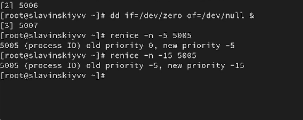

---
## Front matter
title: "Лабараторная работа №6"
subtitle: "Отчет"
author: "Славинский Владислав Вадимович"

## Generic otions
lang: ru-RU
toc-title: "Содержание"

## Bibliography
bibliography: bib/cite.bib
csl: pandoc/csl/gost-r-7-0-5-2008-numeric.csl

## Pdf output format
toc: true # Table of contents
toc-depth: 2
lof: true # List of figures
lot: true # List of tables
fontsize: 12pt
linestretch: 1.5
papersize: a4
documentclass: scrreprt
## I18n polyglossia
polyglossia-lang:
  name: russian
  options:
	- spelling=modern
	- babelshorthands=true
polyglossia-otherlangs:
  name: english
## I18n babel
babel-lang: russian
babel-otherlangs: english
## Fonts
mainfont: IBM Plex Serif
romanfont: IBM Plex Serif
sansfont: IBM Plex Sans
monofont: IBM Plex Mono
mathfont: STIX Two Math
mainfontoptions: Ligatures=Common,Ligatures=TeX,Scale=0.94
romanfontoptions: Ligatures=Common,Ligatures=TeX,Scale=0.94
sansfontoptions: Ligatures=Common,Ligatures=TeX,Scale=MatchLowercase,Scale=0.94
monofontoptions: Scale=MatchLowercase,Scale=0.94,FakeStretch=0.9
mathfontoptions:
## Biblatex
biblatex: true
biblio-style: "gost-numeric"
biblatexoptions:
  - parentracker=true
  - backend=biber
  - hyperref=auto
  - language=auto
  - autolang=other*
  - citestyle=gost-numeric
## Pandoc-crossref LaTeX customization
figureTitle: "Рис."
tableTitle: "Таблица"
listingTitle: "Листинг"
lofTitle: "Список иллюстраций"
lotTitle: "Список таблиц"
lolTitle: "Листинги"
## Misc options
indent: true
header-includes:
  - \usepackage{indentfirst}
  - \usepackage{float} # keep figures where there are in the text
  - \floatplacement{figure}{H} # keep figures where there are in the text
---

# Цель работы

Приобретение практических навыков взаимодействия пользователя с системой по-
средством командной строки.

# Задание

1. Определите полное имя вашего домашнего каталога. Далее относительно этого ката-
лога будут выполняться последующие упражнения.
2. Выполните следующие действия:
2.1. Перейдите в каталог /tmp.
2.2. Выведите на экран содержимое каталога /tmp. Для этого используйте команду ls
с различными опциями. Поясните разницу в выводимой на экран информации.
2.3. Определите, есть ли в каталоге /var/spool подкаталог с именем cron?
2.4. Перейдите в Ваш домашний каталог и выведите на экран его содержимое. Опре-
делите, кто является владельцем файлов и подкаталогов?
3. Выполните следующие действия:
3.1. В домашнем каталоге создайте новый каталог с именем newdir.
3.2. В каталоге ~/newdir создайте новый каталог с именем morefun.
3.3. В домашнем каталоге создайте одной командой три новых каталога с именами
letters, memos, misk. Затем удалите эти каталоги одной командой.
3.4. Попробуйте удалить ранее созданный каталог ~/newdir командой rm. Проверьте,
был ли каталог удалён.
3.5. Удалите каталог ~/newdir/morefun из домашнего каталога. Проверьте, был ли
каталог удалён.
4. С помощью команды man определите, какую опцию команды ls нужно использо-
вать для просмотра содержимое не только указанного каталога, но и подкаталогов,
входящих в него.
5. С помощью команды man определите набор опций команды ls, позволяющий отсорти-
ровать по времени последнего изменения выводимый список содержимого каталога
с развёрнутым описанием файлов.
6. Используйте команду man для просмотра описания следующих команд: cd, pwd, mkdir,
rmdir, rm. Поясните основные опции этих команд.
7. Используя информацию, полученную при помощи команды history, выполните мо-
дификацию и исполнение нескольких команд из буфера команд.

# Выполнение лабораторной работы

Сначала посмотрим полное имя нашего каталога (рис. [-@fig:001])

{#fig:001 width=70%}

Перейдем в каталог tmp и посмотрим его содержимое (рис. [-@fig:002])

{#fig:002 width=70%}

С помощью команды ls -a выведем дополнительные файлы (рис. [-@fig:003])

{#fig:003 width=70%}

С помощью команды ls -l выведем файлы с полной информацией (рис. [-@fig:004])

{#fig:004 width=70%}

С помощью команды ls -F выведем типы элементов (рис. [-@fig:005])

{#fig:005 width=70%}

Посмотрим, есть ли в каталоге /var/spool каталог с именем cron. Он присутствует. (рис. [-@fig:006])

{#fig:006 width=70%}

Перейдем в домашний каталог и выведем подробный список файлов, чтобы посмотреть, кому они принадлежат. И видим, что они принадлежат моему пользователю.  (рис. [-@fig:007])

{#fig:007 width=70%}

В домашнем каталоге создадим каталог с именем newdir. (рис. [-@fig:008])

{#fig:008 width=70%}

В каталоге newdir создадим каталог morefun. (рис. [-@fig:009])

{#fig:009 width=70%}
 
Создадим три каталога letters, memos, disk, и удалим их одной командой. (рис. [-@fig:010])

{#fig:010 width=70%}

Далее удалим каталог newdir. Как видим, мы не можешь его удалить, так как в этом каталоге есть еще один каталог, поэтому нужно удалить дочерний каталог.  (рис. [-@fig:011])

{#fig:011 width=70%}

С помощью команды man определим ключ для вывода всех подкаталогов. (рис. [-@fig:012])

{#fig:012 width=70%}

Теперь ключ для вывода элементов по времени. (рис. [-@fig:013])

{#fig:013 width=70%}

Посмотрим ключи для cd, их 3: L, p и e. (рис. [-@fig:014])

{#fig:014 width=70%}

Теперь посмотрим ключи для pwd. (рис. [-@fig:015])

{#fig:015 width=70%}

Далее ключи для mkdir. (рис. [-@fig:016])

{#fig:016 width=70%}

Ключи для rmdir. (рис. [-@fig:017])

{#fig:017 width=70%}

Ключи для rm. (рис. [-@fig:018])

{#fig:018 width=70%}

Теперь выведем историю команд. (рис. [-@fig:019])

{#fig:019 width=70%}

Примеры использования измененных из истории команд. (рис. [-@fig:020])

{#fig:020 width=70%}

# Выводы

В ходе выполнения лабораторной работы я получил навыки работы с базовыми командами терминала.

# Ответы на вопросы

1. Строка, в которую мы можем писать команды для исполнения.

2. С помощью команды pwd можно определить абсолютный путь текущего каталога. Например, pwd Загрузки

3. С помощью команды ls -F. Пример: ls -F /tmp

4. С помощью команды ls -al. Пример: ls -al /var

5. При помощи команд rm и rmdir. С помощью команды rm -R можно удалить как и файл, так и каталог. Пример: rm -R 1.txt

6. С помощью команды history.

7. !<номер_команды>:s/<что_меняем>/<на_что_меняем>

8. cd; mkdir newdir; rm 1.txt

9. Символы экранирования - это символы, которые интерпретируются по-другому. !3;s/-a//newdir

10. Вывод владельца, даты, прав доступа и названий

11. Относительный путь к файлу- это путь относительно текущего местоположения. cd tmp и cd /tmp

12. С помощью команды man 

13. Клавиша tab.
