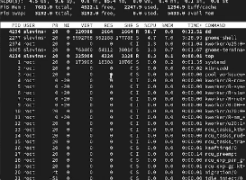
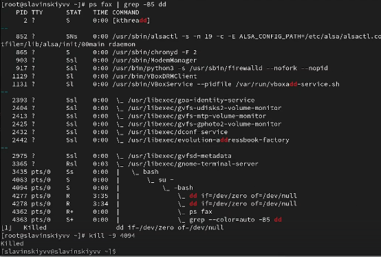
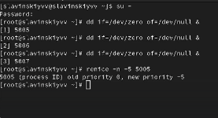
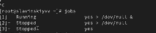

---
## Front matter
title: "Лабараторная работа №6"
subtitle: "Отчет"
author: "Славинский Владислав Вадимович"

## Generic otions
lang: ru-RU
toc-title: "Содержание"

## Bibliography
bibliography: bib/cite.bib
csl: pandoc/csl/gost-r-7-0-5-2008-numeric.csl

## Pdf output format
toc: true # Table of contents
toc-depth: 2
lof: true # List of figures
lot: true # List of tables
fontsize: 12pt
linestretch: 1.5
papersize: a4
documentclass: scrreprt
## I18n polyglossia
polyglossia-lang:
  name: russian
  options:
	- spelling=modern
	- babelshorthands=true
polyglossia-otherlangs:
  name: english
## I18n babel
babel-lang: russian
babel-otherlangs: english
## Fonts
mainfont: IBM Plex Serif
romanfont: IBM Plex Serif
sansfont: IBM Plex Sans
monofont: IBM Plex Mono
mathfont: STIX Two Math
mainfontoptions: Ligatures=Common,Ligatures=TeX,Scale=0.94
romanfontoptions: Ligatures=Common,Ligatures=TeX,Scale=0.94
sansfontoptions: Ligatures=Common,Ligatures=TeX,Scale=MatchLowercase,Scale=0.94
monofontoptions: Scale=MatchLowercase,Scale=0.94,FakeStretch=0.9
mathfontoptions:
## Biblatex
biblatex: true
biblio-style: "gost-numeric"
biblatexoptions:
  - parentracker=true
  - backend=biber
  - hyperref=auto
  - language=auto
  - autolang=other*
  - citestyle=gost-numeric
## Pandoc-crossref LaTeX customization
figureTitle: "Рис."
tableTitle: "Таблица"
listingTitle: "Листинг"
lofTitle: "Список иллюстраций"
lotTitle: "Список таблиц"
lolTitle: "Листинги"
## Misc options
indent: true
header-includes:
  - \usepackage{indentfirst}
  - \usepackage{float} # keep figures where there are in the text
  - \floatplacement{figure}{H} # keep figures where there are in the text
---

# Цель работы

Получить навыки управления процессами операционной системы.

# Выполнение лабораторной работы

В консоли перейдем в режим работы суперпользователя, используя команду su -. (рис. [-@fig:001])

{#fig:001 width=70%}

Введем следующие команды: sleep 3600 &, dd if=/dev/zero of=/dev/null & и sleep 7200(рис. [-@fig:002])

{#fig:002 width=70%}

Поскольку мы запустили последнюю команду без & у нас есть 2 часа, прежде чем мы снова получите контроль над оболочкой. Введем ctrl+z, чтобы остановить процесс. (рис. [-@fig:003])

{#fig:003 width=70%}

Введем команду jobs. Мы видим три процесса, которые мы запустили. Два первых процесса имеют статус running, а последний имеет статус stopped. (рис. [-@fig:004])
 
{#fig:004 width=70%}

Для продолжения выполнения задания 3 в фоновом режиме введем bg 3 и посмотрим статус через jobs. Видим, что состояние изменилось на running. (рис. [-@fig:005])

{#fig:005 width=70%}

Для перемещения задания 1 на передний план введем fg 1. После чего отменим задание через ctrl+c и посмотрим статус (рис. [-@fig:006])

{#fig:006 width=70%}

Проделаем то же самое с заданиями 2 и 3. (рис. [-@fig:007])

{#fig:007 width=70%}

Откроем второй терминал и под учётной записью своего пользователя введем в нём: dd if=/dev/zero of=/dev/null & и выйдем из него.(рис. [-@fig:008])

{#fig:008 width=70%}

На другом терминале под учётной записью своего пользователя запустим top. Видим, что задание dd все еще запущено. Выйдем из top через q.(рис. [-@fig:009])

{#fig:009 width=70%}

Вновь запустим top и с помощью k убьем задание dd. Потом выйдем из top с помощью q. (рис. [-@fig:010])

{#fig:010 width=70%}

Перейдем в режим суперпользователя и введем следующую команду 3 раза dd if=/dev/zero of=/dev/null &. (рис. [-@fig:011])

{#fig:011 width=70%}

Введем ps aux | grep dd. Это показывает все строки, в которых есть буквы dd. Запущенные процессы dd идут
последними. (рис. [-@fig:012])

{#fig:012 width=70%}

Используем PID одного из процессов dd, например 4276, чтобы изменить приоритет. Используем renice -n 5 <PID>. (рис. [-@fig:013])

{#fig:013 width=70%}

Введем ps fax | grep -B5 dd. Параметр -B5 показывает соответствующие запросу строки, включая пять строк до
этого. Поскольку ps fax показывает иерархию отношений между процессами, мы также увидим оболочку, из которой были запущены все процессы dd, и её PID.(рис. [-@fig:014])

{#fig:014 width=70%}

Найдем PID корневой оболочки (у нас значение 4094), из которой были запущены процессы dd, и введем kill -9 <PID>(рис. [-@fig:015])

{#fig:015 width=70%}

Введем три раза команду dd if=/dev/zero of=/dev/null. Нам нужно запустить команду как фоновое значение, поэтому в конце добавляем &.(рис. [-@fig:016])

{#fig:016 width=70%}

Увеличим приоритет одной из этих команд, используя значение приоритета −5. Введем команду renice -n -5 5005(рис. [-@fig:017])

{#fig:017 width=70%}

Изменим приоритет того же процесса ещё раз, но применим на этот раз значение −15. Разница в том, что при приоритете -15 процесс получает гораздо больше процессорного времени, чем при -5. Чем меньше значение, тем выше приоритет.(рис. [-@fig:018])

{#fig:018 width=70%}

Завершим все процессы dd, которые мы запустили.(рис. [-@fig:019])

{#fig:019 width=70%}

Запустим программу yes в фоновом режиме с подавлением потока вывода с помощью команды yes > /dev/null &.(рис. [-@fig:020])

{#fig:020 width=70%}

Запустим программу yes на переднем плане с подавлением потока вывода с помощью команды yes > /dev/null. Затем приостоновим программу через crtl+z. Потом заново запустим и завершим процесс через ctrl+c(рис. [-@fig:021])

{#fig:021 width=70%}

Запустим программу yes на переднем плане без подавления потока вывода. Дальше приостановим выполнение программы через ctrl+z. Потом снова её запустим и завершим через ctrl+c(рис. [-@fig:022])

{#fig:022 width=70%}

Проверим состояния заданий, воспользовавшись командой jobs.(рис. [-@fig:023])

{#fig:023 width=70%}

Переведем процесс, который у нас выполняется в фоновом режиме, на передний план, затем остановим его.(рис. [-@fig:024])

{#fig:024 width=70%}

Переведем второй процесс с подавлением потока вывода в фоновый режим.(рис. [-@fig:025])

{#fig:025 width=70%}

Проверим состояние заданий, воспользовавшись командой jobs. И видим, что второй процесс стал выполняться(рис. [-@fig:026])

{#fig:026 width=70%}

Запустим процесс в фоновом режиме таким образом, чтобы он продолжил свою работу даже после отключения от терминала.(рис. [-@fig:027])

{#fig:027 width=70%}

Закроем и откроем заново консоль. Убедимся, что процесс продолжил свою работу. Получим информацию с помощью утилиты top.(рис. [-@fig:028])

{#fig:028 width=70%}

Запустим ещё три программы yes в фоновом режиме с подавлением потока вывода..(рис. [-@fig:029])

{#fig:029 width=70%}

Убьем два процесса: для одного используйте его PID, а для другого — его идентификатор конкретного задания.(рис. [-@fig:030])

{#fig:030 width=70%}

Попробуем послать сигнал 1 (SIGHUP) процессу, запущенному с помощью nohup, и обычному процессу.(рис. [-@fig:031])

{#fig:031 width=70%}

Запустим ещё несколько программ yes в фоновом режиме с подавлением потока вывода.(рис. [-@fig:032])

{#fig:032 width=70%}

Завершим их работу одновременно, используя команду killall.(рис. [-@fig:033])

{#fig:033 width=70%}

Запустим программу yes в фоновом режиме с подавлением потока вывода. Используя утилиту nice, запустим программу yes с теми же параметрами и с приоритетом, большим на 5. Видим, что приоритеты у них разные.(рис. [-@fig:034])

{#fig:034 width=70%}

Используя утилиту renice, изменим приоритет у одного из потоков yes таким образом, чтобы у обоих потоков приоритеты были равны. Меняем приоритет у 7506  на 5 и получается, что приоритеты теперь равны.(рис. [-@fig:035])

{#fig:035 width=70%}

# Выводы

В ходе выполнения лабораторной работы были получены навыки управления процессами операционной системы.

# Ответы на контрольные вопросы

1.  jobs

2. ctrl+z, bg

3. ctrl+c

4. kill <PID>

5. ps fax

6. renice -n -5 1234 

7. killall -9 dd

8. killall mycommand

9. В интерфейсе top, чтобы убить процесс нужно нажать клавишу k.

10. nice -n  <value> mycommand
