---
## Front matter
lang: ru-RU
title: Управление журналами событий в системе
subtitle: Часть 1
author:
  - Славинский В.В.
institute:
  - Российский университет дружбы народов, Москва, Россия Россия
date: 18 октября 2025

## i18n babel
babel-lang: russian
babel-otherlangs: english

## Formatting pdf
toc: false
toc-title: Содержание
slide_level: 2
aspectratio: 169
section-titles: true
theme: metropolis
header-includes:
 - \metroset{progressbar=frametitle,sectionpage=progressbar,numbering=fraction}
---

# Информация

## Докладчик

:::::::::::::: {.columns align=center}
::: {.column width="70%"}

  * Славинский Владислав Вадимович
  * Студент
  * Российский университет дружбы народов
  * [1132246169@pfur.ru]

:::
::: {.column width="30%"}

# Вводная часть

## Переход в режим суперпользователя

Запустим три вкладки терминала и в каждом из них получим полномочия администратора

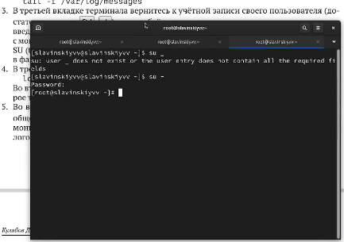

## Запуск мониторинга системных событий в реальном времени

На второй вкладке терминала запустим мониторинг системных событий в реальном времени: tail -f /var/log/messages.

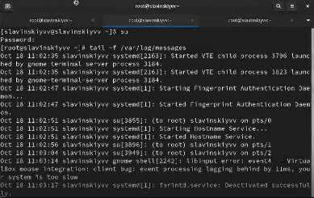

## Ввод неверого пароля

В третьей вкладке терминала вернемся к учётной записи своего пользователя. Попробуем войти в режим суперпользователя, но при этом введем неправильный пароль и посмотрим вторую вкладку терминала.

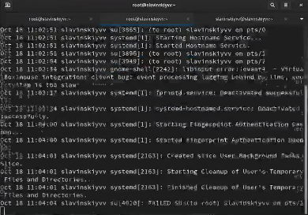

## Logger hello

В третьей вкладке терминала из оболочки пользователя введем logger hello.

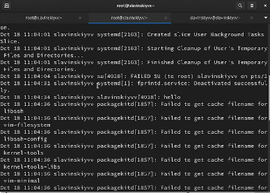

## Запуск мониторига сообщений безопасности

Во второй вкладке терминала с мониторингом остановите трассировку файла сообщений мониторинга реального времени, используя ctrl+c. Затем запустим мониторинг сообщений безопасности (последние 20 строк соответствующего файла логов): tail -n 20 /var/log/secure.

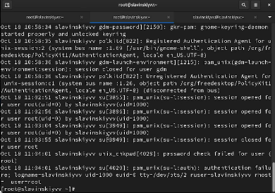

## Установка Apache

В первой вкладке терминала установим Apache: dnf -y install httpd.

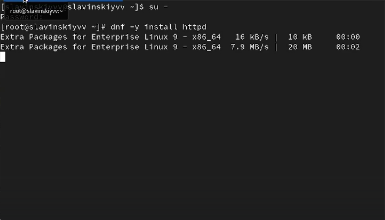

## Запуск веб-службы

После окончания процесса установки запустим веб-службу: systemctl start httpd, systemctl enable httpd.

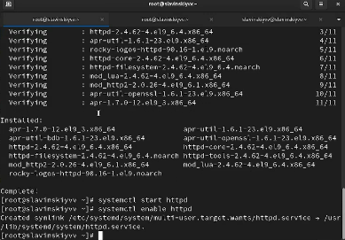

## Просмотр журнала с сообщениями об ошибках веб службы

Во второй вкладке терминала посмотрим журнал сообщений об ошибках веб-службы: tail -f /var/log/httpd/error_log.

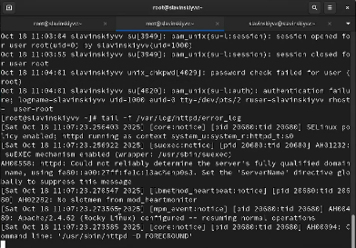

## Добавление строки в файле конфигурации

В третьей вкладке терминала получим полномочия администратора и в файле конфигурации /etc/httpd/conf/httpd.conf в конце добавим следующую строку: ErrorLog syslog:local1.

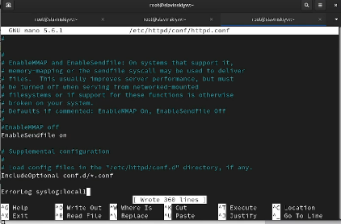

## Создание файла мониторига событий веб-службы

В каталоге /etc/rsyslog.d создадим файл мониторинга событий веб-службы:cd /etc/rsyslog.d, touch httpd.conf. Потом пропишем в нем local1.* -/var/log/httpd-error.log. Эта строка позволит отправлять все сообщения, получаемые для объекта local1 в файл /var/log/httpd-error.log.

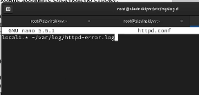

## Перезагрузка конфигурации rsyslogd и веб-службы

Перейдем в первую вкладку терминала и перезагрузите конфигурацию rsyslogd и веб-службу:systemctl restart rsyslog.service, systemctl restart httpd.

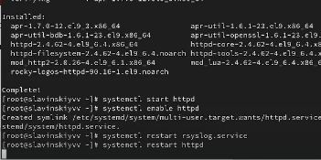

## Создание отдельного файла конфигурации для мониторинга отладочной информации

В третьей вкладке терминала создадим отдельный файл конфигурации для мониторинга отладочной информации: cd /etc/rsyslog.d, touch debug.conf. И в этом же терминале введем echo "*.debug /var/log/messages-debug" > /etc/rsyslog.d/debug.conf.

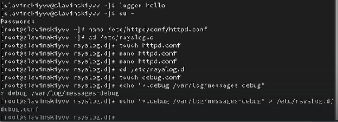

## Перезапуск rsyslog

В первой вкладке терминала снова перезапустим rsyslogd: systemctl restart rsyslog.service.

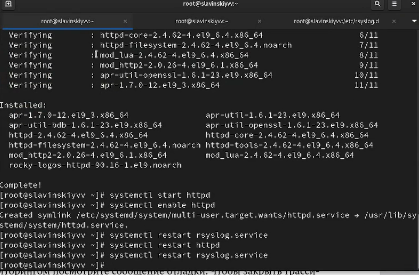

## Запуск мониторинга отладочной информации

Во второй вкладке терминала запустим мониторинг отладочной информации: tail -f /var/log/messages-debug.

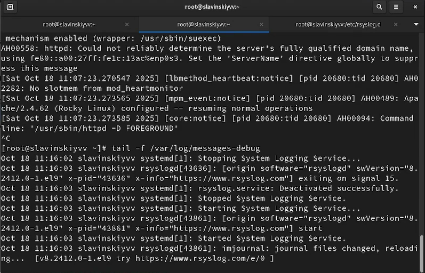

## Ввод команды

В третьей вкладке терминала введем: logger -p daemon.debug "Daemon Debug Message".

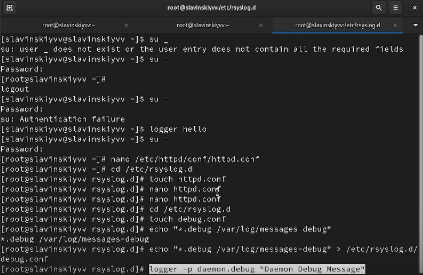

## Содержимое журнала с событиями с момента последнего запуска системы

Во второй вкладке терминала посмотрим содержимое журнала с событиями с момента последнего запуска системы: journalctl.

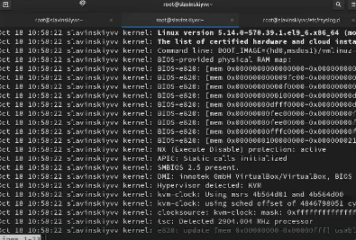

## Просмотр журнала без использования пейджера

Просмотр содержимого журнала без использования пейджера: journalctl --no-pager.

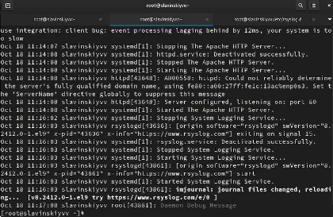

## Просмотр журнала в режиме реального времени

Режим просмотра журнала в реальном времени: journalctl -f.

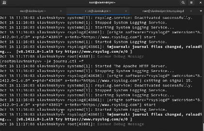

## Использование фильтрации просмотра конкретных параметров журнала

Для использования фильтрации просмотра конкретных параметров журнала введем journalctl и дважды нажмем клавишу tab.

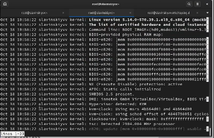

## Просмотр сыбтия для uid 0

Просмотрим события для UID0: journalctl _UID=0.

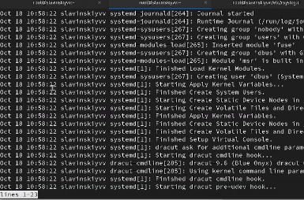

## Отображение последних 20 строк журнала

Для отображения последних 20 строк журнала введем: journalctl -n 20.

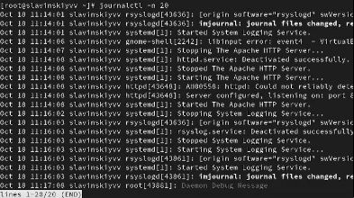

## Просмотр только сообщений об ошибках

Для просмотра только сообщений об ошибках введем: journalctl -p err.

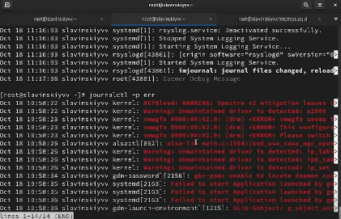

## Просмотр сообщений за определенный период времени

Если мы хотим просмотреть сообщения журнала, записанные за определённый период времени, мы можем  использовать параметры --since и --until. Введем например команду, для просмотра всех сообщений со вчерашнего дня через --since: journalctl --since yesterday.

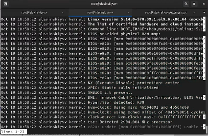

## Все сообщения с ошибкой приоритета

Если мы хотим показать все сообщения с ошибкой приоритета, которые были зафиксированы со вчерашнего дня, то мы используем: journalctl --since yesterday -p err.

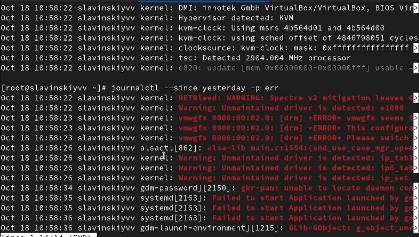

## Вывод детальной информации

Если нам нужна детальная информация, то будем использовать journalctl -o verbose.

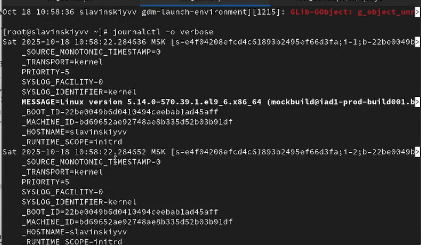

## Дополнительная информация о модуле sshd

Для просмотра дополнительной информации о модуле sshd введем: journalctl _SYSTEMD_UNIT=sshd.service.

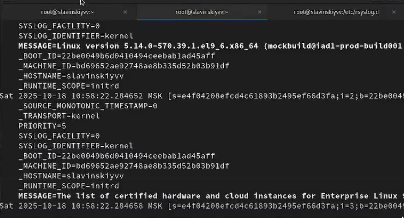

## Создание каталога для хранения записей журнала

Запустим терминал и получим полномочия администратора. Затем создадим каталог для хранения записей журнала: mkdir -p /var/log/journal.

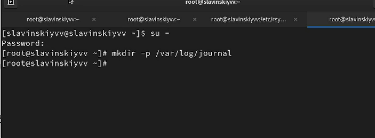

## Корректировка прав доступа

Скорректируем права доступа для каталога /var/log/journal, чтобы journald смог записывать в него информацию:chown root: systemd-journal /var/log/journal, chmod 2755 /var/log/journal.

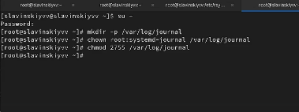

## Принятие изменений

Для принятия изменений нам необходимо или перезагрузить систему (перезапустить службу systemd-journald недостаточно), или использовать команду: killall -USR1 systemd-journald.

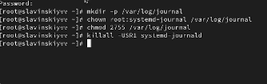

## Включение вывода сообщений после перезагрузки

Журнал systemd теперь постоянный. Если мы хотим видеть сообщения журнала с момента последней перезагрузки, то используем: journalctl -b.

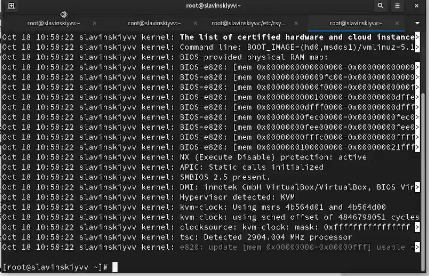

