---
## Front matter
title: "Лабараторная работа №7"
subtitle: "Отчет"
author: "Славинский Владислав Вадимович"

## Generic otions
lang: ru-RU
toc-title: "Содержание"

## Bibliography
bibliography: bib/cite.bib
csl: pandoc/csl/gost-r-7-0-5-2008-numeric.csl

## Pdf output format
toc: true # Table of contents
toc-depth: 2
lof: true # List of figures
lot: true # List of tables
fontsize: 12pt
linestretch: 1.5
papersize: a4
documentclass: scrreprt
## I18n polyglossia
polyglossia-lang:
  name: russian
  options:
	- spelling=modern
	- babelshorthands=true
polyglossia-otherlangs:
  name: english
## I18n babel
babel-lang: russian
babel-otherlangs: english
## Fonts
mainfont: IBM Plex Serif
romanfont: IBM Plex Serif
sansfont: IBM Plex Sans
monofont: IBM Plex Mono
mathfont: STIX Two Math
mainfontoptions: Ligatures=Common,Ligatures=TeX,Scale=0.94
romanfontoptions: Ligatures=Common,Ligatures=TeX,Scale=0.94
sansfontoptions: Ligatures=Common,Ligatures=TeX,Scale=MatchLowercase,Scale=0.94
monofontoptions: Scale=MatchLowercase,Scale=0.94,FakeStretch=0.9
mathfontoptions:
## Biblatex
biblatex: true
biblio-style: "gost-numeric"
biblatexoptions:
  - parentracker=true
  - backend=biber
  - hyperref=auto
  - language=auto
  - autolang=other*
  - citestyle=gost-numeric
## Pandoc-crossref LaTeX customization
figureTitle: "Рис."
tableTitle: "Таблица"
listingTitle: "Листинг"
lofTitle: "Список иллюстраций"
lotTitle: "Список таблиц"
lolTitle: "Листинги"
## Misc options
indent: true
header-includes:
  - \usepackage{indentfirst}
  - \usepackage{float} # keep figures where there are in the text
  - \floatplacement{figure}{H} # keep figures where there are in the text
---

# Цель работы

Получить навыки работы с журналами мониторинга различных событий в системе.

# Выполнение лабораторной работы

Запустим три вкладки терминала и в каждом из них получим полномочия администратора:. (рис. [-@fig:001])

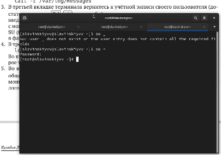{#fig:001 width=70%}

На второй вкладке терминала запустим мониторинг системных событий в реальном времени: tail -f /var/log/messages.(рис. [-@fig:002])

{#fig:002 width=70%}

В третьей вкладке терминала вернемся к учётной записи своего пользователя. Попробуем войти в режим суперпользователя, но при этом введем неправильный пароль и посмотрим вторую вкладку терминала. (рис. [-@fig:003])

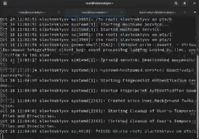{#fig:003 width=70%}

В третьей вкладке терминала из оболочки пользователя введем logger hello. (рис. [-@fig:004])
 
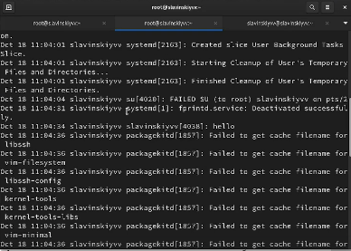{#fig:004 width=70%}

Во второй вкладке терминала с мониторингом остановите трассировку файла сообщений мониторинга реального времени, используя ctrl+c. Затем запустим мониторинг сообщений безопасности (последние 20 строк соответствующего файла логов): tail -n 20 /var/log/secure. (рис. [-@fig:005])

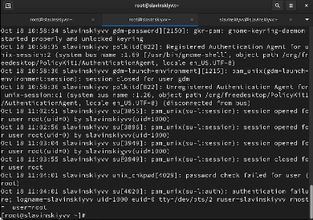{#fig:005 width=70%}

В первой вкладке терминала установим Apache: dnf -y install httpd (рис. [-@fig:006])

{#fig:006 width=70%}

После окончания процесса установки запустим веб-службу: systemctl start httpd, systemctl enable httpd. (рис. [-@fig:007])

{#fig:007 width=70%}

Во второй вкладке терминала посмотрим журнал сообщений об ошибках веб-службы: tail -f /var/log/httpd/error_log.(рис. [-@fig:008])

{#fig:008 width=70%}

В третьей вкладке терминала получим полномочия администратора и в файле конфигурации /etc/httpd/conf/httpd.conf в конце добавим следующую строку: ErrorLog syslog:local1.(рис. [-@fig:009])

{#fig:009 width=70%}

В каталоге /etc/rsyslog.d создадим файл мониторинга событий веб-службы:cd /etc/rsyslog.d, touch httpd.conf. Потом пропишем в нем local1.* -/var/log/httpd-error.log. Эта строка позволит отправлять все сообщения, получаемые для объекта local1 в файл /var/log/httpd-error.log. (рис. [-@fig:010])

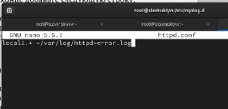{#fig:010 width=70%}

Перейдем в первую вкладку терминала и перезагрузите конфигурацию rsyslogd и веб-службу:systemctl restart rsyslog.service, systemctl restart httpd. (рис. [-@fig:011])

{#fig:011 width=70%}

В третьей вкладке терминала создадим отдельный файл конфигурации для мониторинга отладочной информации: cd /etc/rsyslog.d, touch debug.conf. И в этом же терминале введем echo "*.debug /var/log/messages-debug" > /etc/rsyslog.d/debug.conf. (рис. [-@fig:012])

{#fig:012 width=70%}

В первой вкладке терминала снова перезапустим rsyslogd: systemctl restart rsyslog.service. (рис. [-@fig:013])

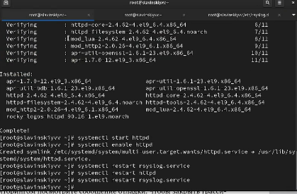{#fig:013 width=70%}

Во второй вкладке терминала запустим мониторинг отладочной информации: tail -f /var/log/messages-debug.(рис. [-@fig:014])

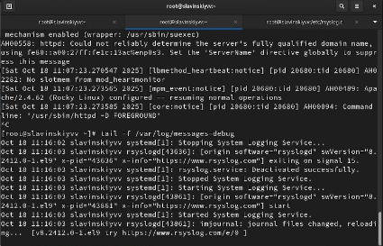{#fig:014 width=70%}

В третьей вкладке терминала введем: logger -p daemon.debug "Daemon Debug Message".(рис. [-@fig:015])

{#fig:015 width=70%}

Во второй вкладке терминала посмотрим содержимое журнала с событиями с момента последнего запуска системы: journalctl.(рис. [-@fig:016])

{#fig:016 width=70%}

Просмотр содержимого журнала без использования пейджера: journalctl --no-pager.(рис. [-@fig:017])

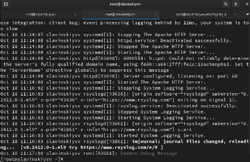{#fig:017 width=70%}

Режим просмотра журнала в реальном времени: journalctl -f.(рис. [-@fig:018])

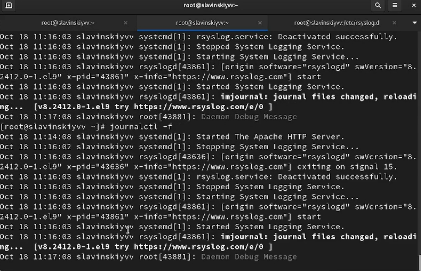{#fig:018 width=70%}

Для использования фильтрации просмотра конкретных параметров журнала введем journalctl и дважды нажмем клавишу tab.(рис. [-@fig:019])

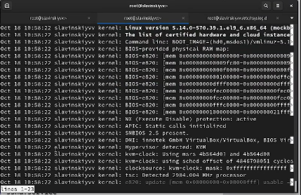{#fig:019 width=70%}

Просмотрим события для UID0: journalctl _UID=0.(рис. [-@fig:020])

{#fig:020 width=70%}

Для отображения последних 20 строк журнала введем: journalctl -n 20.(рис. [-@fig:021])

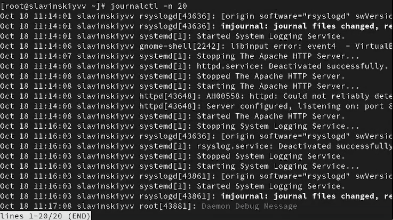{#fig:021 width=70%}

Для просмотра только сообщений об ошибках введем: journalctl -p err.(рис. [-@fig:022])

{#fig:022 width=70%}

Если мы хотим просмотреть сообщения журнала, записанные за определённый период времени, мы можем  использовать параметры --since и --until. Введем например команду, для просмотра всех сообщений со вчерашнего дня через --since: journalctl --since yesterday.(рис. [-@fig:023])

{#fig:023 width=70%}

Если мы хотим показать все сообщения с ошибкой приоритета, которые были зафик-
сированы со вчерашнего дня, то мы используем: journalctl --since yesterday -p err.(рис. [-@fig:024])

{#fig:024 width=70%}

Если нам нужна детальная информация, то будем использовать journalctl -o verbose.(рис. [-@fig:025])

{#fig:025 width=70%}

Для просмотра дополнительной информации о модуле sshd введем: journalctl _SYSTEMD_UNIT=sshd.service(рис. [-@fig:026])

{#fig:026 width=70%}

Запустим терминал и получим полномочия администратора. Затем создадим каталог для хранения записей журнала: mkdir -p /var/log/journal.(рис. [-@fig:027])

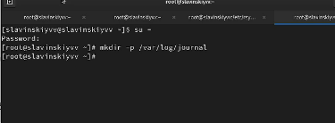{#fig:027 width=70%}

Скорректируем права доступа для каталога /var/log/journal, чтобы journald смог записывать в него информацию:chown root: systemd-journal /var/log/journal, chmod 2755 /var/log/journal.(рис. [-@fig:028])

{#fig:028 width=70%}

Для принятия изменений нам необходимо или перезагрузить систему (перезапустить службу systemd-journald недостаточно), или использовать команду: killall -USR1 systemd-journald.(рис. [-@fig:029])

{#fig:029 width=70%}

Журнал systemd теперь постоянный. Если мы хотим видеть сообщения журнала с момента последней перезагрузки, то используем: journalctl -b.(рис. [-@fig:030])

{#fig:030 width=70%}

# Выводы

В ходе выполнения лабораторной работы были получены навыки работы с журналами мониторинга различных событий в системе.

# Ответы на контрольные вопросы

1.  /etc/rsyslog.conf

2. /var/log/secure

3. Еженедельная ротация

4. *.info /var/log/messages

5.  tail -f - для rsyslog, а для journald journalctl -f

6. journal ctl --since "09:00:00" --until "15:00:00"

7. journalctl -b

8. mkdir -p /var/log/journal, chown root:systemd-journal /var/log/journal, chmod 2755 /var/log/journal, killall -USR1 systemd-journald

