---
## Front matter
lang: ru-RU
title: Планировщики событий
subtitle: Часть 1
author:
  - Славинский В.В.
institute:
  - Российский университет дружбы народов, Москва, Россия Россия
date: 25 октября 2025

## i18n babel
babel-lang: russian
babel-otherlangs: english

## Formatting pdf
toc: false
toc-title: Содержание
slide_level: 2
aspectratio: 169
section-titles: true
theme: metropolis
header-includes:
 - \metroset{progressbar=frametitle,sectionpage=progressbar,numbering=fraction}
---

# Информация

## Докладчик

:::::::::::::: {.columns align=center}
::: {.column width="70%"}

  * Славинский Владислав Вадимович
  * Студент
  * Российский университет дружбы народов
  * [1132246169@pfur.ru]

:::
::: {.column width="30%"}

# Вводная часть

## Переход в режим суперпользователя

Запустим терминал и получим полномочия администратора.

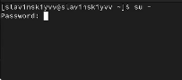

## Проверка статуса crond

Посмотрим статус демона crond: systemctl status crond -l. Как видим, служба активна.

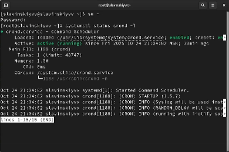

## Содержимое файла конфигурации

Посмотрим содержимое файла конфигурации /etc/crontab: cat /etc/crontab. В файле нам показаны несколько переменных окрежения такие как SHELL, PATH, MAILTO, и приведены примеры расписаний для задач, которые выполняется ежечасно, ежедневно, еженедельно, ежемесячно.

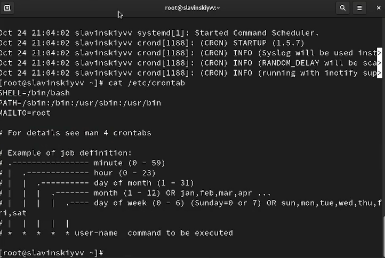

## Список заданий

Посмотрим список заданий в расписании: crontab -l. И замечаем, что у нас пусто, так как расписание еще не задано.

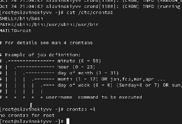

## Редактирование файла расписания

Откроем файл расписания на редактирование (crontab -e) и введем в нем слудующую команду: */1 * * * * logger This message is written from root cron. Синтаксис записи в crontab у нас таков: минута, час, день месяца, месяц, день недели. В нашем случае */1 - это выполнение каждую минуту, а * просто каждый, т.е. каждый час, каждый день и т.д.

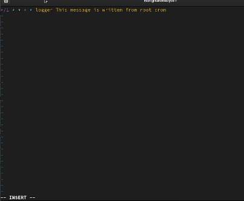

## Проверка списка заданий в расписании

Посмотрим список заданий в расписании: crontab -l. В расписании у нас появилась запись о запланированном событии.

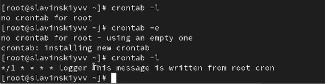

## Журнал системных событий

Теперь оставим нашу систему на 2-3 минуты и потом посмотрим журнал системных событий: grep written /var/log/messages. И как видим, у нас повторяются записи в журнале с интервалом в 1 минуту.

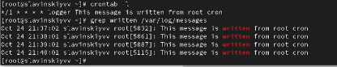

## Новая запись

Изменим запись в расписании crontab на следующую: 0 */1 * * 1-5 logger This message is written from root cron. В этом же случае при 0 будет просиходить выполнение в нулевю минуту каждого часа, */1 - это выполнение каждый час, а 1-5 это выполнение с понедельника по пятницу.

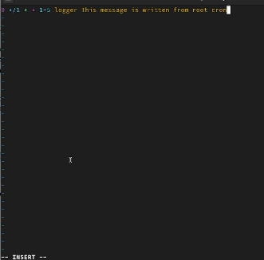

## Просмотр списка заданий в расписании

Посмотрим список заданий в расписании: crontab -l.

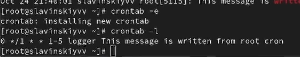

## Создание сценария eachhour

Перейдем в каталог /etc/cron.hourly и создадим в нём файл сценария с именем eachhour: cd /etc/cron.hourly, touch eachhour.

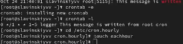

## Редактирование eachhour

Откроем eachhour для редактирования и пропишем в нем: #!/bin/sh, logger This message is written at $(date).

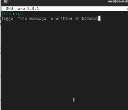

## Становление файла eachour испольняемым

Сделаем файл сценария eachhour исполняемым: chmod +x eachhour.

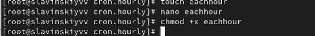

## Создание файла с расписанием в каталоге /etc/crond.d

Перейдем в каталог /etc/crond.d и создадим в нём файл с расписанием eachhour: cd /etc/cron.d, touch eachhour.

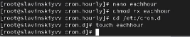

## Редактирование eachhour в cron.d

Откроем файл для редактировани и пропишем следующее: 11 * * * * root logger This message is written from /etc/cron.d. Здесь же у нас будет выполняться в 11-ую минуту каждого часа и будет выполняться каждый час, каждый день, каждый месяц и каждый день недели.

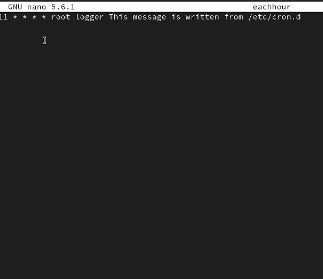

## Журнал системных событий

Теперь оставим нашу систему на 2 часа и потом посмотрим в журнал системных событий: grep written /var/log/messages. И видим, что запуск сценария eachhour был осуществлен, так как мы видим, что у нас есть записи, сгенерированные сценарием eachhour: is written at Fri Oct 24 10:01:01 PM MSK 2025. 

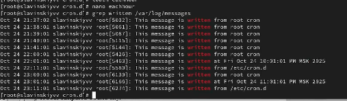

## Проверка службы atd

Проверим, что служба atd загружена и включена: systemctl status atd. Как видим, все работает.

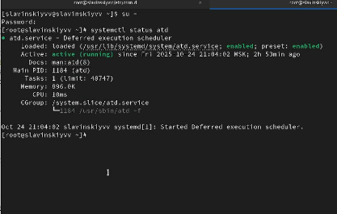

## Настройка выполнения команды

Зададим выполнение команды logger message from at в 23:59. Далее введем logger message from at и используем ctrl+d для закрытия оболочки.

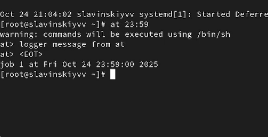

## Проверка запланировано ли задание

Проверяем, что задание запланировано: atq. Видим, что оно запланировано.

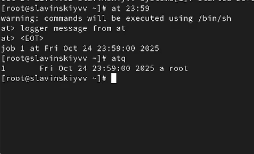

## Проверка сообщения

И в 23:59 вводим команду grep 'from at' /var/log/messages, чтобы проверить, появилось ли сообщение в нужное нам время. И как видим, у нас все работает.

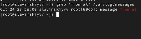

