---
## Front matter
title: "Лабараторная работа №8"
subtitle: "Отчет"
author: "Славинский Владислав Вадимович"

## Generic otions
lang: ru-RU
toc-title: "Содержание"

## Bibliography
bibliography: bib/cite.bib
csl: pandoc/csl/gost-r-7-0-5-2008-numeric.csl

## Pdf output format
toc: true # Table of contents
toc-depth: 2
lof: true # List of figures
lot: true # List of tables
fontsize: 12pt
linestretch: 1.5
papersize: a4
documentclass: scrreprt
## I18n polyglossia
polyglossia-lang:
  name: russian
  options:
	- spelling=modern
	- babelshorthands=true
polyglossia-otherlangs:
  name: english
## I18n babel
babel-lang: russian
babel-otherlangs: english
## Fonts
mainfont: IBM Plex Serif
romanfont: IBM Plex Serif
sansfont: IBM Plex Sans
monofont: IBM Plex Mono
mathfont: STIX Two Math
mainfontoptions: Ligatures=Common,Ligatures=TeX,Scale=0.94
romanfontoptions: Ligatures=Common,Ligatures=TeX,Scale=0.94
sansfontoptions: Ligatures=Common,Ligatures=TeX,Scale=MatchLowercase,Scale=0.94
monofontoptions: Scale=MatchLowercase,Scale=0.94,FakeStretch=0.9
mathfontoptions:
## Biblatex
biblatex: true
biblio-style: "gost-numeric"
biblatexoptions:
  - parentracker=true
  - backend=biber
  - hyperref=auto
  - language=auto
  - autolang=other*
  - citestyle=gost-numeric
## Pandoc-crossref LaTeX customization
figureTitle: "Рис."
tableTitle: "Таблица"
listingTitle: "Листинг"
lofTitle: "Список иллюстраций"
lotTitle: "Список таблиц"
lolTitle: "Листинги"
## Misc options
indent: true
header-includes:
  - \usepackage{indentfirst}
  - \usepackage{float} # keep figures where there are in the text
  - \floatplacement{figure}{H} # keep figures where there are in the text
---

# Цель работы

Получить навыки работы с планировщиками событий cron и at.

# Выполнение лабораторной работы

Запустим терминал и получим полномочия администратора. (рис. [-@fig:001])

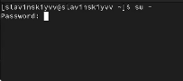{#fig:001 width=70%}

Посмотрим статус демона crond: systemctl status crond -l. Как видим, служба активна.(рис. [-@fig:002])

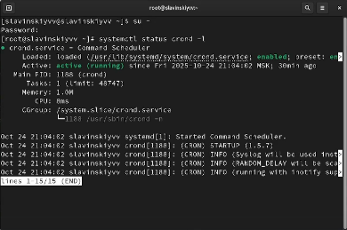{#fig:002 width=70%}

Посмотрим содержимое файла конфигурации /etc/crontab: cat /etc/crontab. В файле нам показаны несколько переменных окрежения такие как SHELL, PATH, MAILTO, и приведены примеры расписаний для задач, которые выполняется ежечасно, ежедневно, еженедельно, ежемесячно. (рис. [-@fig:003])

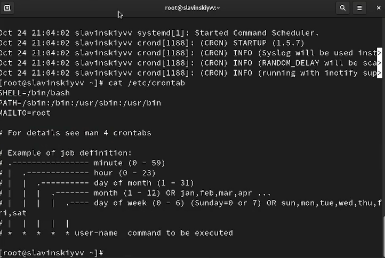{#fig:003 width=70%}

Посмотрим список заданий в расписании: crontab -l. И замечаем, что у нас пусто, так как расписание еще не задано. (рис. [-@fig:004])
 
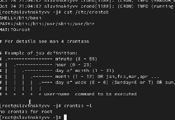{#fig:004 width=70%}

Откроем файл расписания на редактирование (crontab -e) и введем в нем слудующую команду: */1 * * * * logger This message is written from root cron. Синтаксис записи в crontab у нас таков: минута, час, день месяца, месяц, день недели. В нашем случае */1 - это выполнение каждую минуту, а * просто каждый, т.е. каждый час, каждый день и т.д. (рис. [-@fig:005])

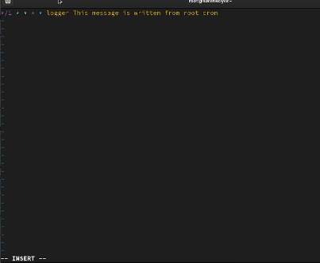{#fig:005 width=70%}

Посмотрим список заданий в расписании: crontab -l. В расписании у нас появилась запись о запланированном событии. (рис. [-@fig:006])

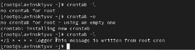{#fig:006 width=70%}

Теперь оставим нашу систему на 2-3 минуты и потом посмотрим журнал системных событий: grep written /var/log/messages. И как видим, у нас повторяются записи в журнале с интервалом в 1 минуту. (рис. [-@fig:007])

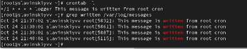{#fig:007 width=70%}

Изменим запись в расписании crontab на следующую: 0 */1 * * 1-5 logger This message is written from root cron. В этом же случае при 0 будет просиходить выполнение в нулевю минуту каждого часа, */1 - это выполнение каждый час, а 1-5 это выполнение с понедельника по пятницу.(рис. [-@fig:008])

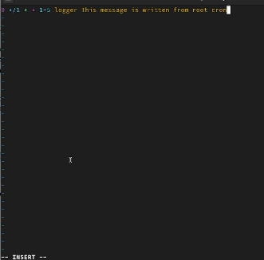{#fig:008 width=70%}

Посмотрим список заданий в расписании: crontab -l.(рис. [-@fig:009])

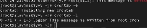{#fig:009 width=70%}

Перейдем в каталог /etc/cron.hourly и создадим в нём файл сценария с именем eachhour: cd /etc/cron.hourly, touch eachhour. (рис. [-@fig:010])

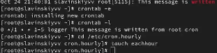{#fig:010 width=70%}

Откроем eachhour для редактирования и пропишем в нем: #!/bin/sh, logger This message is written at $(date). (рис. [-@fig:011])

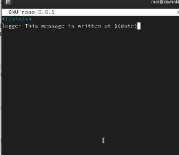{#fig:011 width=70%}

Сделаем файл сценария eachhour исполняемым: chmod +x eachhour. (рис. [-@fig:012])

{#fig:012 width=70%}

Перейдем в каталог /etc/crond.d и создадим в нём файл с расписанием eachhour: cd /etc/cron.d, touch eachhour. (рис. [-@fig:013])

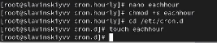{#fig:013 width=70%}

Откроем файл для редактировани и пропишем следующее: 11 * * * * root logger This message is written from /etc/cron.d. Здесь же у нас будет выполняться в 11-ую минуту каждого часа и будет выполняться каждый час, каждый день, каждый месяц и каждый день недели.(рис. [-@fig:014])

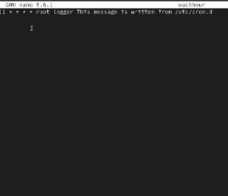{#fig:014 width=70%}

Теперь оставим нашу систему на 2 часа и потом посмотрим в журнал системных событий: grep written /var/log/messages. И видим, что запуск сценария eachhour был осуществлен, так как мы видим, что у нас есть записи, сгенерированные сценарием eachhour: is written at Fri Oct 24 10:01:01 PM MSK 2025.  (рис. [-@fig:015])

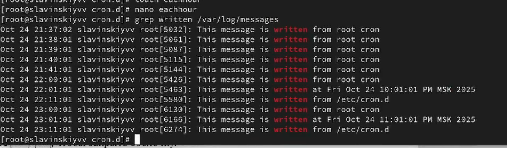{#fig:015 width=70%}

Проверим, что служба atd загружена и включена: systemctl status atd. Как видим, все работает.(рис. [-@fig:016])

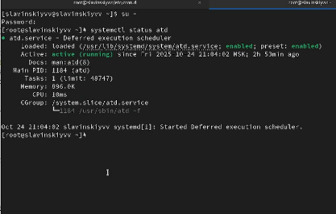{#fig:016 width=70%}

Зададим выполнение команды logger message from at в 23:59. Далее введем logger message from at и используем ctrl+d для закрытия оболочки.(рис. [-@fig:017])

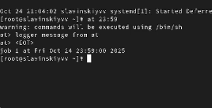{#fig:017 width=70%}

Проверяем, что задание запланировано: atq. Видим, что оно запланировано.(рис. [-@fig:018])

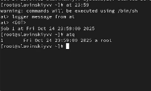{#fig:018 width=70%}

И в 23:59 вводим команду grep 'from at' /var/log/messages, чтобы проверить, появилось ли сообщение в нужное нам время. И как видим, у нас все работает.(рис. [-@fig:019])

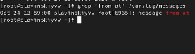{#fig:019 width=70%}

# Выводы

В ходе выполнения лабораторной работы были получены навыки работы с планировщиками событий cron и at.

# Ответы на контрольные вопросы

1.  0 0 1,15 * * выполнение 1-ого и 15-го числа каждый месяц

2.  0 2 1,15 * * нулевая минута, 2:00 ночи, 1,15 числа месяца, любой месяц, любой день недели

3.  */2 * * * * каждые две минуты	

4.  0 0 19 9 * в 00:00, 19-ое число, сентабрь, любой день недели

5.  0 0 * 9 4 в 00:00, каждый день месяца, сентябрь, четверг

6. crontab -u alice -e, 0 9 * * 1-5 /home/scripts/daily_report.sh, crontab -u alice -l (рис. [-@fig:020])

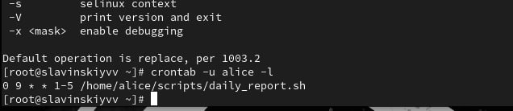{#fig:020 width=70%}
