---
## Front matter
lang: ru-RU
title: Управление SELinux
subtitle: Часть 1
author:
  - Славинский В.В.
institute:
  - Российский университет дружбы народов, Москва, Россия Россия
date: 1 ноября 2025

## i18n babel
babel-lang: russian
babel-otherlangs: english

## Formatting pdf
toc: false
toc-title: Содержание
slide_level: 2
aspectratio: 169
section-titles: true
theme: metropolis
header-includes:
 - \metroset{progressbar=frametitle,sectionpage=progressbar,numbering=fraction}
---

# Информация

## Докладчик

:::::::::::::: {.columns align=center}
::: {.column width="70%"}

  * Славинский Владислав Вадимович
  * Студент
  * Российский университет дружбы народов
  * [1132246169@pfur.ru]

:::
::: {.column width="30%"}

# Вводная часть

## Просмотр информации о состоянии SELinux с помощью root прав

Запускаем терминал в режиме суперпользователя через su - и просмотрим текущую информацию о состоянии SELinux: sestatus -v. 1) SELinux status: enabled - это строчка означает, что SELinux активирован. 2) SELinux mount - SELinux смонтирована в каталоге /sys/fs/selinux, SELinux root directory - корневой каталог конфигурации SELinux находится в /etc/selinux, 3) Loaded policy name - загружена политика безопасности типа targeted, которая защищает только определенные системные процессы, 4) Current mode: enforcing - принудительный режим работы, SELinux активно блокирует действия, нарушающие политику безопасности,  5) Mode from config file: enforcing - режим конфигурационного файла установлен как enforcing, что означает сохранение этого режима после перезагрузки, 6) Policy MLS status: enabled - поддержка многоуровневой безопасности активирована (Multi-Level-Security), 7) Policy deny_unknown status: allowed - неизвестные действия по умолчанию разрешены, 8) Memory protection checking: actual (secure) - проверка защиты памяти выполнеяется на безопасном уровне, 9) Max kernel policy version: 33 - максимальная поддерживаемая версия политики ядра 33, 10) Current context - Текущий процесс (терминал) работает в неограниченном контексте с высоким уровнем привелегий, 11) Init context - процесс init (родительский процесс системы) работает в соответствующем контексте, 12) /usr/sbin/sshd - SSH демон работает в правильном контексте безопасности для SSH службы, 13) /etc/passwd, /etc/shadow - имеют правильные контексты для файлов с паролями, 14) /bin/bash, /bin/login - имеют контексты исполняемых файлов оболочки и входа в систему, 15) /sbin/agetty, /sbin/init - имеют соответствующие контексты для системных служб, 16) /usr/sbin/sshd - имеет правильный контекст для SSH демона.

## Режим работы SELinux

Посмотрим, в каком режиме работает SELinux: getenforce. Видим, что работает в режиме enforcing (в режиме принудительного исполнения.

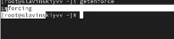

## Изменения режима работы

Изменим режим работы SELinux на разрешающий (Permissive): setenforce 0. Потом введем снова getenforce.

## Изменение файла и перезапуск системы

В файле /etc/sysconfig/selinux с помощью редактора установим SELINUX=disabled и перезапустим систему.

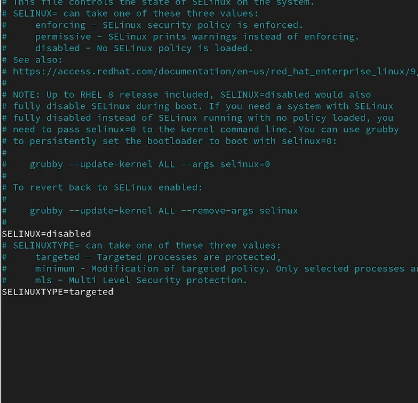

## Перезагрузки и проверка статуса SELinux

После перезагрузки запустим терминал и получим полномочия администратора.Посмотрим статус SELinux: getenforce. Мы видим, что SELinux теперь отключён.

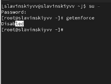

## Попытка переключить режим работы SELinux

Попробуем переключить режим работы SELinux: setenforce 1. Мы не можем переключаться между отключённым и принудительным режимом без перезагрузки системы

## Редактирование файла и перезагрузка системы

Откроем файл /etc/sysconfig/selinux с помощью редактора и установим: SELINUX=enforcing. Затем перезагрузим систему.

## Перезагрузка системы

Во время загрузки системы мы  получаем предупреждающее сообщение (Relabeling could take a very long time) о необходимости восстановления меток SELinux,  это  занимает некоторое время, а также труебется дополнительная перезагрузка системы.

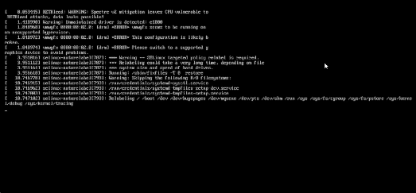

## Проверка статуса

После перезагрузки в терминале с полномочиями администратора просмотрим текущую информацию о состоянии SELinux: sestatus -v. Видим, что система работает в режиме enforcing.

## Просмотр контекста безопасности файла

Запустим терминал и получим полномочия администратора. Затем посмотрим контекст безопасности файла /etc/hosts: ls -Z /etc/hosts. Видим, что присутствует метка net_conf_t, что указывает на тип файла сетевой конфигурации.

## Копирование файла в домашний каталог

Скопируем файл /etc/hosts в домашний каталог: cp /etc/hosts ~/, проверим контекст файла ~/hosts: ls -Z ~/hosts. Поскольку копирование считается созданием нового файла, то параметр контекста в файле ~/hosts, расположенном в домашнем каталоге, станет admin_home_t. 

## Перезапись файла из домашнего каталога

Попытаемся перезаписать существующий файл hosts из домашнего каталога в каталог /etc: mv ~/hosts /etc. И убедимся, что что тип контекста по-прежнему установлен на admin_home_t: ls -Z /etc/hosts.

## Исправление конекста безопасности

Исправим контекст безопасности: restorecon -v /etc/hosts. Опция -v покажет нам процесс изменения. И проверим, что что тип контекста изменился: ls -Z /etc/hosts.

## Массовое исправление контекста безопасности

Для массового исправления контекста безопасности на файловой системе введем touch /.autorelabel и перезагрузим систему. Во время перезапуска нажмем клавишу esc  чтобы мы увидели загрузочные сообщения.

## Перемаркированные сообщения на перезагрузке

Вот какие сообщения выводятся при перезагрузке.

## Установка ПО

Запустим терминал в режиме администратора. Затем установим необходимое программное обеспечение: dnf -y install httpd, dnf -y install lynx.

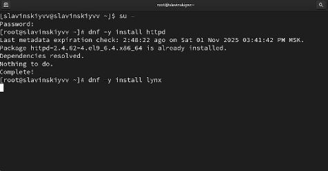

## Создание нового хранилища для файлов web-сервера

Создадим новое хранилище для файлов web-сервера: mkdir /web. Создадим файл index.html в каталоге с контентом веб-сервера: cd /web, touch index.html.

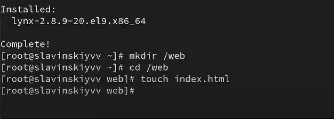

## Вставка текста

Поместим в этот файл следующий текст: Welcome to my web-server.

## Редактирование файла httpd.conf

В файле /etc/httpd/conf/httpd.conf закомментируем строку DocumentRoot "/var/www/html" и ниже добавим строку DocumentRoot "/web".

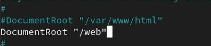

## Редактирование файла httpd.conf

Затем в этом же файле ниже закомментируем раздел
<Directory "/var/www">
AllowOverride None
Require all granted
</Directory>
и добавим следующий раздел, определяющий правила доступа:
<Directory "/web">
AllowOverride None
Require all granted
</Directory>.

## Запуск веб-сервера и службы

Запустим веб-сервер и службу httpd: systemctl start httpd, systemctl enable httpd.

## Запуск

В терминале под учётной записью своего пользователя при обращении к веб-серверу
в текстовом браузере lynx введем: lynx http://localhost. Мы увидим веб-страницу Red Hat по умолчанию, а не содержимое только что созданного файла index.html.

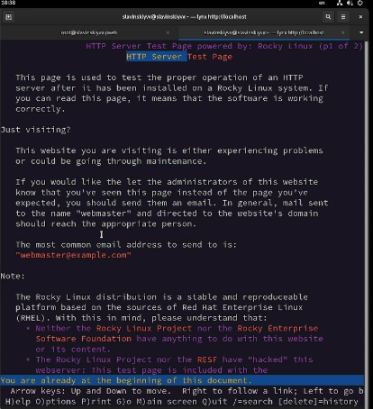

## Применение новой метки контекста

В терминале с полномочиями администратора применим новую метку контекста к /web: semanage fcontext -a -t httpd_sys_content_t "/web(/.*)?".

## Восстановление контекста безопасности

Восстановим контекст безопасности: restorecon -R -v /web.

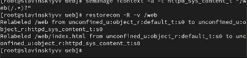

## Проверка веб-сервера

В терминале под учётной записью своего пользователя снова обратимся к веб-серверу: lynx http://localhost. У нас ничего не произошло. Значит перезапускаем систему и опять обращаемся к веб-серверу. Как видим, у нас все получилось.

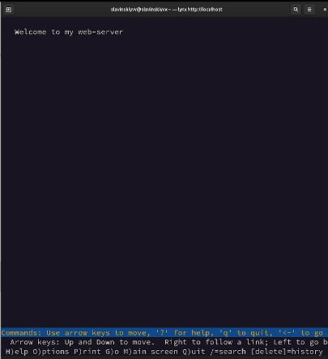

## Список переключателей SELinux

Через полномочия администратора посмотрим список переключателей SELinux для службы ftp: getsebool -a | grep ftp.

## Список переключателей

Для службы ftpd_anon посмотрим список переключателей: semanage boolean -l | grep ftpd_anon. Первое значение off - текущее состояние выполнение времени, второе значение off - постоянное состояние. Ftpd_anon_write  разрешает или запрещает анонимным пользователям FTP выполнять операции записи.

## Изменения значения переключателя

Изменим текущее значение переключателя для службы ftpd_anon_write с off на on: setsebool ftpd_anon_write on. Повторно посмотрим список переключателей SELinux для службы ftpd_anon_write: getsebool ftpd_anon_write.

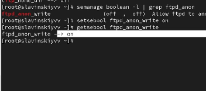

## Просмотр списка переключателей

Посмотрим список переключателей: semanage boolean -l | grep ftpd_anon. Видим, что настройка времени выполнения включена, но постоянная настройка выключена.

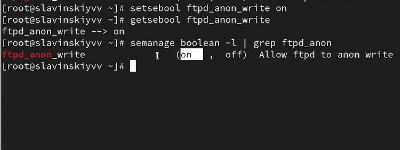

## Изменение постоянного значения переключателя

Изменим постоянное значение переключателя для службы ftpd_anon_write с off на on: setsebool -P ftpd_anon_write on. Посмотрим список переключателей: semanage boolean -l | grep ftpd_anon. Теперь у нас fttpd_anon_write полностью включен. Оба значения установлены на on: 1) включены состояние во время выполнения и постоянное состояние после перезагрузки. Теперь анонимные пользователи FTP могут выполнять операции записи на сервер.

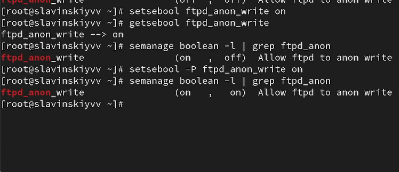

