---
## Front matter
title: "Лабараторная работа №9"
subtitle: "Отчет"
author: "Славинский Владислав Вадимович"

## Generic otions
lang: ru-RU
toc-title: "Содержание"

## Bibliography
bibliography: bib/cite.bib
csl: pandoc/csl/gost-r-7-0-5-2008-numeric.csl

## Pdf output format
toc: true # Table of contents
toc-depth: 2
lof: true # List of figures
lot: true # List of tables
fontsize: 12pt
linestretch: 1.5
papersize: a4
documentclass: scrreprt
## I18n polyglossia
polyglossia-lang:
  name: russian
  options:
	- spelling=modern
	- babelshorthands=true
polyglossia-otherlangs:
  name: english
## I18n babel
babel-lang: russian
babel-otherlangs: english
## Fonts
mainfont: IBM Plex Serif
romanfont: IBM Plex Serif
sansfont: IBM Plex Sans
monofont: IBM Plex Mono
mathfont: STIX Two Math
mainfontoptions: Ligatures=Common,Ligatures=TeX,Scale=0.94
romanfontoptions: Ligatures=Common,Ligatures=TeX,Scale=0.94
sansfontoptions: Ligatures=Common,Ligatures=TeX,Scale=MatchLowercase,Scale=0.94
monofontoptions: Scale=MatchLowercase,Scale=0.94,FakeStretch=0.9
mathfontoptions:
## Biblatex
biblatex: true
biblio-style: "gost-numeric"
biblatexoptions:
  - parentracker=true
  - backend=biber
  - hyperref=auto
  - language=auto
  - autolang=other*
  - citestyle=gost-numeric
## Pandoc-crossref LaTeX customization
figureTitle: "Рис."
tableTitle: "Таблица"
listingTitle: "Листинг"
lofTitle: "Список иллюстраций"
lotTitle: "Список таблиц"
lolTitle: "Листинги"
## Misc options
indent: true
header-includes:
  - \usepackage{indentfirst}
  - \usepackage{float} # keep figures where there are in the text
  - \floatplacement{figure}{H} # keep figures where there are in the text
---

# Цель работы

Получить навыки работы с контекстом безопасности и политиками SELinux.

# Выполнение лабораторной работы

Запускаем терминал в режиме суперпользователя через su - и просмотрим текущую информацию о состоянии SELinux: sestatus -v. 1) SELinux status: enabled - это строчка означает, что SELinux активирован. 2) SELinux mount - SELinux смонтирована в каталоге /sys/fs/selinux, SELinux root directory - корневой каталог конфигурации SELinux находится в /etc/selinux, 3) Loaded policy name - загружена политика безопасности типа targeted, которая защищает только определенные системные процессы, 4) Current mode: enforcing - принудительный режим работы, SELinux активно блокирует действия, нарушающие политику безопасности,  5) Mode from config file: enforcing - режим конфигурационного файла установлен как enforcing, что означает сохранение этого режима после перезагрузки, 6) Policy MLS status: enabled - поддержка многоуровневой безопасности активирована (Multi-Level-Security), 7) Policy deny_unknown status: allowed - неизвестные действия по умолчанию разрешены, 8) Memory protection checking: actual (secure) - проверка защиты памяти выполнеяется на безопасном уровне, 9) Max kernel policy version: 33 - максимальная поддерживаемая версия политики ядра 33, 10) Current context - Текущий процесс (терминал) работает в неограниченном контексте с высоким уровнем привелегий, 11) Init context - процесс init (родительский процесс системы) работает в соответствующем контексте, 12) /usr/sbin/sshd - SSH демон работает в правильном контексте безопасности для SSH службы, 13) /etc/passwd, /etc/shadow - имеют правильные контексты для файлов с паролями, 14) /bin/bash, /bin/login - имеют контексты исполняемых файлов оболочки и входа в систему, 15) /sbin/agetty, /sbin/init - имеют соответствующие контексты для системных служб, 16) /usr/sbin/sshd - имеет правильный контекст для SSH демона. (рис. [-@fig:001])

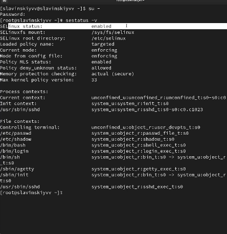{#fig:001 width=70%}

Посмотрим, в каком режиме работает SELinux: getenforce. Видим, что работает в режиме enforcing (в режиме принудительного исполнения.(рис. [-@fig:002])

{#fig:002 width=70%}

Изменим режим работы SELinux на разрешающий (Permissive): setenforce 0. Потом введем снова getenforce. (рис. [-@fig:003])

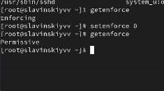{#fig:003 width=70%}

В файле /etc/sysconfig/selinux с помощью редактора установим SELINUX=disabled и перезапустим систему. (рис. [-@fig:004])
 
{#fig:004 width=70%}

После перезагрузки запустим терминал и получим полномочия администратора.Посмотрим статус SELinux: getenforce. Мы видим, что SELinux теперь отключён. (рис. [-@fig:005])

{#fig:005 width=70%}

Попробуем переключить режим работы SELinux: setenforce 1. Мы не можем переключаться между отключённым и принудительным режимом без перезагрузки системы.(рис. [-@fig:006])

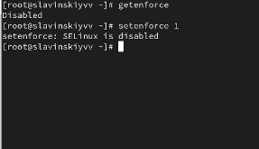{#fig:006 width=70%}

Откроем файл /etc/sysconfig/selinux с помощью редактора и установим: SELINUX=enforcing. Затем перезагрузим систему. (рис. [-@fig:007])

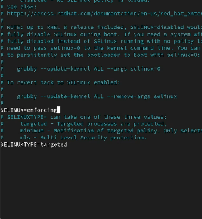{#fig:007 width=70%}

Во время загрузки системы мы  получаем предупреждающее сообщение (Relabeling could take a very long time) о необходимости восстановления меток SELinux,  это  занимает некоторое время, а также труебется дополнительная перезагрузка системы. (рис. [-@fig:008])

{#fig:008 width=70%}

После перезагрузки в терминале с полномочиями администратора просмотрим текущую информацию о состоянии SELinux: sestatus -v. Видим, что система работает в режиме enforcing.(рис. [-@fig:009])

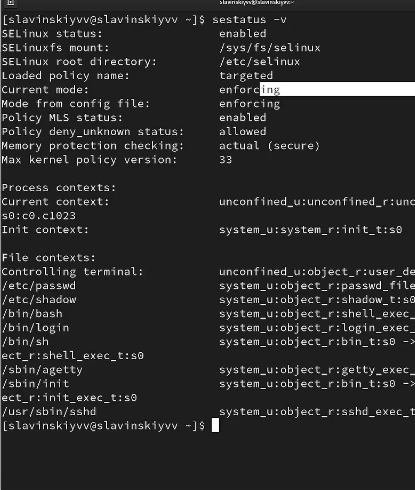{#fig:009 width=70%}

Запустим терминал и получим полномочия администратора. Затем посмотрим контекст безопасности файла /etc/hosts: ls -Z /etc/hosts. Видим, что присутствует метка net_conf_t, что указывает на тип файла сетевой конфигурации. (рис. [-@fig:010])

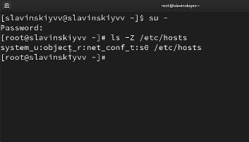{#fig:010 width=70%}

Скопируем файл /etc/hosts в домашний каталог: cp /etc/hosts ~/, проверим контекст файла ~/hosts: ls -Z ~/hosts. Поскольку копирование считается созданием нового файла, то параметр контекста в файле ~/hosts, расположенном в домашнем каталоге, станет admin_home_t. (рис. [-@fig:011])

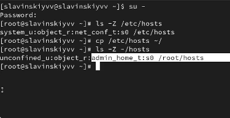{#fig:011 width=70%}

Попытаемся перезаписать существующий файл hosts из домашнего каталога в каталог /etc: mv ~/hosts /etc. И убедимся, что что тип контекста по-прежнему установлен на admin_home_t: ls -Z /etc/hosts. (рис. [-@fig:012])

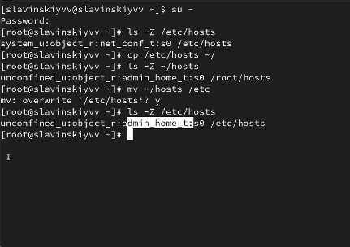{#fig:012 width=70%}

Исправим контекст безопасности: restorecon -v /etc/hosts. Опция -v покажет нам процесс изменения. И проверим, что что тип контекста изменился: ls -Z /etc/hosts. (рис. [-@fig:013])

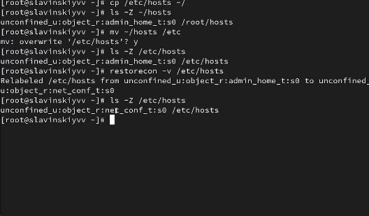{#fig:013 width=70%}

Для массового исправления контекста безопасности на файловой системе введем touch /.autorelabel и перезагрузим систему. Во время перезапуска нажмем клавишу esc  чтобы мы увидели загрузочные сообщения.(рис. [-@fig:014])

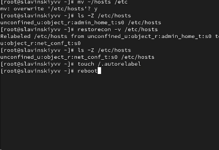{#fig:014 width=70%}

Вот какие сообщения выводятся при перезагрузке.(рис. [-@fig:015])

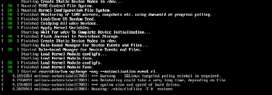{#fig:015 width=70%}

Запустим терминал в режиме администратора. Затем установим необходимое программное обеспечение: dnf -y install httpd, dnf -y install lynx.(рис. [-@fig:016])

{#fig:016 width=70%}

Создадим новое хранилище для файлов web-сервера: mkdir /web. Создадим файл index.html в каталоге с контентом веб-сервера: cd /web, touch index.html.(рис. [-@fig:017])

{#fig:017 width=70%}

Поместим в этот файл следующий текст: Welcome to my web-server.(рис. [-@fig:018])

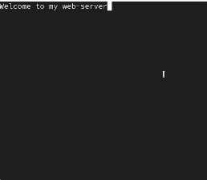{#fig:018 width=70%}

В файле /etc/httpd/conf/httpd.conf закомментируем строку DocumentRoot "/var/www/html" и ниже добавим строку DocumentRoot "/web".(рис. [-@fig:019])

{#fig:019 width=70%}

Затем в этом же файле ниже закомментируем раздел
<Directory "/var/www">
AllowOverride None
Require all granted
</Directory>
и добавим следующий раздел, определяющий правила доступа:
<Directory "/web">
AllowOverride None
Require all granted
</Directory>.(рис. [-@fig:020])

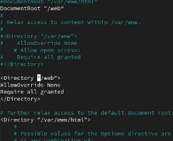{#fig:020 width=70%}

Запустим веб-сервер и службу httpd: systemctl start httpd, systemctl enable httpd.(рис. [-@fig:021])

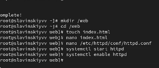{#fig:021 width=70%}

В терминале под учётной записью своего пользователя при обращении к веб-серверу
в текстовом браузере lynx введем: lynx http://localhost. Мы увидим веб-страницу Red Hat по умолчанию, а не содержимое только что созданного файла index.html.(рис. [-@fig:022])

{#fig:022 width=70%}

В терминале с полномочиями администратора применим новую метку контекста к /web: semanage fcontext -a -t httpd_sys_content_t "/web(/.*)?".(рис. [-@fig:023])

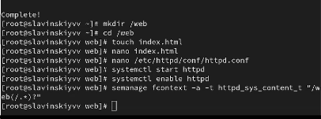{#fig:023 width=70%}

Восстановим контекст безопасности: restorecon -R -v /web.(рис. [-@fig:024])

{#fig:024 width=70%}

В терминале под учётной записью своего пользователя снова обратимся к веб-серверу: lynx http://localhost. У нас ничего не произошло. Значит перезапускаем систему и опять обращаемся к веб-серверу. Как видим, у нас все получилось.(рис. [-@fig:025])

{#fig:025 width=70%}

Через полномочия администратора посмотрим список переключателей SELinux для службы ftp: getsebool -a | grep ftp(рис. [-@fig:026])

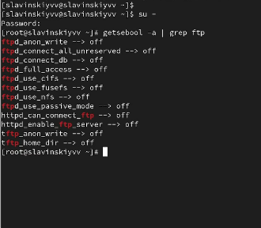{#fig:026 width=70%}

Для службы ftpd_anon посмотрим список переключателей: semanage boolean -l | grep ftpd_anon. Первое значение off - текущее состояние выполнение времени, второе значение off - постоянное состояние. Ftpd_anon_write  разрешает или запрещает анонимным пользователям FTP выполнять операции записи.(рис. [-@fig:027])

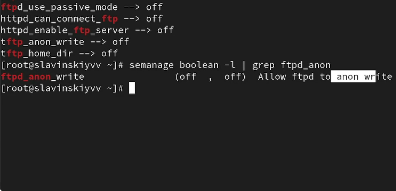{#fig:027 width=70%}

Изменим текущее значение переключателя для службы ftpd_anon_write с off на on: setsebool ftpd_anon_write on. Повторно посмотрим список переключателей SELinux для службы ftpd_anon_write: getsebool ftpd_anon_write.(рис. [-@fig:028])

{#fig:028 width=70%}

Посмотрим список переключателей: semanage boolean -l | grep ftpd_anon. Видим, что настройка времени выполнения включена, но постоянная настройка выключена(рис. [-@fig:029])

{#fig:029 width=70%}

Изменим постоянное значение переключателя для службы ftpd_anon_write с off на on: setsebool -P ftpd_anon_write on. Посмотрим список переключателей: semanage boolean -l | grep ftpd_anon. Теперь у нас fttpd_anon_write полностью включен. Оба значения установлены на on: 1) включены состояние во время выполнения и постоянное состояние после перезагрузки. Теперь анонимные пользователи FTP могут выполнять операции записи на сервер. (рис. [-@fig:030])

{#fig:030 width=70%}

# Выводы

В ходе выполнения лабораторной работы были получены навыки работы с контекстом безопасности и политиками SELinux.

# Ответы на контрольные вопросы

1.  setenforce 0

2. getsebool - a

3. setroubleshoot

4. semenage fcontext -a -t , restorecon -R -v 

5.  /etc/sysconfig/selinux

6. /var/lor/messages

7. seinfo -t | grep ftp

8. setenforce 0, если в режиме permissive проблема исчезает, то она связана с политиками SELinux. Если проблема остается, то причина в другой конфигурации

