---
## Front matter
lang: ru-RU
title: Основы работы с модулями ядра операционной системы
subtitle: Часть 1
author:
  - Славинский В.В.
institute:
  - Российский университет дружбы народов, Москва, Россия Россия
date: 8 ноября 2025

## i18n babel
babel-lang: russian
babel-otherlangs: english

## Formatting pdf
toc: false
toc-title: Содержание
slide_level: 2
aspectratio: 169
section-titles: true
theme: metropolis
header-includes:
 - \metroset{progressbar=frametitle,sectionpage=progressbar,numbering=fraction}
---

# Информация

## Докладчик

:::::::::::::: {.columns align=center}
::: {.column width="70%"}

  * Славинский Владислав Вадимович
  * Студент
  * Российский университет дружбы народов
  * [1132246169@pfur.ru]

:::
::: {.column width="30%"}

# Вводная часть

## Получение root прав

Запустим терминал и получим полномочия администратора: su -.

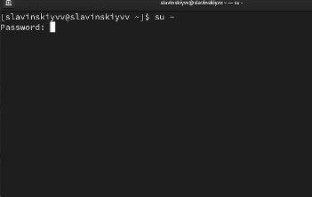

## Устройства в системе

Посмотрим, какие устройства имеются в нашей системе и какие модули ядра с ними связаны: lspci -k. Эта команда выводит нам список устройств, которые подключены через шину PCI, а также модули ядра, которые используются для работы этих устройств. Например VGA compatible controller - это виртуальный видеоконтроллер VMware. А драйвер vmgfx - это драйвер графического адамтера VMware для гостевых систем.

## Загруженные ядра

Посмотрим, какие модули ядра загружены: lsmod | sort.

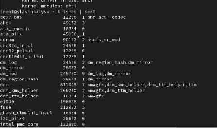

## Проверка модуля ext4

Посмотрим, загружен ли модуль ext4: lsmod | grep ext4. Модуль не загружен, поэтому нам нужно его загрузить.

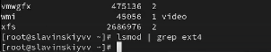

## Загрузка модуля ext4

Загрузим модуль ядра ext4: modprobe ext4. Проверяем, загрузился ли он.

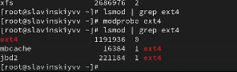

## Просмотр информации о модуле ядра ext4

Далее посмотрим информацию о модуле ядра ext4: modinfo ext4. Команда выводит полную информацию о модуле ядра Linux. Модуль ядра ext4 обеспечивает поддержку одноименной файловой системы в Linux.

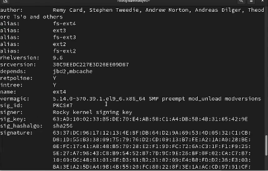

## Выгрузка ext4

Выгрузим модуль ядра ext4: modprobe -r ext4. В первый раз нам не удалось выгрузить, потому что ext4 использует другой модуль ядра, а именно crc32c_intel. Во второй раз получилось, потому что модуль crc20c_intel больше не использовался напрямую системой, либо часть часть функционала ext4 была временно неактивна.

## Выгрузка xfs

Потом попробуем выгрузить модуль ядра xfs: modprobe -r xfs. Здесь же мы не можем уже выгрузить модуль ядра xfs.

## Проверка модуля bluetooth

Дальше посмотрим, загружен ли модуль bluetooth: lsmod | grep bluetooth. Видим, что у нас не загружен.

## Загрузка bluetooth

Загрузим модуль bluetooth: modprobe bluetooth. И дальше проверим список модулей ядра: lsmod | grep bluetooth

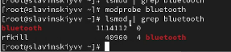

## Информация о модуле bluetooth

Посмотрим информацию о модуле bluetooth:modinfo bluetooth. Команда вывела информацию о модуле ядра bluetooth. У нас есть такие параметры как: disable eSCO support, disable retransmission mode, enable enhanced credit flow control mode. Первый параметр - это отключение типа аудиоканала bluetooth. Второй парамтр - это отключение расширенного режима повторной передачи, и третий параметр включает улучшенный режим управления потоком данных.

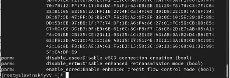

## Выгрузка модуля bluetooth

Выгрузим модуль bluetooth.

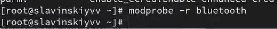

## Версия ядра Linux

Дальше посмотрим версию ядра Linux, используемую в операционной системе: uname -r.

## Вывод списка пакетов

Выведем на экран список пакетов, относящихся к ядру операционной системы: dnf list kernel.

## Обновление системы

Обновим систему, чтобы убедиться, что все существующие пакеты обновлены, чтобы избежать конфликтов: dnf upgrade --refresh.

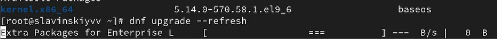

## Обновление ядра ОС, ОС

Обновим ядро операционной системы, а затем саму операционную систему: dnf update kernel, dnf update, dnf upgrade --refresh.

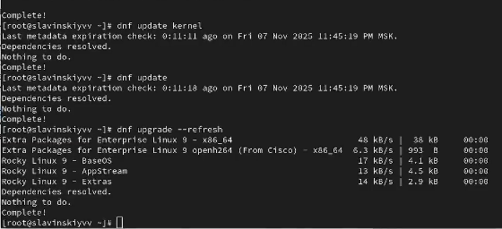

## Выбор нового ядра

Перезагружаем систему, выбираем новое ядро и проверяем изменения: uname -r, hostnamectl. И как видим, версия ядра изменилась.

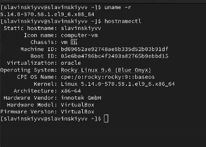

