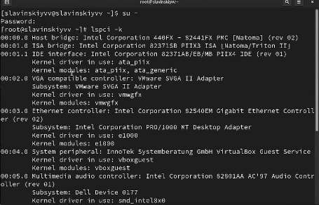
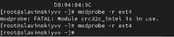
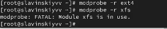
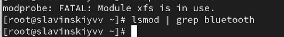
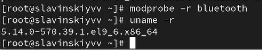
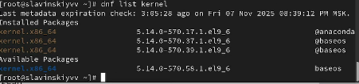

---
## Front matter
title: "Лабараторная работа №10"
subtitle: "Отчет"
author: "Славинский Владислав Вадимович"

## Generic otions
lang: ru-RU
toc-title: "Содержание"

## Bibliography
bibliography: bib/cite.bib
csl: pandoc/csl/gost-r-7-0-5-2008-numeric.csl

## Pdf output format
toc: true # Table of contents
toc-depth: 2
lof: true # List of figures
lot: true # List of tables
fontsize: 12pt
linestretch: 1.5
papersize: a4
documentclass: scrreprt
## I18n polyglossia
polyglossia-lang:
  name: russian
  options:
	- spelling=modern
	- babelshorthands=true
polyglossia-otherlangs:
  name: english
## I18n babel
babel-lang: russian
babel-otherlangs: english
## Fonts
mainfont: IBM Plex Serif
romanfont: IBM Plex Serif
sansfont: IBM Plex Sans
monofont: IBM Plex Mono
mathfont: STIX Two Math
mainfontoptions: Ligatures=Common,Ligatures=TeX,Scale=0.94
romanfontoptions: Ligatures=Common,Ligatures=TeX,Scale=0.94
sansfontoptions: Ligatures=Common,Ligatures=TeX,Scale=MatchLowercase,Scale=0.94
monofontoptions: Scale=MatchLowercase,Scale=0.94,FakeStretch=0.9
mathfontoptions:
## Biblatex
biblatex: true
biblio-style: "gost-numeric"
biblatexoptions:
  - parentracker=true
  - backend=biber
  - hyperref=auto
  - language=auto
  - autolang=other*
  - citestyle=gost-numeric
## Pandoc-crossref LaTeX customization
figureTitle: "Рис."
tableTitle: "Таблица"
listingTitle: "Листинг"
lofTitle: "Список иллюстраций"
lotTitle: "Список таблиц"
lolTitle: "Листинги"
## Misc options
indent: true
header-includes:
  - \usepackage{indentfirst}
  - \usepackage{float} # keep figures where there are in the text
  - \floatplacement{figure}{H} # keep figures where there are in the text
---

# Цель работы

Получить навыки работы с утилитами управления модулями ядра операционной системы.

# Выполнение лабораторной работы

Запустим терминал и получим полномочия администратора: su - (рис. [-@fig:001])

{#fig:001 width=70%}

Посмотрим, какие устройства имеются в нашей системе и какие модули ядра с ними связаны: lspci -k. Эта команда выводит нам список устройств, которые подключены через шину PCI, а также модули ядра, которые используются для работы этих устройств. Например VGA compatible controller - это виртуальный видеоконтроллер VMware. А драйвер vmgfx - это драйвер графического адамтера VMware для гостевых систем. (рис. [-@fig:002])

{#fig:002 width=70%}

Посмотрим, какие модули ядра загружены: lsmod | sort. (рис. [-@fig:003])

{#fig:003 width=70%}

Посмотрим, загружен ли модуль ext4: lsmod | grep ext4. Модуль не загружен, поэтому нам нужно его загрузить. (рис. [-@fig:004])
 
{#fig:004 width=70%}

Загрузим модуль ядра ext4: modprobe ext4. Проверяем, загрузился ли он. (рис. [-@fig:005])

{#fig:005 width=70%}

Далее посмотрим информацию о модуле ядра ext4: modinfo ext4. Команда выводит полную информацию о модуле ядра Linux. Модуль ядра ext4 обеспечивает поддержку одноименной файловой системы в Linux. (рис. [-@fig:006])

{#fig:006 width=70%}

Выгрузим модуль ядра ext4: modprobe -r ext4. В первый раз нам не удалось выгрузить, потому что ext4 использует другой модуль ядра, а именно crc32c_intel. Во второй раз получилось, потому что модуль crc20c_intel больше не использовался напрямую системой, либо часть часть функционала ext4 была временно неактивна.   (рис. [-@fig:007])

{#fig:007 width=70%}

Потом попробуем выгрузить модуль ядра xfs: modprobe -r xfs. Здесь же мы не можем уже выгрузить модуль ядра xfs. (рис. [-@fig:008])

{#fig:008 width=70%}

Дальше посмотрим, загружен ли модуль bluetooth: lsmod | grep bluetooth. Видим, что у нас не загружен.(рис. [-@fig:009])

{#fig:009 width=70%}

Загрузим модуль bluetooth: modprobe bluetooth. И дальше проверим список модулей ядра: lsmod | grep bluetooth (рис. [-@fig:010])

{#fig:010 width=70%}

Посмотрим информацию о модуле bluetooth:modinfo bluetooth. Команда вывела информацию о модуле ядра bluetooth. У нас есть такие параметры как: disable eSCO support, disable retransmission mode, enable enhanced credit flow control mode. Первый параметр - это отключение типа аудиоканала bluetooth. Второй парамтр - это отключение расширенного режима повторной передачи, и третий параметр включает улучшенный режим управления потоком данных. (рис. [-@fig:011])

{#fig:011 width=70%}

Выгрузим модуль bluetooth. (рис. [-@fig:012])

{#fig:012 width=70%}

Дальше посмотрим версию ядра Linux, используемую в операционной системе: uname -r. (рис. [-@fig:013])

{#fig:013 width=70%}

Выведем на экран список пакетов, относящихся к ядру операционной системы: dnf list kernel.(рис. [-@fig:014])

{#fig:014 width=70%}

Обновим систему, чтобы убедиться, что все существующие пакеты обновлены, чтобы избежать конфликтов: dnf upgrade --refresh.(рис. [-@fig:015])

{#fig:015 width=70%}

Обновим ядро операционной системы, а затем саму операционную систему: dnf update kernel, dnf update, dnf upgrade --refresh.(рис. [-@fig:016])

{#fig:016 width=70%}

Перезагружаем систему, выбираем новое ядро и проверяем изменения: uname -r, hostnamectl. И как видим, версия ядра изменилась.(рис. [-@fig:017])

{#fig:017 width=70%}

# Выводы

В ходе выполнения лабораторной работы были получены навыки работы с утилитами управления модулями ядра операционной системы.

# Ответы на контрольные вопросы

1.  uname -r

2. uname -a

3. lsmod

4. modinfo <имя модуля>

5.  modprobe -r <имя модуля>

6. Найти, что использует модуль lsmod | grep <<имя модуля>, завершить процессы, которые используют модуль, если возможно, попробовать выгрузить зависимые модули перед целевым модулем

7. Через команду modinfo ищем строку parm

8. dnf update kernel, dnf update

