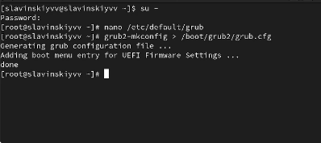
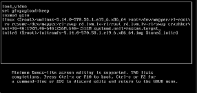
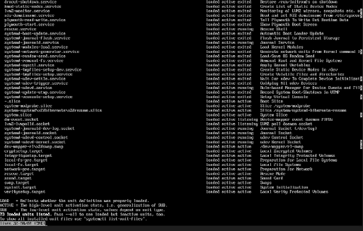
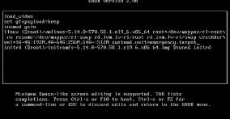
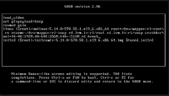
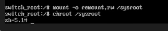
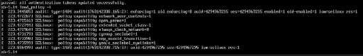
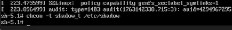

---
## Front matter
lang: ru-RU
title: Управление загрузкой системы
subtitle: Часть 1
author:
  - Славинский В.В.
institute:
  - Российский университет дружбы народов, Москва, Россия Россия
date: 15 ноября 2025

## i18n babel
babel-lang: russian
babel-otherlangs: english

## Formatting pdf
toc: false
toc-title: Содержание
slide_level: 2
aspectratio: 169
section-titles: true
theme: metropolis
header-includes:
 - \metroset{progressbar=frametitle,sectionpage=progressbar,numbering=fraction}
---

# Информация

## Докладчик

:::::::::::::: {.columns align=center}
::: {.column width="70%"}

  * Славинский Владислав Вадимович
  * Студент
  * Российский университет дружбы народов
  * [1132246169@pfur.ru]

:::
::: {.column width="30%"}

# Вводная часть

## Установка таймера загрузки

В терминале получим права администратора, после в файле /etc/default/grub установим параметр отображения меню загрузки в течение 10 секунд: GRUB_TIMEOUT=10.

## Запись изменений в GRUB2

Запишем изменения в GRUB2, введя в командной строке: grub2-mkconfig > /boot/grub2/grub.cfg.

## Проверка изменений

Перезагрузим систему и смотрим изменения.

## Редактирование

Перезагрузим систему. Как только появляется меню GRUB входим в режим редактирования. После чего находим строку, которая начинается с linux ($root)/vmlinuz-, в ней мы удаляем rhgb и quit и в конце добавляем systemd.unit=rescue.target.

## Список всех файлов модулей

Нажмем ctrl+x для продолжения загрузки. Введем root пароль и посмотрим список всех файлов модулей, которые загружены в настоящее время: systemctl list-units. У нас загружена базовая системная среда.

## Задействованные переменные среды оболочки

Посмотрим задействованные переменные среды оболочки: systemctl show-environment.

## Редактирование

Перезагрузим систему через systemctl reboot. Дальше опять зайдем в режим редактирования, удалим rhgb и quit, и введем в конце другую строку systemd.unit=emergency.target.

## Просмотр списка всех загруженных файлов модулей и перезагрузка

Далее используем сочетание клавиш ctrl+x для продолжения загрузки. Ввводим root пароль. После успешного входа в систему посмотрим список всех загруженных файлов модулей: systemctl list-units. Видим, что количество загружаемых файлов модулей уменьшилось до минимума, так как мы загрузились в режиме максимальной экономии ресурсов. Потом снова перезагружаем систему.

## Редактирование

Перезагружаем компьютер. Входим в режим редактирования. Опять удаляем опции rhgb и quit и в конце дописываем rd.break. После чего используем сочетание клавиш ctrl+x для продолжения загрузки.

## Получение доступа к системному образу для чтения и записи

Этап загрузки системы у нас остановится в момент загрузки initramfs непосредственно перед монтированием корневой файловой системы в каталоге /. Чтобы получить доступ к системному образу для чтения и записи, наберем mount -o remount,rw /sysroot.

## Новый корневой каталог

Сделаем содержимое каталога /sysimage новым корневым каталогом, набрав chroot /sysroot.

## Создание нового пароля root

Введем команду passwd и дальше зададим новый пароль root. 

## Исправление контекста

Поскольку на этом очень раннем этапе загрузки SELinux ещё не активирован, то тип
контекста SELinux для файла /etc/shadow будет испорчен.Если мы перезагрузимся в этот момент, то никто не сможет зайти в систему. Нам нужно убедится, что тип контекста задан правильно, поэтому нам нужно загрузить политику SELinux: load_policy -i.

## Установка правильного типа контекста

Теперь устанавливаем правильный тип контекста для /etc/shadow: chcon -t shadow_t /etc/shadow.

## Перезагрузка и проверка изменений

Перезагружаем систему с помощью команды reboot -f. Когда загрузились, войдем в консоль и получим root права, введя новый пароль. Пароль успешно изменился.

