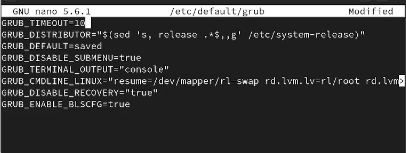
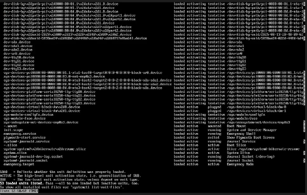
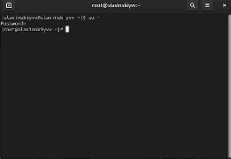

---
## Front matter
title: "Лабараторная работа №11"
subtitle: "Отчет"
author: "Славинский Владислав Вадимович"

## Generic otions
lang: ru-RU
toc-title: "Содержание"

## Bibliography
bibliography: bib/cite.bib
csl: pandoc/csl/gost-r-7-0-5-2008-numeric.csl

## Pdf output format
toc: true # Table of contents
toc-depth: 2
lof: true # List of figures
lot: true # List of tables
fontsize: 12pt
linestretch: 1.5
papersize: a4
documentclass: scrreprt
## I18n polyglossia
polyglossia-lang:
  name: russian
  options:
	- spelling=modern
	- babelshorthands=true
polyglossia-otherlangs:
  name: english
## I18n babel
babel-lang: russian
babel-otherlangs: english
## Fonts
mainfont: IBM Plex Serif
romanfont: IBM Plex Serif
sansfont: IBM Plex Sans
monofont: IBM Plex Mono
mathfont: STIX Two Math
mainfontoptions: Ligatures=Common,Ligatures=TeX,Scale=0.94
romanfontoptions: Ligatures=Common,Ligatures=TeX,Scale=0.94
sansfontoptions: Ligatures=Common,Ligatures=TeX,Scale=MatchLowercase,Scale=0.94
monofontoptions: Scale=MatchLowercase,Scale=0.94,FakeStretch=0.9
mathfontoptions:
## Biblatex
biblatex: true
biblio-style: "gost-numeric"
biblatexoptions:
  - parentracker=true
  - backend=biber
  - hyperref=auto
  - language=auto
  - autolang=other*
  - citestyle=gost-numeric
## Pandoc-crossref LaTeX customization
figureTitle: "Рис."
tableTitle: "Таблица"
listingTitle: "Листинг"
lofTitle: "Список иллюстраций"
lotTitle: "Список таблиц"
lolTitle: "Листинги"
## Misc options
indent: true
header-includes:
  - \usepackage{indentfirst}
  - \usepackage{float} # keep figures where there are in the text
  - \floatplacement{figure}{H} # keep figures where there are in the text
---

# Цель работы

Получить навыки работы с загрузчиком системы GRUB2.

# Выполнение лабораторной работы

В терминале получим права администратора, после в файле /etc/default/grub установим параметр отображения меню загрузки в течение 10 секунд: GRUB_TIMEOUT=10. (рис. [-@fig:001])

{#fig:001 width=70%}

Запишем изменения в GRUB2, введя в командной строке: grub2-mkconfig > /boot/grub2/grub.cfg.(рис. [-@fig:002])

{#fig:002 width=70%}

Перезагрузим систему и смотрим изменения. (рис. [-@fig:003])

{#fig:003 width=70%}

Перезагрузим систему. Как только появляется меню GRUB входим в режим редактирования. После чего находим строку, которая начинается с linux ($root)/vmlinuz-, в ней мы удаляем rhgb и quit и в конце добавляем systemd.unit=rescue.target.   (рис. [-@fig:004])
 
{#fig:004 width=70%}

Нажмем ctrl+x для продолжения загрузки. Введем root пароль и посмотрим список всех файлов модулей, которые загружены в настоящее время: systemctl list-units. У нас загружена базовая системная среда. (рис. [-@fig:005])

{#fig:005 width=70%}

Посмотрим задействованные переменные среды оболочки: systemctl show-environment. (рис. [-@fig:006])

{#fig:006 width=70%}

Перезагрузим систему через systemctl reboot. Дальше опять зайдем в режим редактирования, удалим rhgb и quit, и введем в конце другую строку systemd.unit=emergency.target.  (рис. [-@fig:007])

{#fig:007 width=70%}

Далее используем сочетание клавиш ctrl+x для продолжения загрузки. Ввводим root пароль. После успешного входа в систему посмотрим список всех загруженных файлов модулей: systemctl list-units. Видим, что количество загружаемых файлов модулей уменьшилось до минимума, так как мы загрузились в режиме максимальной экономии ресурсов. Потом снова перезагружаем систему.(рис. [-@fig:008])

{#fig:008 width=70%}

Перезагружаем компьютер. Входим в режим редактирования. Опять удаляем опции rhgb и quit и в конце дописываем rd.break. После чего используем сочетание клавиш ctrl+x для продолжения загрузки.(рис. [-@fig:009])

{#fig:009 width=70%}

Этап загрузки системы у нас остановится в момент загрузки initramfs непосредственно перед монтированием корневой файловой системы в каталоге /. Чтобы получить доступ к системному образу для чтения и записи, наберем mount -o remount,rw /sysroot. (рис. [-@fig:010])

{#fig:010 width=70%}

Сделаем содержимое каталога /sysimage новым корневым каталогом, набрав chroot /sysroot. (рис. [-@fig:011])

{#fig:011 width=70%}

Введем команду passwd и дальше зададим новый пароль root. (рис. [-@fig:012])

{#fig:012 width=70%}

Поскольку на этом очень раннем этапе загрузки SELinux ещё не активирован, то тип
контекста SELinux для файла /etc/shadow будет испорчен.Если мы перезагрузимся в этот момент, то никто не сможет зайти в систему. Нам нужно убедится, что тип контекста задан правильно, поэтому нам нужно загрузить политику SELinux: load_policy -i. (рис. [-@fig:013])

{#fig:013 width=70%}

Теперь устанавливаем правильный тип контекста для /etc/shadow: chcon -t shadow_t /etc/shadow.(рис. [-@fig:014])

{#fig:014 width=70%}

Перезагружаем систему с помощью команды reboot -f. Когда загрузились, войдем в консоль и получим root права, введя новый пароль. Пароль успешно изменился. (рис. [-@fig:015])

{#fig:015 width=70%}

# Выводы

В ходе выполнения лабораторной работы были получены навыки работы с загрузчиком системы GRUB2.

# Ответы на контрольные вопросы

1.  /etc/default/grub

2.  /etc/default/grub

3.  grub-mkconfig > /boot/grub/grub.cfg

