---
## Front matter
lang: ru-RU
title: Настройки сети в Linux
subtitle: Часть 1
author:
  - Славинский В.В.
institute:
  - Российский университет дружбы народов, Москва, Россия Россия
date: 22 ноября 2025

## i18n babel
babel-lang: russian
babel-otherlangs: english

## Formatting pdf
toc: false
toc-title: Содержание
slide_level: 2
aspectratio: 169
section-titles: true
theme: metropolis
header-includes:
 - \metroset{progressbar=frametitle,sectionpage=progressbar,numbering=fraction}
---

# Информация

## Докладчик

:::::::::::::: {.columns align=center}
::: {.column width="70%"}

  * Славинский Владислав Вадимович
  * Студент
  * Российский университет дружбы народов
  * [1132246169@pfur.ru]

:::
::: {.column width="30%"}

# Вводная часть

## Вывод о сетевых подключениях

В терминале получим права администратора, после выведем на экран информацию о существующих сетевых подключениях, а также статистику о количестве отправленных пакетов и связанных с ними сообщениях об
ошибках: ip -s link. У нас вывелось на экран два интерфейса. Рассмотрим интерфейс enp0s3. Здесь у нас есть информация, что он активен (UP), дальше mtu (maximum trasmission unit) - максимальный размер одного пакета данных, который может быть передан по сети, значение 1500. Статистики RX (полученные пакеты) и TX (отправленные).

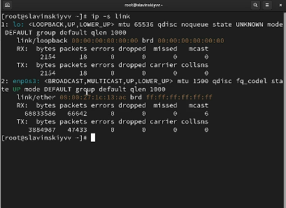

## Вывод информации о текущих маршрутах

Выведем на экран информацию о текущих маршрутах: ip route show. Значит у нас есть маршрут по умолчанию 10.0.2.2, в котором используется интерфейс enp0s3, и используется локальная сеть 10.0.2.0/24, в которой пакеты для этой сети отправляются через интерфейс enp0s3.

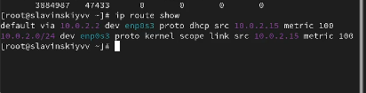

## Информация о текущих назначениях адресов для сетевых интерфейсов

Выведем на экран информацию о текущих назначениях адресов для сетевых интерфейсов на устройстве: ip addr show. Информация по интерфейсу enp0s3: название сетевого адаптера ,состояние UP (активен), тип интерфейса ethernet, ipv4 адрес устройства 10.0.2.15/24, где 10.0.2.15 адрес, а /24 маска подсети и ipv6 адрес.

## Проверка правильности подключения к интернету

Используем команду ping для проверки правильности подключения к Интернету: ping -c 4 8.8.8.8. 

## Добавление дополнительного адреса

Добавим дополнительный адрес к нашему интерфейсу: ip addr add 10.0.0.10/24 dev enp0s3.

## Проверка

Проверим, что адрес добавился: ip addr show. Видим, что наш адрес добавился

## Сравнение

Сравним вывод информации от утилиты ip и от команды ifconfig: ifconfig. Есть различие в формате подсети в ip выглядит как /24, а в ifconfig 255.255.255.0. В ip не показывается статистика трафика, в ifconfig отображается RX и TX. Различается так же состояние интерфейса. Чтобы узнать информацию об ошибках для ip нужно прописать ip -s link.

## Список прослушиваемых системой портов

Выведем на экран список всех прослушиваемых системой портов UDP и TCP:
ss -tul.

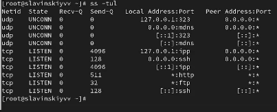

## Вывод о текущих соединениях

Получим полномочия администратора. Выведем на экран информацию о текущих соединениях: nmcli connection show.

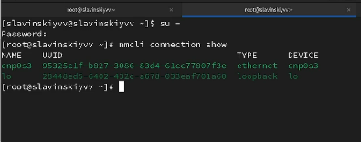

## Добавление ethernet соединения

Добавим Ethernet-соединение с именем dhcp к интерфейсу:nmcli connection add con-name "dhcp" type ethernet ifname enp0s3.

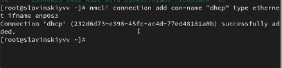

## Добавление static

Добавим к этому же интерфейсу Ethernet-соединение с именем static, статическим IPv4-адресом адаптера и статическим адресом шлюза: nmcli connection add con-name "static" ifname enp0s3 autoconnect no type ethernet ip4 10.0.0.10/24 gw4 10.0.0.1 ifname enp0s3.

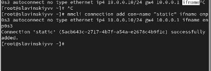

## Вывод

Выведем информацию о текущих соединениях: nmcli connection show.

## Переключение на static

Переключимся на статическое соединение: nmcli connection up "static".

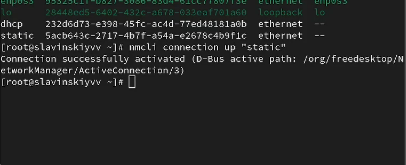

## Проверка

Проверяем успешность переключения при помощи nmcli connection show и ip addr.

## Изменение параметров

Отключим автоподключение статического соединения: nmcli connection modify "static" connection.autoconnect no. Потом добавим DNS-сервер в статическое соединение: nmcli connection modify "static" ipv4.dns 10.0.0.10. Добавим второй DNS-сервер: nmcli connection modify "static" +ipv4.dns 8.8.8.8. Изменим IP-адрес статического соединения: nmcli connection modify "static" ipv4.addresses 10.0.0.20/24. Добавим другой IP-адрес для статического соединения: nmcli connection modify "static" +ipv4.addresses 10.20.30.40/16. После всех изменений активируем его: nmcli connection up "static".

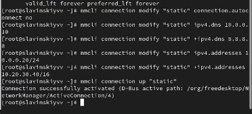

## Проверка

Проверим успешность переключения при помощи nmcli con show и ip addr.

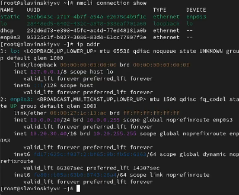

## Настройки сети

Используя nmtui, посмотрим настройки сети на устройстве.

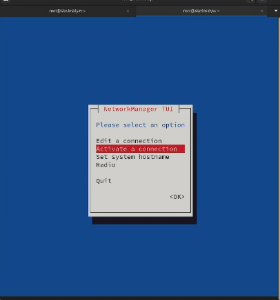

## Настройки сети

В самих настройках у нас есть имя профиля, устройство, IP адреса, шлюз, DNS сервера.

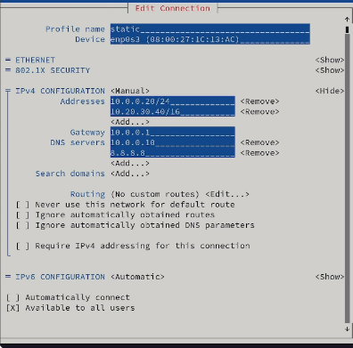

## Настройки сети в графическом интерфейсе

Посмотрим настройки сетевых соединений в графическом интерфейсе операционной
системы.

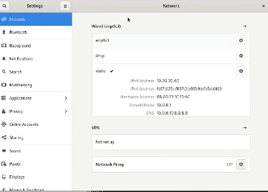

## Переключение на первоначальное сетевое соединение

Переключимся на первоначальное сетевое соединение: nmcli connection up enp0s3.

