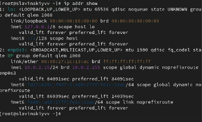
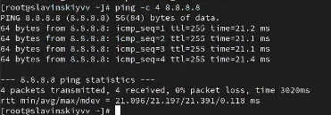
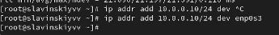
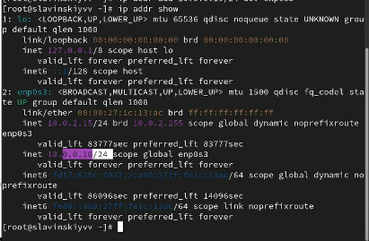
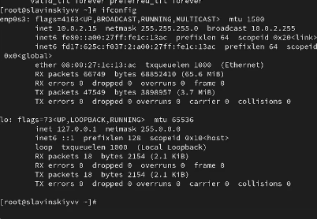
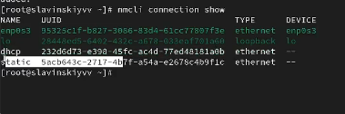
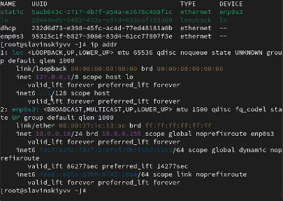
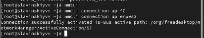

---
## Front matter
title: "Лабараторная работа №12"
subtitle: "Отчет"
author: "Славинский Владислав Вадимович"

## Generic otions
lang: ru-RU
toc-title: "Содержание"

## Bibliography
bibliography: bib/cite.bib
csl: pandoc/csl/gost-r-7-0-5-2008-numeric.csl

## Pdf output format
toc: true # Table of contents
toc-depth: 2
lof: true # List of figures
lot: true # List of tables
fontsize: 12pt
linestretch: 1.5
papersize: a4
documentclass: scrreprt
## I18n polyglossia
polyglossia-lang:
  name: russian
  options:
	- spelling=modern
	- babelshorthands=true
polyglossia-otherlangs:
  name: english
## I18n babel
babel-lang: russian
babel-otherlangs: english
## Fonts
mainfont: IBM Plex Serif
romanfont: IBM Plex Serif
sansfont: IBM Plex Sans
monofont: IBM Plex Mono
mathfont: STIX Two Math
mainfontoptions: Ligatures=Common,Ligatures=TeX,Scale=0.94
romanfontoptions: Ligatures=Common,Ligatures=TeX,Scale=0.94
sansfontoptions: Ligatures=Common,Ligatures=TeX,Scale=MatchLowercase,Scale=0.94
monofontoptions: Scale=MatchLowercase,Scale=0.94,FakeStretch=0.9
mathfontoptions:
## Biblatex
biblatex: true
biblio-style: "gost-numeric"
biblatexoptions:
  - parentracker=true
  - backend=biber
  - hyperref=auto
  - language=auto
  - autolang=other*
  - citestyle=gost-numeric
## Pandoc-crossref LaTeX customization
figureTitle: "Рис."
tableTitle: "Таблица"
listingTitle: "Листинг"
lofTitle: "Список иллюстраций"
lotTitle: "Список таблиц"
lolTitle: "Листинги"
## Misc options
indent: true
header-includes:
  - \usepackage{indentfirst}
  - \usepackage{float} # keep figures where there are in the text
  - \floatplacement{figure}{H} # keep figures where there are in the text
---

# Цель работы

Получить навыки настройки сетевых параметров системы.

# Выполнение лабораторной работы

В терминале получим права администратора, после выведем на экран информацию о существующих сетевых подключениях, а также статистику о количестве отправленных пакетов и связанных с ними сообщениях об
ошибках: ip -s link. У нас вывелось на экран два интерфейса. Рассмотрим интерфейс enp0s3. Здесь у нас есть информация, что он активен (UP), дальше mtu (maximum trasmission unit) - максимальный размер одного пакета данных, который может быть передан по сети, значение 1500. Статистики RX (полученные пакеты) и TX (отправленные).  (рис. [-@fig:001])

{#fig:001 width=70%}

Выведем на экран информацию о текущих маршрутах: ip route show. Значит у нас есть маршрут по умолчанию 10.0.2.2, в котором используется интерфейс enp0s3, и используется локальная сеть 10.0.2.0/24, в которой пакеты для этой сети отправляются через интерфейс enp0s3. (рис. [-@fig:002])

{#fig:002 width=70%}

Выведем на экран информацию о текущих назначениях адресов для сетевых интерфейсов на устройстве: ip addr show. Информация по интерфейсу enp0s3: название сетевого адаптера ,состояние UP (активен), тип интерфейса ethernet, ipv4 адрес устройства 10.0.2.15/24, где 10.0.2.15 адрес, а /24 маска подсети и ipv6 адрес.  (рис. [-@fig:003])

{#fig:003 width=70%}

Используем команду ping для проверки правильности подключения к Интернету: ping -c 4 8.8.8.8.   (рис. [-@fig:004])
 
{#fig:004 width=70%}

Добавим дополнительный адрес к нашему интерфейсу: ip addr add 10.0.0.10/24 dev enp0s3. (рис. [-@fig:005])

{#fig:005 width=70%}

Проверим, что адрес добавился: ip addr show. Видим, что наш адрес добавился (рис. [-@fig:006])

{#fig:006 width=70%}

Сравним вывод информации от утилиты ip и от команды ifconfig: ifconfig. Есть различие в формате подсети в ip выглядит как /24, а в ifconfig 255.255.255.0. В ip не показывается статистика трафика, в ifconfig отображается RX и TX. Различается так же состояние интерфейса. Чтобы узнать информацию об ошибках для ip нужно прописать ip -s link. (рис. [-@fig:007])

{#fig:007 width=70%}

Выведем на экран список всех прослушиваемых системой портов UDP и TCP:
ss -tul.(рис. [-@fig:008])

{#fig:008 width=70%}

Получим полномочия администратора. Выведем на экран информацию о текущих соединениях: nmcli connection show.(рис. [-@fig:009])

{#fig:009 width=70%}

Добавим Ethernet-соединение с именем dhcp к интерфейсу:nmcli connection add con-name "dhcp" type ethernet ifname enp0s3. (рис. [-@fig:010])

{#fig:010 width=70%}

Добавим к этому же интерфейсу Ethernet-соединение с именем static, статическим IPv4-адресом адаптера и статическим адресом шлюза: nmcli connection add con-name "static" ifname enp0s3 autoconnect no type ethernet ip4 10.0.0.10/24 gw4 10.0.0.1 ifname enp0s3. (рис. [-@fig:011])

{#fig:011 width=70%}

Выведем информацию о текущих соединениях: nmcli connection show. (рис. [-@fig:012])

{#fig:012 width=70%}

Переключимся на статическое соединение: nmcli connection up "static". (рис. [-@fig:013])

{#fig:013 width=70%}

Проверяем успешность переключения при помощи nmcli connection show и ip addr.(рис. [-@fig:014])

{#fig:014 width=70%}

Отключим автоподключение статического соединения: nmcli connection modify "static" connection.autoconnect no. Потом добавим DNS-сервер в статическое соединение: nmcli connection modify "static" ipv4.dns 10.0.0.10. Добавим второй DNS-сервер: nmcli connection modify "static" +ipv4.dns 8.8.8.8. Изменим IP-адрес статического соединения: nmcli connection modify "static" ipv4.addresses 10.0.0.20/24. Добавим другой IP-адрес для статического соединения: nmcli connection modify "static" +ipv4.addresses 10.20.30.40/16. После всех изменений активируем его: nmcli connection up "static". (рис. [-@fig:015])

{#fig:015 width=70%}

Проверим успешность переключения при помощи nmcli con show и ip addr. (рис. [-@fig:016])

{#fig:016 width=70%}

Используя nmtui, посмотрим настройки сети на устройстве. (рис. [-@fig:017])

{#fig:017 width=70%}

В самих настройках у нас есть имя профиля, устройство, IP адреса, шлюз, DNS сервера. (рис. [-@fig:018])

{#fig:018 width=70%}

Посмотрим настройки сетевых соединений в графическом интерфейсе операционной
системы. (рис. [-@fig:019])

{#fig:019 width=70%}

Переключимся на первоначальное сетевое соединение: nmcli connection up enp0s3. (рис. [-@fig:020])

{#fig:020 width=70%}

# Выводы

В ходе выполнения лабораторной работы были получены навыки настройки сетевых параметров системы.

# Ответы на контрольные вопросы

1.  ip link show

2.  NetworkManager

3.  /etc/hostname

4.  hostnamectl set-hostname

5.  /etc/hosts

6.  ip route show

7.  systemctl status NetworkManager

8.  nmcli connection modify 

