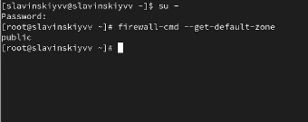
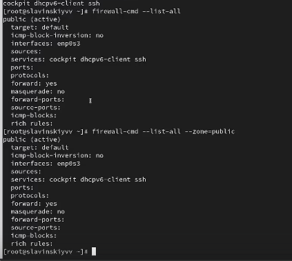
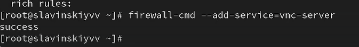
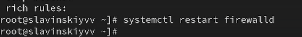
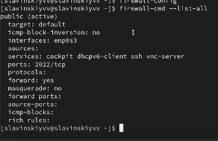
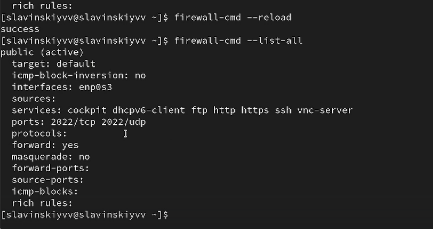
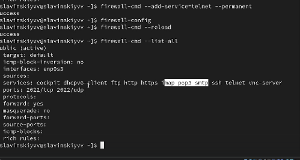

---
## Front matter
lang: ru-RU
title: Фильтр пакетов
subtitle: Часть 1
author:
  - Славинский В.В.
institute:
  - Российский университет дружбы народов, Москва, Россия Россия
date: 29 ноября 2025

## i18n babel
babel-lang: russian
babel-otherlangs: english

## Formatting pdf
toc: false
toc-title: Содержание
slide_level: 2
aspectratio: 169
section-titles: true
theme: metropolis
header-includes:
 - \metroset{progressbar=frametitle,sectionpage=progressbar,numbering=fraction}
---

# Информация

## Докладчик

:::::::::::::: {.columns align=center}
::: {.column width="70%"}

  * Славинский Владислав Вадимович
  * Студент
  * Российский университет дружбы народов
  * [1132246169@pfur.ru]

:::
::: {.column width="30%"}

# Вводная часть

## Определение текущей зоны по умолчанию

В терминале получим права администратора, определим текущую зону по умолчанию, введя: firewall-cmd --get-default-zone.

## Определение доступных зон

Определим доступные зоны с помощью firewall-cmd --get-zones.

## Доступные службы

Посмотрим службы, доступные на компьютере, используя firewall-cmd --get-services.

## Доступные службы в текущей зоне

Определим доступные службы в текущей зоне: firewall-cmd --list-services. 

## Сравнение вывода информации

Сравним результаты вывода информации при использовании команды firewall-cmd --list-all и команды firewall-cmd --list-all --zone=public. Вывод у нас одинаковый, так как первая команда показывает текущую зону по умолчанию, по умолчанию у нас зона public, а вторая команда показывает конкретно зону public

## Добавление VNC в брандмауэр

Добавим сервер VNC в конфигурацию брандмауэра: firewall-cmd --add-service=vnc-server

## Проверка

Проверим, добавился ли vnc-server в конфигурацию: firewall-cmd --list-all.

## Перезапуск службы

Перезапустим службу firewalld: systemctl restart firewalld.

## Проверка

Проверим, есть ли vnc-server в конфигурации: firewall-cmd --list-all. vnc-server пропал, потому что служба была добавлена только во временную конфигурацию.

## Добавление службы в постоянную

Добавим службу vnc-server ещё раз, но на этот раз сделаем её постоянной, используя команду firewall-cmd --add-service=vnc-server --permanent.

## Проверка

Проверим наличие vnc-server в конфигурации: firewall-cmd --list-all.

## Перезагрузка конфигурации

Перезагрузим конфигурацию firewalld и просмотрим конфигурацию времени выполнения: firewall-cmd --reload, firewall-cmd --list-all.

## Добавление порта

Добавим в конфигурацию межсетевого экрана порт 2022 протокола TCP: firewall-cmd --add-port=2022/tcp --permanent. Потом перезагрузим конфигурацию firewalld и проверим, что порт добавлен в конфигурацию.

## Запуск интерфейса GUI

Откроем терминал и под учётной записью своего пользователя запустим интерфейс GUI firewall-config: firewall-config

## Изменение параметров

Далее в конфигурации выберем permanent. В зоне public выберем http ftp и https. Во вкладке ports введем 2022 и добавим протокол udp.

## Вывод информации

В окне терминала введем firewall-cmd --list-all

## Перезагрузка

Перезагрузим конфигурацию firewalld: firewall-cmd --reload. И потом опять выведем список сервисов. Как видим, они добавились.

## Создание конфигурации

Создадим конфигурацию межсетевого экрана, которая позволяет получить доступ к службам telnet, imap, pop3, smtp. Через командную строку добавим telnet.

## Добавление сервисов в графическом интерфейсе

Далее делаем в графическом интерфейса GUI.

## Перезагрузка конфигурации и проверка

Перезагружаем конфигурацию firewalld и смотрим список доступных сервисов, как видим, все добавилось.

