---
## Front matter
title: "Лабараторная работа №13"
subtitle: "Отчет"
author: "Славинский Владислав Вадимович"

## Generic otions
lang: ru-RU
toc-title: "Содержание"

## Bibliography
bibliography: bib/cite.bib
csl: pandoc/csl/gost-r-7-0-5-2008-numeric.csl

## Pdf output format
toc: true # Table of contents
toc-depth: 2
lof: true # List of figures
lot: true # List of tables
fontsize: 12pt
linestretch: 1.5
papersize: a4
documentclass: scrreprt
## I18n polyglossia
polyglossia-lang:
  name: russian
  options:
	- spelling=modern
	- babelshorthands=true
polyglossia-otherlangs:
  name: english
## I18n babel
babel-lang: russian
babel-otherlangs: english
## Fonts
mainfont: IBM Plex Serif
romanfont: IBM Plex Serif
sansfont: IBM Plex Sans
monofont: IBM Plex Mono
mathfont: STIX Two Math
mainfontoptions: Ligatures=Common,Ligatures=TeX,Scale=0.94
romanfontoptions: Ligatures=Common,Ligatures=TeX,Scale=0.94
sansfontoptions: Ligatures=Common,Ligatures=TeX,Scale=MatchLowercase,Scale=0.94
monofontoptions: Scale=MatchLowercase,Scale=0.94,FakeStretch=0.9
mathfontoptions:
## Biblatex
biblatex: true
biblio-style: "gost-numeric"
biblatexoptions:
  - parentracker=true
  - backend=biber
  - hyperref=auto
  - language=auto
  - autolang=other*
  - citestyle=gost-numeric
## Pandoc-crossref LaTeX customization
figureTitle: "Рис."
tableTitle: "Таблица"
listingTitle: "Листинг"
lofTitle: "Список иллюстраций"
lotTitle: "Список таблиц"
lolTitle: "Листинги"
## Misc options
indent: true
header-includes:
  - \usepackage{indentfirst}
  - \usepackage{float} # keep figures where there are in the text
  - \floatplacement{figure}{H} # keep figures where there are in the text
---

# Цель работы

Получить навыки настройки пакетного фильтра в Linux.

# Выполнение лабораторной работы

В терминале получим права администратора, определим текущую зону по умолчанию, введя: firewall-cmd --get-default-zone  (рис. [-@fig:001])

{#fig:001 width=70%}

Определим доступные зоны с помощью firewall-cmd --get-zones. (рис. [-@fig:002])

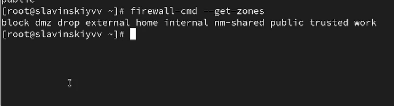{#fig:002 width=70%}

Посмотрим службы, доступные на компьютере, используя firewall-cmd --get-services.  (рис. [-@fig:003])

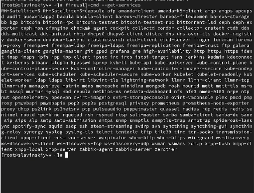{#fig:003 width=70%}

Определим доступные службы в текущей зоне: firewall-cmd --list-services.   (рис. [-@fig:004])
 
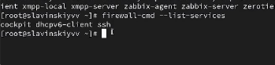{#fig:004 width=70%}

Сравним результаты вывода информации при использовании команды firewall-cmd --list-all и команды firewall-cmd --list-all --zone=public. Вывод у нас одинаковый, так как первая команда показывает текущую зону по умолчанию, по умолчанию у нас зона public, а вторая команда показывает конкретно зону public (рис. [-@fig:005])

{#fig:005 width=70%}

Добавим сервер VNC в конфигурацию брандмауэра: firewall-cmd --add-service=vnc-server (рис. [-@fig:006])

{#fig:006 width=70%}

Проверим, добавился ли vnc-server в конфигурацию: firewall-cmd --list-all. (рис. [-@fig:007])

{#fig:007 width=70%}

Перезапустим службу firewalld: systemctl restart firewalld.(рис. [-@fig:008])

{#fig:008 width=70%}

Проверим, есть ли vnc-server в конфигурации: firewall-cmd --list-all. vnc-server пропал, потому что служба была добавлена только во временную конфигурацию.(рис. [-@fig:009])

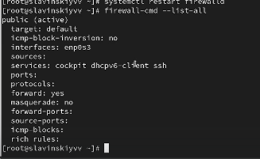{#fig:009 width=70%}

Добавим службу vnc-server ещё раз, но на этот раз сделаем её постоянной, используя команду firewall-cmd --add-service=vnc-server --permanent. (рис. [-@fig:010])

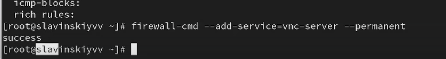{#fig:010 width=70%}

Проверим наличие vnc-server в конфигурации: firewall-cmd --list-all. (рис. [-@fig:011])

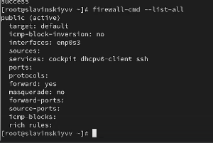{#fig:011 width=70%}

Перезагрузим конфигурацию firewalld и просмотрим конфигурацию времени выполнения: firewall-cmd --reload, firewall-cmd --list-all. (рис. [-@fig:012])

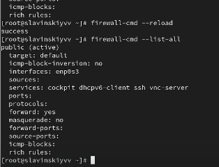{#fig:012 width=70%}

Добавим в конфигурацию межсетевого экрана порт 2022 протокола TCP: firewall-cmd --add-port=2022/tcp --permanent. Потом перезагрузим конфигурацию firewalld и проверим, что порт добавлен в конфигурацию. (рис. [-@fig:013])

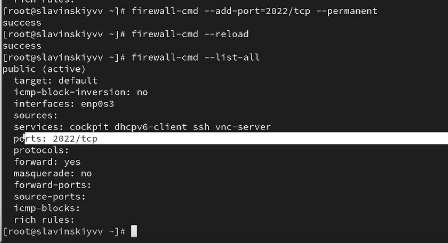{#fig:013 width=70%}

Откроем терминал и под учётной записью своего пользователя запустим интерфейс GUI firewall-config: firewall-config(рис. [-@fig:014])

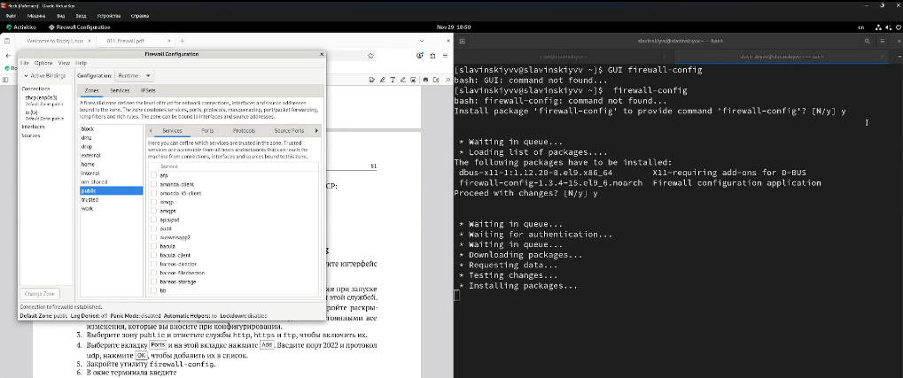{#fig:014 width=70%}

Далее в конфигурации выберем permanent. В зоне public выберем http ftp и https. Во вкладке ports введем 2022 и добавим протокол udp. (рис. [-@fig:015])

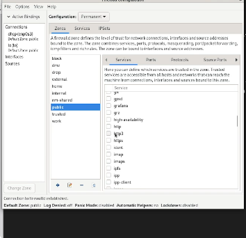{#fig:015 width=70%}

В окне терминала введем firewall-cmd --list-all (рис. [-@fig:016])

{#fig:016 width=70%}

Перезагрузим конфигурацию firewalld: firewall-cmd --reload. И потом опять выведем список сервисов. Как видим, они добавились. (рис. [-@fig:017])

{#fig:017 width=70%}

Создадим конфигурацию межсетевого экрана, которая позволяет получить доступ к службам telnet, imap, pop3, smtp. Через командную строку добавим telnet. (рис. [-@fig:018])

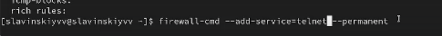{#fig:018 width=70%}

Далее делаем в графическом интерфейса GUI. (рис. [-@fig:019])

{#fig:019 width=70%}

Перезагружаем конфигурацию firewalld и смотрим список доступных сервисов, как видим, все добавилось. (рис. [-@fig:020])

{#fig:020 width=70%}

# Выводы

В ходе выполнения лабораторной работы были получены навыки настройки пакетного фильтра в Linux.

# Ответы на контрольные вопросы

1.  firewalld

2.  firewall-cmd --add-port=2355/upd

3.  firewall-cmd --list-all-zones

4.  firewall-cmd --remove-service=vnc-server

5.  firewall-cmd --reload

6.  firewall-cmd --list-all

7.  firewall-cmd --zone=public --add-interface=eno1

8.  В зону по умолчанию - public

