---
## Front matter
lang: ru-RU
title: Партиции, файловые системы, монтирование
subtitle: Часть 1
author:
  - Славинский В.В.
institute:
  - Российский университет дружбы народов, Москва, Россия Россия
date: 6 декабря 2025

## i18n babel
babel-lang: russian
babel-otherlangs: english

## Formatting pdf
toc: false
toc-title: Содержание
slide_level: 2
aspectratio: 169
section-titles: true
theme: metropolis
header-includes:
 - \metroset{progressbar=frametitle,sectionpage=progressbar,numbering=fraction}
---

# Информация

## Докладчик

:::::::::::::: {.columns align=center}
::: {.column width="70%"}

  * Славинский Владислав Вадимович
  * Студент
  * Российский университет дружбы народов
  * [1132246169@pfur.ru]

:::
::: {.column width="30%"}

# Вводная часть

## Создание дисков

Добавим к виртуальной машине два диска размером 512 МБ. Формат жесткого диска должен быть в VDI. Названия у дисков будет disk1 и disk2.

## Просмотр перечня разделов

Дальше запустим машину с добавленными виртуальными дисками. В командной строке получим полномочия администратора и с помощью fdisk посмотрим перечень разделов на всех имеющихся устройствах жестких дисков. Видим, что добавились два раздела /dev/sdb и /dev/sdc.

## Создание основного раздела

Нам необходимо сделать разметку диска /dev/sdb с помощью утилиты fdisk: fdisk /dev/sdb. Дальше мы нажимаем клавишу p, чтобы просмотреть текущее распределение пространства диска. Введем n, чтобы добавить новый раздел. Выберем p, чтобы создать основной раздел. Дальше укажем первый сектор по умолчанию, а в последнем секторе введем +100M, чтобы создать раздел на 100 MiB. 

## Тип раздела

Дальше можено определить тип раздела. По умолчанию у нас используется Linux. Но чтобы раздел имел какой-либо другой тип, то можно использовать t. Нажмем Enter, чтобы принять тип раздела по умолчанию 83. Дальше нажмем на клавишу w, чтобы принять изменения и выйти из fdisk. 

## Сравнение вывода информации

Сравним вывод команды fdisk -l /dev/sdb с cat /proc/partitions. Основное различие в том, что fdisk -l  может показать то, что записано на носитель, независимо от того, видит ли это ядро, а cat покажет что происходит в данный момент, то что есть здесь и сейчас, и если какого-нибудь раздела не будет в списке, то мы не сможем его отформатировать или смонтировать.

## Запись изменений

Запишем изменения в таблицу разделов ядра: partprobe /dev/sdb

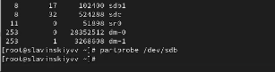

## Создание расширенного раздела

В терминале с полномочиями администратора запустим fdisk /dev/sdb. Дальше ввдем n, чтобы добавить новый раздел. Введем e, чтобы создать расширенный раздел. Дальше нажимаем Enter, чтобы первый сектор был по умолчанию. Последний сектор тоже сделаем по умолчанию. 

## Создание логического раздела

Из интерфейса fdisk снова нажмем n, чтобы создать логический раздел. Утилита нам сообщит, что нет свободных первичных разделов и по умолчанию нам предложат выбрать раздел с номером 5. Дальше нажмем Enter, чтобы принять выбор первого сектора по умолчанию, а в последнем секторе введем +101M. После создания логического раздела нажмем w, чтобы изменения применились, и чтобы завершить процедуру введем partprobe /dev/sdb.

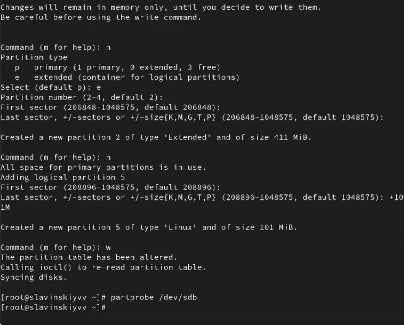

## Проверка информации

Посмотрим информацию о добавленных разделах.

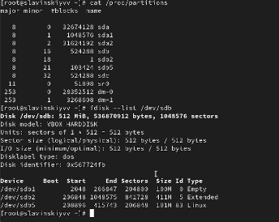

## Создание раздела подкачки

Запутим fdisk: fdisk /dev/sdb. Нажмем n, чтобы добавить новый раздел. У нас нет свободных первичных разделов, поэтому выбираем добавление раздела по умолчанию с номером раздела 6. Нажмем Enter, чтобы принять первый сектор по умолчанию, а в последнем секторе введем +100M. Нажмем t, чтобы изменить тип раздела. Вводим 82 (раздел подкачки). Далее нажимаем w, чтобы изменения записались на диск, и чтобы завершить процедуру введем partprobe /dev/sdb.

## Форматирование раздела подкачки и включение

Посмотрим информацию и добавленных разделах. Потом отформатируем раздел подкачки с помощью команды: mkswap /dev/sdb6. Для включения вновь выделенного пространства подкачки используем swapon /dev/sdb6. И для просмотра размера пространства подкачки, которое в настоящее время выделено, введем free -m. 

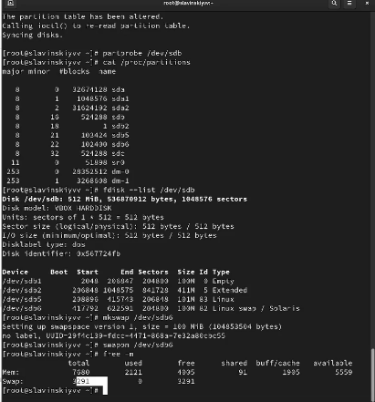

## Создание gpt раздела

Дальше в терминале с помощью gdisk посмотрим таблицы разделов и разделы на втором добавленном ранее диске /dev/sdc: gdisk -l /dev/sdc. Создадим раздел с помощью gdisk: gdisk /dev/sdc. Дальше введем n, чтобы добавить новый раздел. Выберем номер раздела по умолчанию. Затем зададим первый сектор по умолчанию, а в последнем секторе зададид +100M. Дальше установим тип раздела по умолчанию (8300 Linux). Нажмем p, чтобы просмотреть разбиение диска. Нам все устраивает, поэтому нажмем w, чтобы изменения записались. Обновим таблицу разделов через partprobe /dev/sdc.

## Информация о добавленных разделах

Посмотрим информацию о добавленных разделах cat /proc/partitions, gdisk -l /dev/sdc.

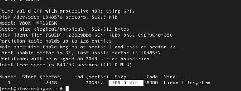

## Форматирование файловой системы XFS

Дальше для диска dev/sdb1 создадим файловую систему XFS: mkfs.xfs /dev/sdb1. Потом установим метки файловой системы в xfsdisk: xfs_admin -L xfsdisk /dev/sdb1.

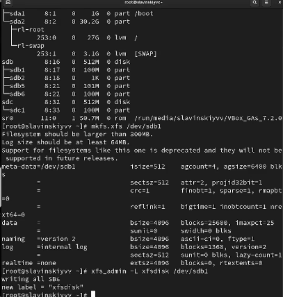

## Форматирование файловой системы EXT4

Создадим файловую систему EXT4 для диска dev/sdb5: mkfs.ext4 /dev/sdb5. Для установки метки файловой систему в ext4disk используем tune2fs -L ext4disk /dev/sdb5. Для установки параметров монтирования по умолчанию для файловой системы используем tune2fs -o acl,user_xattr /dev/sdb5.

## Ручное монтирование файловой системы

Далее создадим точку монтирования для раздела: mkdir -p /mnt/tmp. Чтобы смонтировать файловую систему, используем следующую команду: mount /dev/sdb5 /mnt/tmp. Для проверки корректности введем: mount.

## Ручное монтирование

Дальше, чтобы отмонтировать раздел используем umoumt с именем устройства либо с именем точки монтирования: umount /dev/sdb5, umount /mnt/tmp. Проверяем, что раздел отмонтирован: mount.

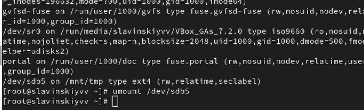

## Создание точки монтирования

Нам нужно подмонтировать отформатированный раздел XFS /dev/sdb1, который был смонтирован. Создаем точку монтирования для раздела XFS /dev/sdb1: mkdir -p /mnt/data. Посмотрим информацию об идентификаторах блочных устройств (UUID): blkid.

## Редактирование

Введем blkid /dev/sdb1, чтобы скопировать UUID для устройства /dev/sdb1. Далее откроем файл /etc/fstab на редоктирование и добавим строку UUID=значение_идентификатора /mnt/data xfs defaults 1 2 

## Монтирование

Дальше смонтируем все, что указано в /etc/fstab: mount -a. Проверим, что раздел правильно смонтировался: df -h.

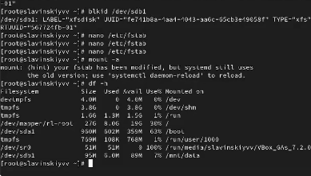

## Создание раздела под систему EXT4

Создаем раздел /dev/sdc2 по файловую систему EXT4, для этого переходим в gdisk /dev/sdc. Вводим n, чтобы создать новый раздел, номер раздела по умолчанию у нас 2, далее делаем первый сектор по умолчанию, а последний +100M. Тип раздела выбираем 8300 Linux filesystem.

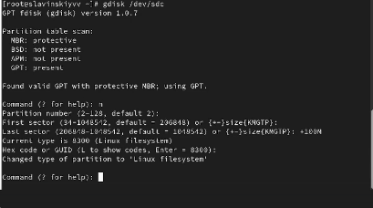

## Создание раздела под систему swap

Создаем раздел /dev/sdc3 под swap, для этого переходим в gdisk /dev/sdc. Вводим n, чтобы создать новый раздел, номер раздела по умолчанию у нас 3, далее делаем первый сектор по умолчанию, а последний +100M. Тип раздела выбираем 8200 Linux swap.

## Проверка

Проверяем наши разделы с помощью p. Дальше применяем запись с помощью w и обновляем таблицу разделов: partprobe /dev/sdc. 

## Форматирование

На втором разделе была создана файловая система EXT4, поэтому используем mkfs.ext4 /dev/sdc2. Задаем метку файловой системы tune2fs -L dataext /dev/sdc2.

## Подготовка раздела /dev/sdc3

Дальше создаем область подкачки mkswap /dev/sdc3, временно активируем через swapon /dev/sdc3. Последним шагом проверяем: swapon --show.

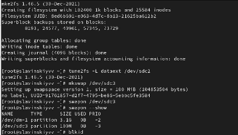

## Создание точки монтирования и подключения swap

Создаем точки монтирования : mkdir -p /mnt/data-ext. Потом,  получаем UUID-ы разделов sdc2 и sdc3 и вставляем их в /etc/fstab

## Проверка корректности настроек

Выполнеяем проверку корректности настроек без перезагрузки через mount -a, swapon -a.

## Перезагрузка системы и проверка

Перезагружаем систему и проверяем после перезагрузки. Как итог, выполнено все правильно.

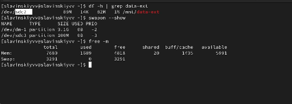

