---
## Front matter
title: "Лабараторная работа №14"
subtitle: "Отчет"
author: "Славинский Владислав Вадимович"

## Generic otions
lang: ru-RU
toc-title: "Содержание"

## Bibliography
bibliography: bib/cite.bib
csl: pandoc/csl/gost-r-7-0-5-2008-numeric.csl

## Pdf output format
toc: true # Table of contents
toc-depth: 2
lof: true # List of figures
lot: true # List of tables
fontsize: 12pt
linestretch: 1.5
papersize: a4
documentclass: scrreprt
## I18n polyglossia
polyglossia-lang:
  name: russian
  options:
	- spelling=modern
	- babelshorthands=true
polyglossia-otherlangs:
  name: english
## I18n babel
babel-lang: russian
babel-otherlangs: english
## Fonts
mainfont: IBM Plex Serif
romanfont: IBM Plex Serif
sansfont: IBM Plex Sans
monofont: IBM Plex Mono
mathfont: STIX Two Math
mainfontoptions: Ligatures=Common,Ligatures=TeX,Scale=0.94
romanfontoptions: Ligatures=Common,Ligatures=TeX,Scale=0.94
sansfontoptions: Ligatures=Common,Ligatures=TeX,Scale=MatchLowercase,Scale=0.94
monofontoptions: Scale=MatchLowercase,Scale=0.94,FakeStretch=0.9
mathfontoptions:
## Biblatex
biblatex: true
biblio-style: "gost-numeric"
biblatexoptions:
  - parentracker=true
  - backend=biber
  - hyperref=auto
  - language=auto
  - autolang=other*
  - citestyle=gost-numeric
## Pandoc-crossref LaTeX customization
figureTitle: "Рис."
tableTitle: "Таблица"
listingTitle: "Листинг"
lofTitle: "Список иллюстраций"
lotTitle: "Список таблиц"
lolTitle: "Листинги"
## Misc options
indent: true
header-includes:
  - \usepackage{indentfirst}
  - \usepackage{float} # keep figures where there are in the text
  - \floatplacement{figure}{H} # keep figures where there are in the text
---

# Цель работы

Получить навыки создания разделов на диске и файловых систем. Получить навыки
монтирования файловых систем.

# Выполнение лабораторной работы

Добавим к виртуальной машине два диска размером 512 МБ. Формат жесткого диска должен быть в VDI. Названия у дисков будет disk1 и disk2.   (рис. [-@fig:001])

{#fig:001 width=70%}

Дальше запустим машину с добавленными виртуальными дисками. В командной строке получим полномочия администратора и с помощью fdisk посмотрим перечень разделов на всех имеющихся устройствах жестких дисков. Видим, что добавились два раздела /dev/sdb и /dev/sdc.(рис. [-@fig:002])

{#fig:002 width=70%}

Нам необходимо сделать разметку диска /dev/sdb с помощью утилиты fdisk: fdisk /dev/sdb. Дальше мы нажимаем клавишу p, чтобы просмотреть текущее распределение пространства диска. Введем n, чтобы добавить новый раздел. Выберем p, чтобы создать основной раздел. Дальше укажем первый сектор по умолчанию, а в последнем секторе введем +100M, чтобы создать раздел на 100 MiB.   (рис. [-@fig:003])

{#fig:003 width=70%}

Дальше можено определить тип раздела. По умолчанию у нас используется Linux. Но чтобы раздел имел какой-либо другой тип, то можно использовать t. Нажмем Enter, чтобы принять тип раздела по умолчанию 83. Дальше нажмем на клавишу w, чтобы принять изменения и выйти из fdisk.  (рис. [-@fig:004])
 
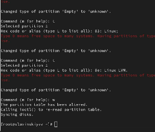{#fig:004 width=70%}

Сравним вывод команды fdisk -l /dev/sdb с cat /proc/partitions. Основное различие в том, что fdisk -l  может показать то, что записано на носитель, независимо от того, видит ли это ядро, а cat покажет что происходит в данный момент, то что есть здесь и сейчас, и если какого-нибудь раздела не будет в списке, то мы не сможем его отформатировать или смонтировать.  (рис. [-@fig:005])

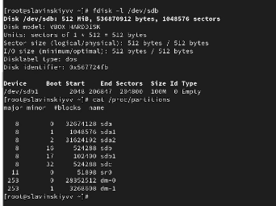{#fig:005 width=70%}

Запишем изменения в таблицу разделов ядра: partprobe /dev/sdb(рис. [-@fig:006])

{#fig:006 width=70%}

В терминале с полномочиями администратора запустим fdisk /dev/sdb. Дальше ввдем n, чтобы добавить новый раздел. Введем e, чтобы создать расширенный раздел. Дальше нажимаем Enter, чтобы первый сектор был по умолчанию. Последний сектор тоже сделаем по умолчанию. (рис. [-@fig:007])

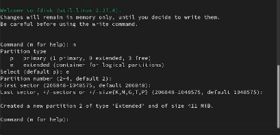{#fig:007 width=70%}

Из интерфейса fdisk снова нажмем n, чтобы создать логический раздел. Утилита нам сообщит, что нет свободных первичных разделов и по умолчанию нам предложат выбрать раздел с номером 5. Дальше нажмем Enter, чтобы принять выбор первого сектора по умолчанию, а в последнем секторе введем +101M. После создания логического раздела нажмем w, чтобы изменения применились, и чтобы завершить процедуру введем partprobe /dev/sdb. (рис. [-@fig:008])

{#fig:008 width=70%}

Посмотрим информацию о добавленных разделах.(рис. [-@fig:009])

{#fig:009 width=70%}

Запутим fdisk: fdisk /dev/sdb. Нажмем n, чтобы добавить новый раздел. У нас нет свободных первичных разделов, поэтому выбираем добавление раздела по умолчанию с номером раздела 6. Нажмем Enter, чтобы принять первый сектор по умолчанию, а в последнем секторе введем +100M. Нажмем t, чтобы изменить тип раздела. Вводим 82 (раздел подкачки). Далее нажимаем w, чтобы изменения записались на диск, и чтобы завершить процедуру введем partprobe /dev/sdb. (рис. [-@fig:010])

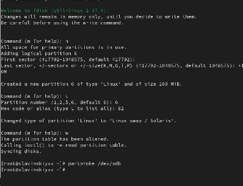{#fig:010 width=70%}

Посмотрим информацию и добавленных разделах. Потом отформатируем раздел подкачки с помощью команды: mkswap /dev/sdb6. Для включения вновь выделенного пространства подкачки используем swapon /dev/sdb6. И для просмотра размера пространства подкачки, которое в настоящее время выделено, введем free -m. (рис. [-@fig:011])

{#fig:011 width=70%}

Дальше в терминале с помощью gdisk посмотрим таблицы разделов и разделы на втором добавленном ранее диске /dev/sdc: gdisk -l /dev/sdc. Создадим раздел с помощью gdisk: gdisk /dev/sdc. Дальше введем n, чтобы добавить новый раздел. Выберем номер раздела по умолчанию. Затем зададим первый сектор по умолчанию, а в последнем секторе зададид +100M. Дальше установим тип раздела по умолчанию (8300 Linux). Нажмем p, чтобы просмотреть разбиение диска. Нам все устраивает, поэтому нажмем w, чтобы изменения записались. Обновим таблицу разделов через partprobe /dev/sdc. (рис. [-@fig:012])

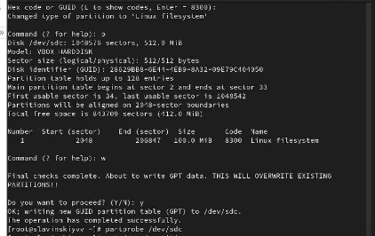{#fig:012 width=70%}

Посмотрим информацию о добавленных разделах cat /proc/partitions, gdisk -l /dev/sdc. (рис. [-@fig:013])

{#fig:013 width=70%}

Дальше для диска dev/sdb1 создадим файловую систему XFS: mkfs.xfs /dev/sdb1. Потом установим метки файловой системы в xfsdisk: xfs_admin -L xfsdisk /dev/sdb1.(рис. [-@fig:014])

{#fig:014 width=70%}

Создадим файловую систему EXT4 для диска dev/sdb5: mkfs.ext4 /dev/sdb5. Для установки метки файловой систему в ext4disk используем tune2fs -L ext4disk /dev/sdb5. Для установки параметров монтирования по умолчанию для файловой системы используем tune2fs -o acl,user_xattr /dev/sdb5. (рис. [-@fig:015])

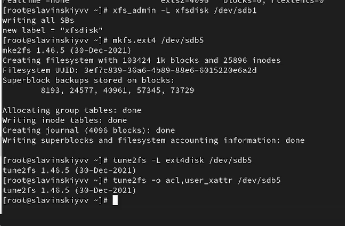{#fig:015 width=70%}

Далее создадим точку монтирования для раздела: mkdir -p /mnt/tmp. Чтобы смонтировать файловую систему, используем следующую команду: mount /dev/sdb5 /mnt/tmp. Для проверки корректности введем: mount.  (рис. [-@fig:016])

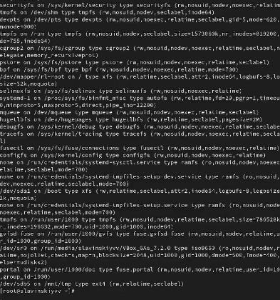{#fig:016 width=70%}

Дальше, чтобы отмонтировать раздел используем umoumt с именем устройства либо с именем точки монтирования: umount /dev/sdb5, umount /mnt/tmp. Проверяем, что раздел отмонтирован: mount. (рис. [-@fig:017])

{#fig:017 width=70%}

Нам нужно подмонтировать отформатированный раздел XFS /dev/sdb1, который был смонтирован. Создаем точку монтирования для раздела XFS /dev/sdb1: mkdir -p /mnt/data. Посмотрим информацию об идентификаторах блочных устройств (UUID): blkid.(рис. [-@fig:018])

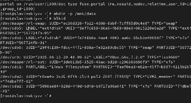{#fig:018 width=70%}

Введем blkid /dev/sdb1, чтобы скопировать UUID для устройства /dev/sdb1. Далее откроем файл /etc/fstab на редоктирование и добавим строку UUID=значение_идентификатора /mnt/data xfs defaults 1 2 (рис. [-@fig:019])

{#fig:019 width=70%}

Дальше смонтируем все, что указано в /etc/fstab: mount -a. Проверим, что раздел правильно смонтировался: df -h. (рис. [-@fig:020])

{#fig:020 width=70%}

Создаем раздел /dev/sdc2 по файловую систему EXT4, для этого переходим в gdisk /dev/sdc. Вводим n, чтобы создать новый раздел, номер раздела по умолчанию у нас 2, далее делаем первый сектор по умолчанию, а последний +100M. Тип раздела выбираем 8300 Linux filesystem. (рис. [-@fig:021])

{#fig:021 width=70%}

Создаем раздел /dev/sdc3 под swap, для этого переходим в gdisk /dev/sdc. Вводим n, чтобы создать новый раздел, номер раздела по умолчанию у нас 3, далее делаем первый сектор по умолчанию, а последний +100M. Тип раздела выбираем 8200 Linux swap. (рис. [-@fig:022])

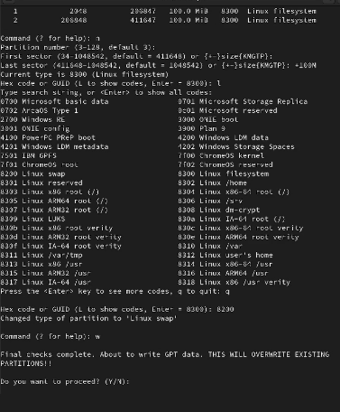{#fig:022 width=70%}

Проверяем наши разделы с помощью p. Дальше применяем запись с помощью w и обновляем таблицу разделов: partprobe /dev/sdc. (рис. [-@fig:023])

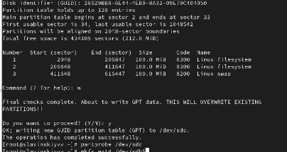{#fig:023 width=70%}

На втором разделе была создана файловая система EXT4, поэтому используем mkfs.ext4 /dev/sdc2. Задаем метку файловой системы tune2fs -L dataext /dev/sdc2. (рис. [-@fig:024])

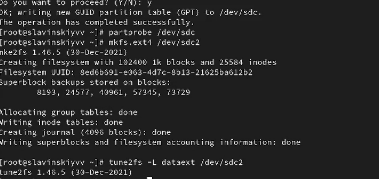{#fig:024 width=70%}

Дальше создаем область подкачки mkswap /dev/sdc3, временно активируем через swapon /dev/sdc3. Последним шагом проверяем: swapon --show.  (рис. [-@fig:025])

{#fig:025 width=70%}

Создаем точки монтирования : mkdir -p /mnt/data-ext. Потом,  получаем UUID-ы разделов sdc2 и sdc3 и вставляем их в /etc/fstab (рис. [-@fig:026])

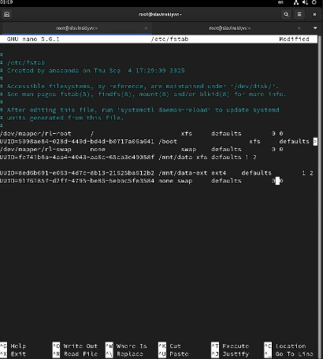{#fig:026 width=70%}

Выполнеяем проверку корректности настроек без перезагрузки через mount -a, swapon -a. (рис. [-@fig:027])

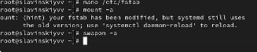{#fig:027 width=70%}

Перезагружаем систему и проверяем после перезагрузки. Как итог, выполнено все правильно. (рис. [-@fig:028])

{#fig:028 width=70%}

# Выводы

В ходе выполнения лабораторной работы были получены навыки монтирования файловых систем.

# Ответы на контрольные вопросы

1.  gdisk

2.  fdisk

3. /etc/fstab

4. указывать параметр noauto

5. mkswap

6. mount -a, swapon -a

7.  Обычно система создает ext2, но некоторые дистрибутивы могут перенаправлять на ext4

8.  mkfs.ext4

9. blkid 
