---
## Front matter
lang: ru-RU
title: Управление логическими томами
subtitle: Часть 1
author:
  - Славинский В.В.
institute:
  - Российский университет дружбы народов, Москва, Россия Россия
date: 14 декабря 2025

## i18n babel
babel-lang: russian
babel-otherlangs: english

## Formatting pdf
toc: false
toc-title: Содержание
slide_level: 2
aspectratio: 169
section-titles: true
theme: metropolis
header-includes:
 - \metroset{progressbar=frametitle,sectionpage=progressbar,numbering=fraction}
---

# Информация

## Докладчик

:::::::::::::: {.columns align=center}
::: {.column width="70%"}

  * Славинский Владислав Вадимович
  * Студент
  * Российский университет дружбы народов
  * [1132246169@pfur.ru]

:::
::: {.column width="30%"}

# Вводная часть

## Комментирование строк

В терминале с полномочиями администратора в файле /etc/fstab закомментируем строки автомонтирования /mnt/data и /mnt/data-ext.

## Монтирование

Отмонтируем /mnt/data и /mnt/data-ext: umount /mnt/data, umount /mnt/data-ext.

## Проверка

С помощью команды mount без параметров убедимся, что диски /dev/sdb и /dev/sdc не подмонтированы.

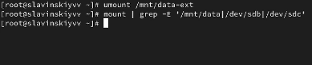

## Создание новой разметки

С помощью fdisk сделаем новую разметку для /dev/sdb и /dev/sdc, удалив ранее
созданные партиции.

## Запись изменений

Запишем изменения в таблицу разделов ядра: partprobe /dev/sdb. 

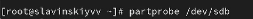

## Просмотр информации

Просмотрим информацию о разделах: cat /proc/partitions, fdisk --list /dev/sdb.

## Создание раздела с LVM типа

В терминале с полномочиями администратора с помощью fdisk создадим основной
раздел с типом LVM 

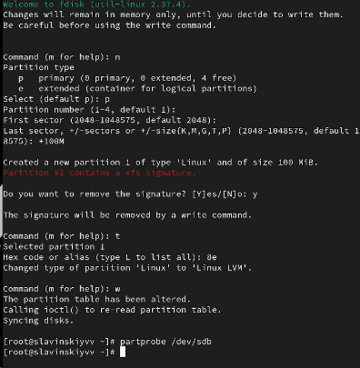

## Обновление таблицы разделов и указание на физический том

Обновим таблицу разделов. Укажем раздел как физический том LVM. Для этого введите: pvcreate /dev/sdb1

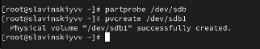

## Проверка информации

Теперь введем pvs, чтобы убедиться, что физический том создан успешно.

## Создание группы томов

Создадим группу томов с присвоенным ей физическим томом: vgcreate vgdata /dev/sdb1. Далее убедимся, что группа томов была успешно создана с помощью vgs, pvs

## Создание логического тома

Введем команду vcreate -n lvdata -l 50%FREE vgdata , она создаст логический том LVM с именем lvdata, который будет использовать 50% доступного дискового пространства в группе томов vgdata и для проверки введем lvs.

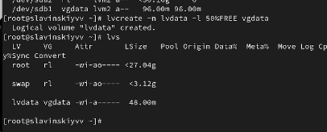

## Создание файловой системы и создание папки для монтирования

На этом этапе мы готовы создать файловую систему поверх логического тома. Для этого введем mkfs.ext4 /dev/vgdata/lvdata. После этого создадим папку, на которую можно смонтировать том mkdir -p /mnt/data

## Добавление строки в /etc/fstab

Добавим следующую строку в /etc/fstab: /dev/vgdata/lvdata /mnt/data ext4 defaults 1 2.

## Проверка

Проверим, монтируется ли файловая система mount -a,  mount | grep /mnt.

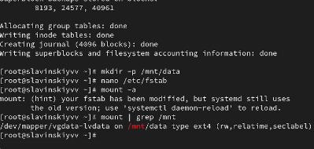

## Отображение текущей конфигураций физических томов и групп

В терминале с полномочиями администратора введем pvs и vgs, чтобы отобразить
текущую конфигурацию физических томов и группы томов.

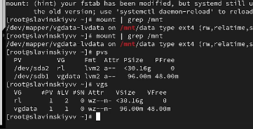

## Создание раздела

С помощью fdisk добавим раздел /dev/sdb2 размером 100 М. Зададим тип раздела 8e.

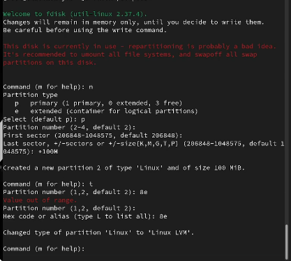

## Создание физического тома и расширение vgdata

Создадим физический том: pvcreate /dev/sdb2. Расширим vgdata: vgextend vgdata /dev/sdb2.

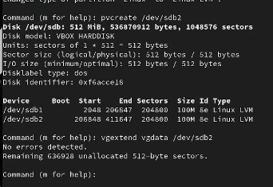

## Проверка размера файловой системы

Проверим текущий размер файловой системы на lvdata: df -h.

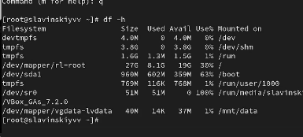

## Увеличение lvdata на 50%

Увеличим lvdata на 50% оставшегося доступного дискового пространства в группе томов: lvextend -r -l +50%FREE /dev/vgdata/lvdata

## Проверка

Убедиимся, что добавленное дисковое пространство стало доступным: lvs, df -h.

## Уменьшение lvdata на 50 МБ

Уменьшим размер lvdata на 50 МБ: lvreduce -r -L -50M /dev/vgdata/lvdata. 

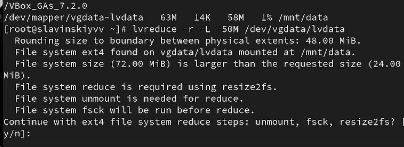

## Проверка

Убедимся в успешном изменении дискового пространства: lvs, df -h.

