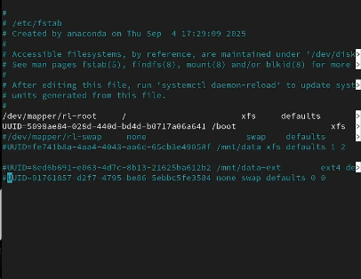
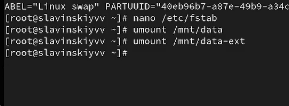
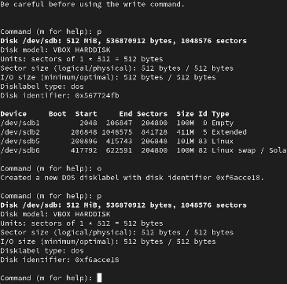
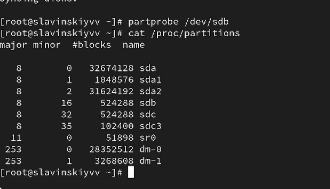
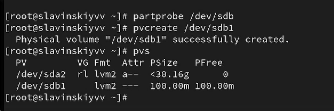
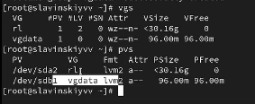
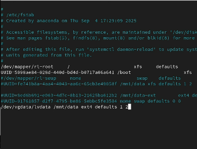
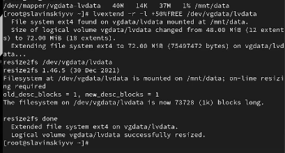
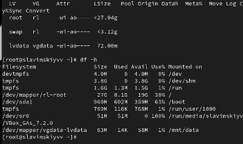
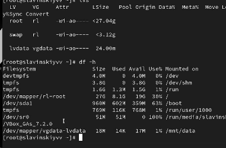

---
## Front matter
title: "Лабараторная работа №15"
subtitle: "Отчет"
author: "Славинский Владислав Вадимович"

## Generic otions
lang: ru-RU
toc-title: "Содержание"

## Bibliography
bibliography: bib/cite.bib
csl: pandoc/csl/gost-r-7-0-5-2008-numeric.csl

## Pdf output format
toc: true # Table of contents
toc-depth: 2
lof: true # List of figures
lot: true # List of tables
fontsize: 12pt
linestretch: 1.5
papersize: a4
documentclass: scrreprt
## I18n polyglossia
polyglossia-lang:
  name: russian
  options:
	- spelling=modern
	- babelshorthands=true
polyglossia-otherlangs:
  name: english
## I18n babel
babel-lang: russian
babel-otherlangs: english
## Fonts
mainfont: IBM Plex Serif
romanfont: IBM Plex Serif
sansfont: IBM Plex Sans
monofont: IBM Plex Mono
mathfont: STIX Two Math
mainfontoptions: Ligatures=Common,Ligatures=TeX,Scale=0.94
romanfontoptions: Ligatures=Common,Ligatures=TeX,Scale=0.94
sansfontoptions: Ligatures=Common,Ligatures=TeX,Scale=MatchLowercase,Scale=0.94
monofontoptions: Scale=MatchLowercase,Scale=0.94,FakeStretch=0.9
mathfontoptions:
## Biblatex
biblatex: true
biblio-style: "gost-numeric"
biblatexoptions:
  - parentracker=true
  - backend=biber
  - hyperref=auto
  - language=auto
  - autolang=other*
  - citestyle=gost-numeric
## Pandoc-crossref LaTeX customization
figureTitle: "Рис."
tableTitle: "Таблица"
listingTitle: "Листинг"
lofTitle: "Список иллюстраций"
lotTitle: "Список таблиц"
lolTitle: "Листинги"
## Misc options
indent: true
header-includes:
  - \usepackage{indentfirst}
  - \usepackage{float} # keep figures where there are in the text
  - \floatplacement{figure}{H} # keep figures where there are in the text
---

# Цель работы

Получить навыки управления логическими томами.

# Выполнение лабораторной работы

В терминале с полномочиями администратора в файле /etc/fstab закомментируем строки автомонтирования /mnt/data и /mnt/data-ext.   (рис. [-@fig:001])

{#fig:001 width=70%}

Отмонтируем /mnt/data и /mnt/data-ext: umount /mnt/data, umount /mnt/data-ext.(рис. [-@fig:002])

{#fig:002 width=70%}

С помощью команды mount без параметров убедимся, что диски /dev/sdb и /dev/sdc не подмонтированы.   (рис. [-@fig:003])

{#fig:003 width=70%}

С помощью fdisk сделаем новую разметку для /dev/sdb и /dev/sdc, удалив ранее
созданные партиции.  (рис. [-@fig:004])
 
{#fig:004 width=70%}

Запишем изменения в таблицу разделов ядра: partprobe /dev/sdb.  (рис. [-@fig:005])

{#fig:005 width=70%}

Просмотрим информацию о разделах: cat /proc/partitions, fdisk --list /dev/sdb(рис. [-@fig:006])

{#fig:006 width=70%}

В терминале с полномочиями администратора с помощью fdisk создадим основной
раздел с типом LVM (рис. [-@fig:007])

{#fig:007 width=70%}

Обновим таблицу разделов. Укажем раздел как физический том LVM. Для этого введите: pvcreate /dev/sdb1 (рис. [-@fig:008])

{#fig:008 width=70%}

Теперь введем pvs, чтобы убедиться, что физический том создан успешно.(рис. [-@fig:009])

{#fig:009 width=70%}

Создадим группу томов с присвоенным ей физическим томом: vgcreate vgdata /dev/sdb1. Далее убедимся, что группа томов была успешно создана с помощью vgs, pvs (рис. [-@fig:010])

{#fig:010 width=70%}

Введем команду vcreate -n lvdata -l 50%FREE vgdata , она создаст логический том LVM с именем lvdata, который будет использовать 50% доступного дискового пространства в группе томов vgdata и для проверки введем lvs. (рис. [-@fig:011])

{#fig:011 width=70%}

На этом этапе мы готовы создать файловую систему поверх логического тома. Для этого введем mkfs.ext4 /dev/vgdata/lvdata. После этого создадим папку, на которую можно смонтировать том mkdir -p /mnt/data (рис. [-@fig:012])

{#fig:012 width=70%}

Добавим следующую строку в /etc/fstab: /dev/vgdata/lvdata /mnt/data ext4 defaults 1 2. (рис. [-@fig:013])

{#fig:013 width=70%}

Проверим, монтируется ли файловая система mount -a,  mount | grep /mnt.(рис. [-@fig:014])

{#fig:014 width=70%}

В терминале с полномочиями администратора введем pvs и vgs, чтобы отобразить
текущую конфигурацию физических томов и группы томов. (рис. [-@fig:015])

{#fig:015 width=70%}

С помощью fdisk добавим раздел /dev/sdb2 размером 100 М. Зададим тип раздела 8e. (рис. [-@fig:016])

{#fig:016 width=70%}

Создадим физический том: pvcreate /dev/sdb2. Расширим vgdata: vgextend vgdata /dev/sdb2. (рис. [-@fig:017])

{#fig:017 width=70%}

Проверим текущий размер файловой системы на lvdata: df -h.(рис. [-@fig:018])

{#fig:018 width=70%}

Увеличим lvdata на 50% оставшегося доступного дискового пространства в группе томов: lvextend -r -l +50%FREE /dev/vgdata/lvdata (рис. [-@fig:019])

{#fig:019 width=70%}

Убедиимся, что добавленное дисковое пространство стало доступным: lvs, df -h. (рис. [-@fig:020])

{#fig:020 width=70%}

Уменьшим размер lvdata на 50 МБ: lvreduce -r -L -50M /dev/vgdata/lvdata. (рис. [-@fig:021])

{#fig:021 width=70%}

Убедимся в успешном изменении дискового пространства: lvs, df -h. (рис. [-@fig:022])

{#fig:022 width=70%}

# Выводы

В ходе выполнения лабораторной работы были получены навыки управления логическими томами.

# Ответы на контрольные вопросы

1.  8e00

2.  vgcreate -s 4M vggroup /dev/sdb3

3. pvs

4. pvdisplay

5. lvcreate -n lvvol1 -L 6M "имя группы томов"

6. lvextend -L +100M /dev/<имя группы томов>/lvvol1

7.  pvcreate /dev/<новое устройство>, vgextend <имя группы томов> /dev/<новое устройство>

8. Опция -r или --resizefs

9. lvs

10. fsck /dev/vgdata/lvdata
