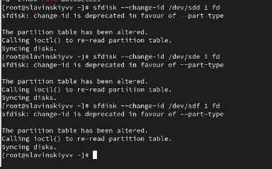
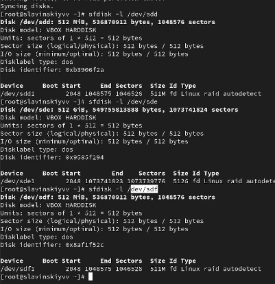
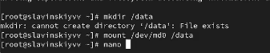
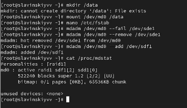
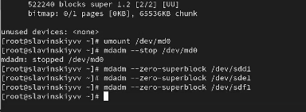
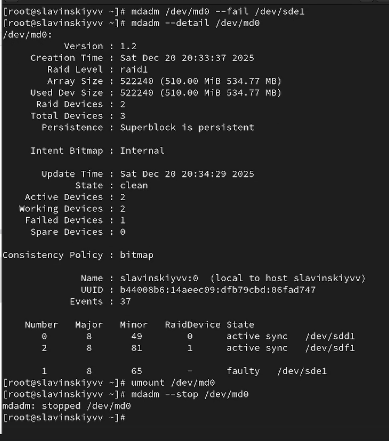
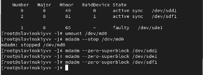
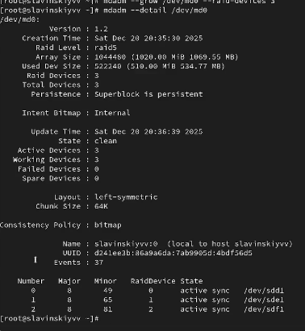

---
## Front matter
lang: ru-RU
title: Программный RAID
subtitle: Часть 1
author:
  - Славинский В.В.
institute:
  - Российский университет дружбы народов, Москва, Россия Россия
date: 20 декабря 2025

## i18n babel
babel-lang: russian
babel-otherlangs: english

## Formatting pdf
toc: false
toc-title: Содержание
slide_level: 2
aspectratio: 169
section-titles: true
theme: metropolis
header-includes:
 - \metroset{progressbar=frametitle,sectionpage=progressbar,numbering=fraction}
---

# Информация

## Докладчик

:::::::::::::: {.columns align=center}
::: {.column width="70%"}

  * Славинский Владислав Вадимович
  * Студент
  * Российский университет дружбы народов
  * [1132246169@pfur.ru]

:::
::: {.column width="30%"}

# Вводная часть

## Проверка создания дисков

После создания трех дисков размером 512МБ, получаем полномочия администратора, и проверим наличие созданных  на предыдущем этапе дисков: fdisk -l | grep /dev/sd 

## Создание разделов EOF

Создадим на каждом из дисков раздел EOF.

## Проверка типа созданных разделов

Проверим текущий тип созданных разделов. Все созданные разделы имеют тип 83 Linux.

## Проверка партиций

Просмотрим, какие типы партиций, относящиеся к RAID, можно задать: sfdisk -T | grep -i raid. Можно задать Linux raid autodetect.

## Установка типа разделов

Установим тип разделов в Linux raid autodetect.

## Состояние дисков

Просмотрим состояние дисков

## Массив RAID 1 из дисков sdd1 и sde1

При помощи утилиты mdadm создадим массив RAID 1 из двух дисков 

## Проверка состояния массива

Проверим состояние массива RAID, используя команды  cat /proc/mdstat, mdadm --query /dev/md0, mdadm --detail /dev/md0. Массив RAID 1 создан и синхронизирован. Состояние clean, все данные согласованы. В массиве 2 активных устройства. Политика согласованности bitmap.

## Создание файловой системы

Создадим файловую систему на RAID: mkfs.ext4 /dev/md0.

## Монтирование

Подмонтируем RAID

## Запись для автомонтирования

Далее для автомонтирования добавим запись в /etc/fstab: /dev/md0 /data ext4 defaults 1 2 

## Измененное состояние массива

Сымитируем сбой одного из дисков: mdadm /dev/md0 --fail /dev/sde1. Потом удалим сбойный диск: mdadm /dev/md0 --remove /dev/sde. И заменим диск в массиве: mdadm /dev/md0 --add /dev/sdf. Массив перестраивается с использованием bitmap. Bitmap ускоряет процесс восстановления, так как остлеживает только измененные блоки данных.

## Удаление массива и очистка

Удалим массив и очистим метаданные

## Создание массива из двух дисков  и добавление третьего

Создадим массив RAID 1 из двух дисков. Потом добавим третий диск sdf1.

## Монтирование и просмотр состояния массива

Подмонтируем /dev/md0 и посмотрим состояние массива. Массив имеет два активных диска и одним резервным (spare). Исользуется bitmap для отслеживания изменений.

## Имитация сбоя одного из дисков

Сымитируем сбой одного из дисков: mdadm /dev/md0 --fail /dev/sde1. Проверим состояние массива: mdadm --detail /dev/md0. Hotspare диск автоматически заменил сбойный диск. Bitmap позволил быстро восстановить данные, так как отслеживал измененные блоки. 

## Удаление массива и очистка

Удалим массив и очистим метаданные.

## Создание массива с двумя дисками

Создадим массив RAID 1 из двух дисков: mdadm --create --verbose /dev/md0 --level=1 --raid-devices=2 /dev/sdd1 /dev/sde1. И добавим третий диск sdf1

## Монтирование и проверка состояния

Подмонтируем /dev/md0 и проверим состояние массива.

## Изменение типа массива

Измените тип массива RAID 5 и проверим состояние.  Массив преобразован в RAID 5 с использованием bitmap. Преобразование происходит постепенно с сохранением данных.

## Изменение кол-во дисков в массиве

Изменим количество дисков в массиве RAID 5 и посмотрим изменения. RAID 5 с тремя дисками, полезный объем увеличен до 1гб. Bitmap продолжает использоваться для отслеживания изменений. 

## Удаление массива и очистка

Удалим массив и очистим метаданные и заккоментируем запись в /etc/fstab.

