---
## Front matter
title: "Лабараторная работа №16"
subtitle: "Отчет"
author: "Славинский Владислав Вадимович"

## Generic otions
lang: ru-RU
toc-title: "Содержание"

## Bibliography
bibliography: bib/cite.bib
csl: pandoc/csl/gost-r-7-0-5-2008-numeric.csl

## Pdf output format
toc: true # Table of contents
toc-depth: 2
lof: true # List of figures
lot: true # List of tables
fontsize: 12pt
linestretch: 1.5
papersize: a4
documentclass: scrreprt
## I18n polyglossia
polyglossia-lang:
  name: russian
  options:
	- spelling=modern
	- babelshorthands=true
polyglossia-otherlangs:
  name: english
## I18n babel
babel-lang: russian
babel-otherlangs: english
## Fonts
mainfont: IBM Plex Serif
romanfont: IBM Plex Serif
sansfont: IBM Plex Sans
monofont: IBM Plex Mono
mathfont: STIX Two Math
mainfontoptions: Ligatures=Common,Ligatures=TeX,Scale=0.94
romanfontoptions: Ligatures=Common,Ligatures=TeX,Scale=0.94
sansfontoptions: Ligatures=Common,Ligatures=TeX,Scale=MatchLowercase,Scale=0.94
monofontoptions: Scale=MatchLowercase,Scale=0.94,FakeStretch=0.9
mathfontoptions:
## Biblatex
biblatex: true
biblio-style: "gost-numeric"
biblatexoptions:
  - parentracker=true
  - backend=biber
  - hyperref=auto
  - language=auto
  - autolang=other*
  - citestyle=gost-numeric
## Pandoc-crossref LaTeX customization
figureTitle: "Рис."
tableTitle: "Таблица"
listingTitle: "Листинг"
lofTitle: "Список иллюстраций"
lotTitle: "Список таблиц"
lolTitle: "Листинги"
## Misc options
indent: true
header-includes:
  - \usepackage{indentfirst}
  - \usepackage{float} # keep figures where there are in the text
  - \floatplacement{figure}{H} # keep figures where there are in the text
---

# Цель работы

Освоить работу с RAID-массивами при помощи утилиты mdadm.

# Выполнение лабораторной работы

После создания трех дисков размером 512МБ, получаем полномочия администратора, и проверим наличие созданных  на предыдущем этапе дисков: fdisk -l | grep /dev/sd   (рис. [-@fig:001])

{#fig:001 width=70%}

Создадим на каждом из дисков раздел EOF.(рис. [-@fig:002])

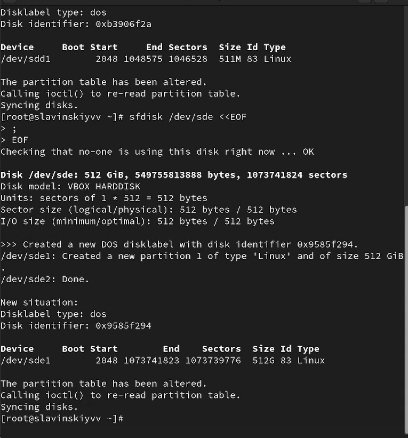{#fig:002 width=70%}

Проверим текущий тип созданных разделов. Все созданные разделы имеют тип 83 Linux.  (рис. [-@fig:003])

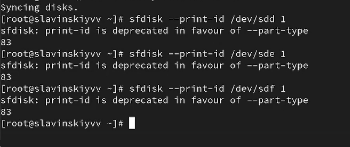{#fig:003 width=70%}

Просмотрим, какие типы партиций, относящиеся к RAID, можно задать: sfdisk -T | grep -i raid. Можно задать Linux raid autodetect. (рис. [-@fig:004])
 
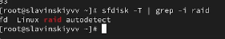{#fig:004 width=70%}

Установим тип разделов в Linux raid autodetect.  (рис. [-@fig:005])

{#fig:005 width=70%}

Просмотрим состояние дисков(рис. [-@fig:006])

{#fig:006 width=70%}

При помощи утилиты mdadm создадим массив RAID 1 из двух дисков (рис. [-@fig:007])

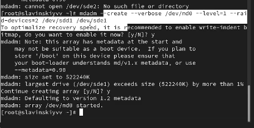{#fig:007 width=70%}

Проверим состояние массива RAID, используя команды  cat /proc/mdstat, mdadm --query /dev/md0, mdadm --detail /dev/md0. Массив RAID 1 создан и синхронизирован. Состояние clean, все данные согласованы. В массиве 2 активных устройства. Политика согласованности bitmap.(рис. [-@fig:008])

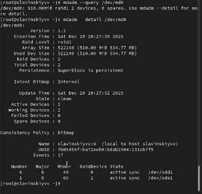{#fig:008 width=70%}

Создадим файловую систему на RAID: mkfs.ext4 /dev/md0.(рис. [-@fig:009])

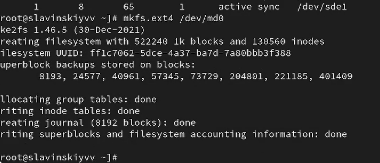{#fig:009 width=70%}

Подмонтируем RAID (рис. [-@fig:010])

{#fig:010 width=70%}

Далее для автомонтирования добавим запись в /etc/fstab: /dev/md0 /data ext4 defaults 1 2 (рис. [-@fig:011])

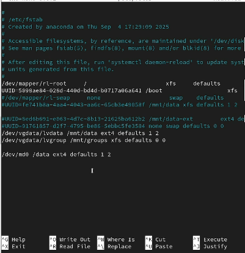{#fig:011 width=70%}

Сымитируем сбой одного из дисков: mdadm /dev/md0 --fail /dev/sde1. Потом удалим сбойный диск: mdadm /dev/md0 --remove /dev/sde. И заменим диск в массиве: mdadm /dev/md0 --add /dev/sdf. Массив перестраивается с использованием bitmap. Bitmap ускоряет процесс восстановления, так как остлеживает только измененные блоки данных. (рис. [-@fig:012])

{#fig:012 width=70%}

Удалим массив и очистим метаданные (рис. [-@fig:013])

{#fig:013 width=70%}

Создадим массив RAID 1 из двух дисков. Потом добавим третий диск sdf1.(рис. [-@fig:014])

{#fig:014 width=70%}

Подмонтируем /dev/md0 и посмотрим состояние массива. Массив имеет два активных диска и одним резервным (spare). Исользуется bitmap для отслеживания изменений. (рис. [-@fig:015])

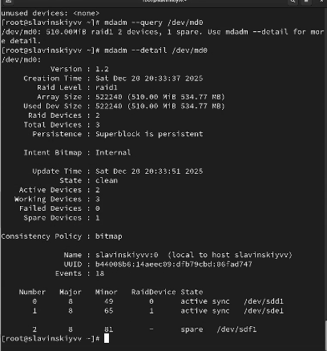{#fig:015 width=70%}

Сымитируем сбой одного из дисков: mdadm /dev/md0 --fail /dev/sde1. Проверим состояние массива: mdadm --detail /dev/md0. Hotspare диск автоматически заменил сбойный диск. Bitmap позволил быстро восстановить данные, так как отслеживал измененные блоки.  (рис. [-@fig:016])

{#fig:016 width=70%}

Удалим массив и очистим метаданные.(рис. [-@fig:017])

{#fig:017 width=70%}

Создадим массив RAID 1 из двух дисков: mdadm --create --verbose /dev/md0 --level=1 --raid-devices=2 /dev/sdd1 /dev/sde1. И добавим третий диск sdf1(рис. [-@fig:018])

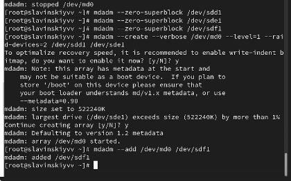{#fig:018 width=70%}

Подмонтируем /dev/md0 и проверим состояние массива.(рис. [-@fig:019])

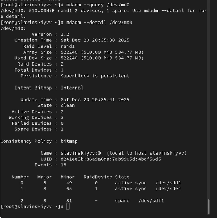{#fig:019 width=70%}

Измените тип массива RAID 5 и проверим состояние.  Массив преобразован в RAID 5 с использованием bitmap. Преобразование происходит постепенно с сохранением данных.(рис. [-@fig:020])

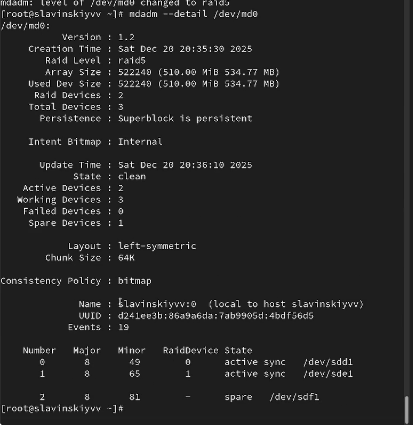{#fig:020 width=70%}

Изменим количество дисков в массиве RAID 5 и посмотрим изменения. RAID 5 с тремя дисками, полезный объем увеличен до 1гб. Bitmap продолжает использоваться для отслеживания изменений. (рис. [-@fig:021])

{#fig:021 width=70%}

Удалим массив и очистим метаданные и заккоментируем запись в /etc/fstab. (рис. [-@fig:022])

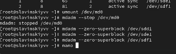{#fig:022 width=70%}

# Выводы

В ходе выполнения лабораторной работы была освоена работа с RAID-массивами при помощи утилиты mdadm.

# Ответы на контрольные вопросы

1.  Это технология объединения нескольких физических дисков в логический массик для повышения производительности

2.  RAID 0, RAID 1, RAID 5, RAID 6, RAID 10.

3.  1) RAID 0 (striping). Чередование. Высокая скорость, но не обеспечивается отказоустойчивость. Поэтому фактически не считается RAID. 2) RAID 1. Зеркалирование. Каждый диск представляет собой полную копию другого. Минимальное количество дисков — 2. 3) RAID 5. Блоки данных и контрольные суммы записываются на все диски циклично. Для хранения контрольных сумм используется объём одного диска. Минимальное количество дисков при использовании RAID 5 равно трём. 4) RAID 6. Аналогичен RAID 5. Для хранения контрольных сумм используется объём двух дисков. Основан на кодах Рида–Соломона. Минимальное количество дисков — четыре.
