---
## Front matter
lang: ru-RU
title: Введение в linux
subtitle: Часть 1
author:
  - Славинский В.В.
institute:
  - Российский университет дружбы народов, Москва, Россия Россия
date: 17 мая 2025

## i18n babel
babel-lang: russian
babel-otherlangs: english

## Formatting pdf
toc: false
toc-title: Содержание
slide_level: 2
aspectratio: 169
section-titles: true
theme: metropolis
header-includes:
 - \metroset{progressbar=frametitle,sectionpage=progressbar,numbering=fraction}
---

# Информация

## Докладчик

:::::::::::::: {.columns align=center}
::: {.column width="70%"}

  * Славинский Владислав Вадимович
  * Студент
  * Российский университет дружбы народов
  * [1132246169@pfur.ru]

:::
::: {.column width="30%"}

# Вводная часть

## Задание 1

Создадим документ в LibreOffice и напишем в нем шрифтом FreeMono. Потом сохраним его в формате FODT.

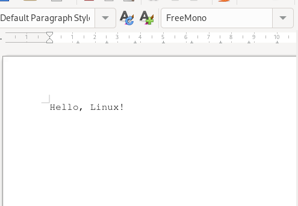

## Задание 2

Установочные пакеты в Linux (Ubuntu) имеют расширение deb.

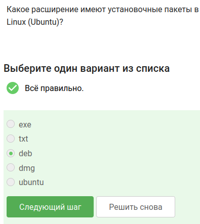

## Задание 3

Далее поставим плеер VLC в систему и из вкладки "Авторы" запишем первую фамилию из этого списка.

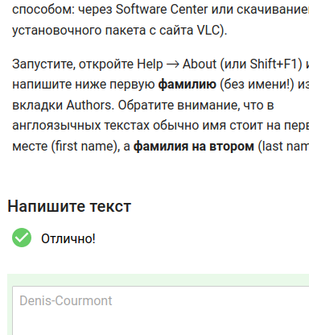

## Задание 4

Приложение Update Manager можно использовать для: обновления ссылок в Software Center, обновления всей системы до новой версии, обновления установленных программ.

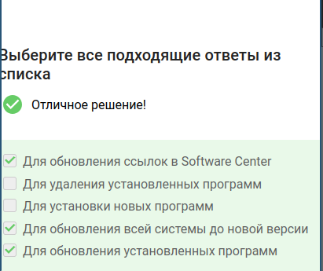

## Задание 5

Терминал и консоль являются синонимами для "командной строки".

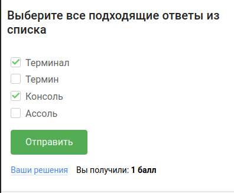

## Задание 6

Только pwd напечатаем в какой директории мы сейчас находимся.

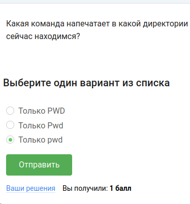

## Задание 7

Все команды полностью эквивалентны команде ls -A --human-readable -l /some/directory

## Задание 8

Команды ls ../Downloads, ls ./../Downloads ls /home/bi/Downloads выведут содержимое диретктории, при этом не показывая содержимое других директорий.

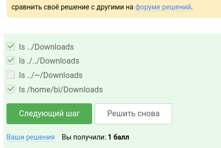

## Задание 9

Команда rm -r используется для удаления директорий

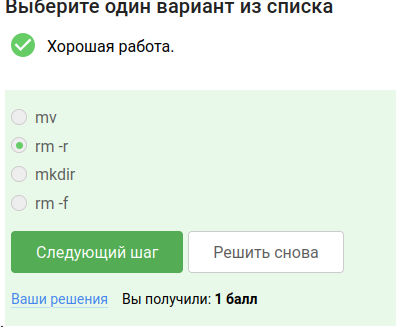

## Задание 10

Если ввести в терминал команду firefox, а затем ввести туда же команду exit, то ничего не закроется.

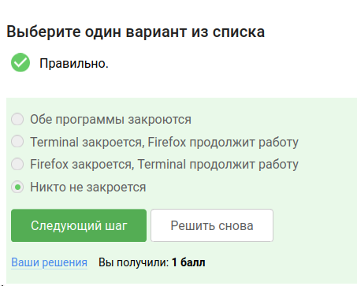

## Задание 11

Запуск ctrl+z, bg эквивалентен запуску программы с &.

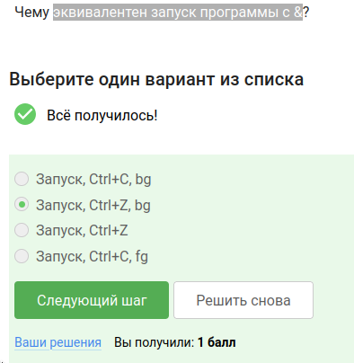

## Задание 12

Скачаем файл с программой, далее сделаем его исполняемым, скопируем то, что нам вывело на экран в форму.

## Задание 13

По умолчанию на экран выводится поток ошибок из программы, которая была запущена в терминале.

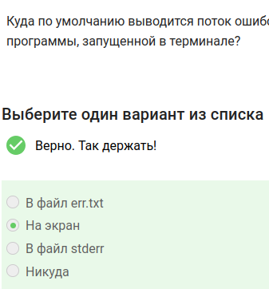

## Задание 14

Команды program 2> file.txt и program 2 >> file.txt создадут файл file.txt и запишут в него поток ошибок программы program. 

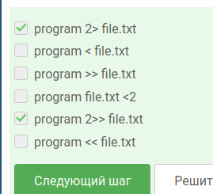

## Задание 15

Сообщения об ошибках от программ, которые объединены в конвейер, выводятся на экран.

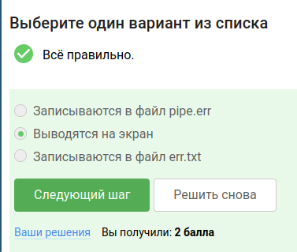

## Задание 16 

Если были использованы команды: cd /home/alex/ и wget -P /home/alex/Pictures -O 1.jpg http://example.com/example.jpg, то они окажутся в /home/alex/1.jpg

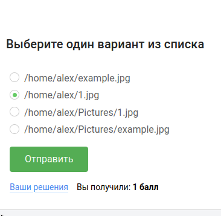

## Задание 17

Чтобы команда wget не выводила никаких сообщений на экран ( Resolving, Connecting to...), то нужна опция -q или -quiet

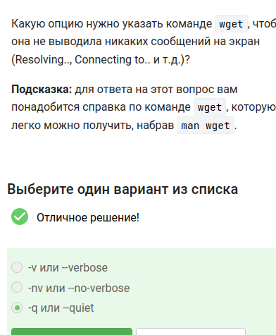

## Задание 18

Есдт га гекльлолй веб странице есть ссылки на картинки в форматах png и jpg, а также ссылки на другие страницы сайта, то будут скачаны jpg и html файлы, но все html будут удалены, если запустить wget -r -l 1 -A jpg.

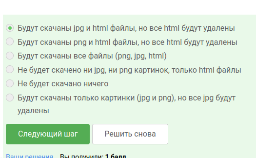

## Задание 19

Архиваторы zip и gzip отличаются тем, что gzip удаляет архив после его распаковки.

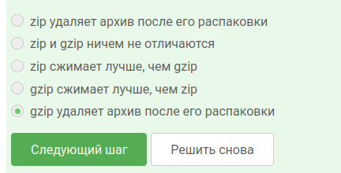

## Задание 20 

Zip и tar могут создать арфих из директории с файлами.

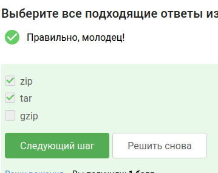

## Задание 21

Чтобы запаковать файлы в my_archive.tar.bz2 через программу tar, нужно использовать опцию -cjf

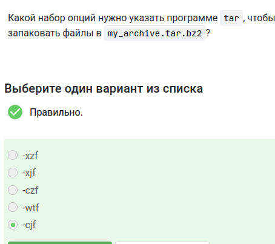

## Задание 22

Маска alexey.*, *.jpg,*.? не найдет файл Alexey.jpeg

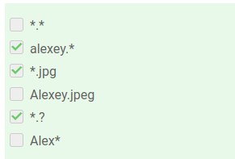

## Задание 23

Команда grep "world" text .txt выведет: The "world" is not enough, The world is not enough, The beautiful-world is not enough, world, The beautifulworld is not enough.

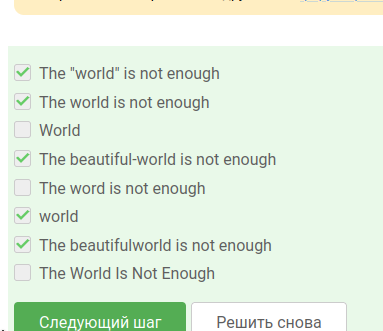

## Задание 24

Скачаем архив и сгенерируем файл, в котором будут все строчки из произведений Шекспира, содержащие "love".

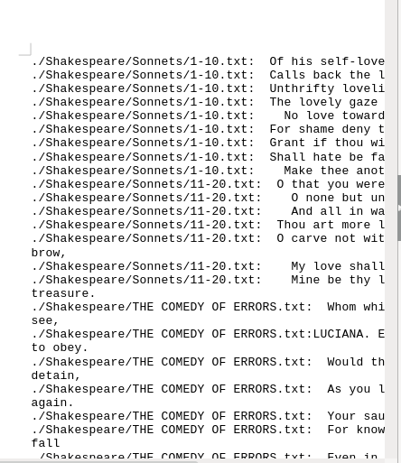

