---
## Front matter
title: "Прохождение 1-ого раздела курса stepik"
subtitle: "Отчет"
author: "Славинский Владислав Вадимович"

## Generic otions
lang: ru-RU
toc-title: "Содержание"

## Bibliography
bibliography: bib/cite.bib
csl: pandoc/csl/gost-r-7-0-5-2008-numeric.csl

## Pdf output format
toc: true # Table of contents
toc-depth: 2
lof: true # List of figures
lot: true # List of tables
fontsize: 12pt
linestretch: 1.5
papersize: a4
documentclass: scrreprt
## I18n polyglossia
polyglossia-lang:
  name: russian
  options:
	- spelling=modern
	- babelshorthands=true
polyglossia-otherlangs:
  name: english
## I18n babel
babel-lang: russian
babel-otherlangs: english
## Fonts
mainfont: IBM Plex Serif
romanfont: IBM Plex Serif
sansfont: IBM Plex Sans
monofont: IBM Plex Mono
mathfont: STIX Two Math
mainfontoptions: Ligatures=Common,Ligatures=TeX,Scale=0.94
romanfontoptions: Ligatures=Common,Ligatures=TeX,Scale=0.94
sansfontoptions: Ligatures=Common,Ligatures=TeX,Scale=MatchLowercase,Scale=0.94
monofontoptions: Scale=MatchLowercase,Scale=0.94,FakeStretch=0.9
mathfontoptions:
## Biblatex
biblatex: true
biblio-style: "gost-numeric"
biblatexoptions:
  - parentracker=true
  - backend=biber
  - hyperref=auto
  - language=auto
  - autolang=other*
  - citestyle=gost-numeric
## Pandoc-crossref LaTeX customization
figureTitle: "Рис."
tableTitle: "Таблица"
listingTitle: "Листинг"
lofTitle: "Список иллюстраций"
lotTitle: "Список таблиц"
lolTitle: "Листинги"
## Misc options
indent: true
header-includes:
  - \usepackage{indentfirst}
  - \usepackage{float} # keep figures where there are in the text
  - \floatplacement{figure}{H} # keep figures where there are in the text
---

# Цель работы

Целью данной работы является освоить Linux.

# Задание

Основы
Запуск исполняемых файлов
Ввод/вывод
Скачивание файлов
Работа с архивами
Поиск файлов и слов

# Выполнение отчета

В первом задании нас просят создать документ и написать в нем шрифтом FreeMono,после этого переформатировать его в FODT файл и загрузить на сайт (рис. [-@fig:001])

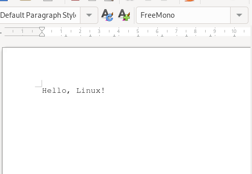{#fig:001 width=70%}

Какое расширение имеют установочные пакеты в Linux (Ubuntu)? Ответ: deb (рис. [-@fig:002])

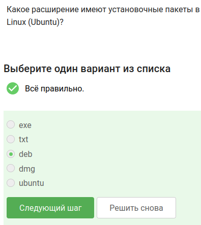{#fig:002 width=70%}

Нужно поставить в систему VLC и посмотреть первую фамилию из вкладки Авторов. (рис. [-@fig:003])

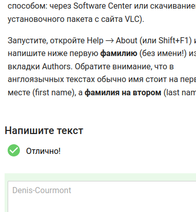{#fig:003 width=70%}

Для чего можно использовать приложение Update Manager? Для обновления ссылок в Software Center,Для обновления всей системы до новой версии,Для обновления установленных программ.  (рис. [-@fig:004])

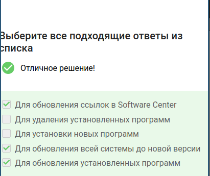{#fig:004 width=70%}

Все синонимы для командной строки: терминал и консоль (рис. [-@fig:005])

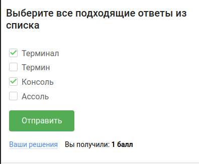{#fig:005 width=70%}

Команда, которая покажет, в какой директории мы находимся-только pwd(рис. [-@fig:006])

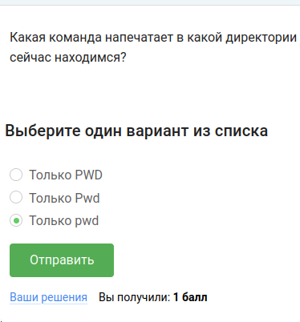{#fig:006 width=70%}

Нужно указать, какие из следующих команд полностью эквивалентны команде ls -A --human-readable -l /some/directory. Подходят все варианты ответов. -A (--almost-all)-показывает все файлы, кроме . и .. , --human-readable(-h) - выводит размеры в удобочитаемом формате, -l - длинный формат вывода или же вывод подробной информации. У нас в вариантах ответов просто разные способы одной записи  и той же команды.  (рис. [-@fig:007])

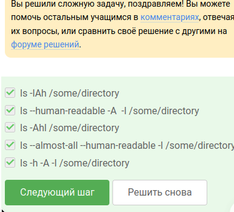{#fig:007 width=70%}

Команды, которые выведят содержимое /home/bi/Downloads, при этом не показывая содержимое других директорий (рис. [-@fig:008])

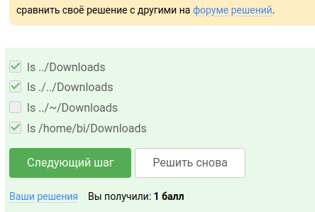{#fig:008 width=70%}

Команда для удаления директорий rm -r (рис. [-@fig:009])

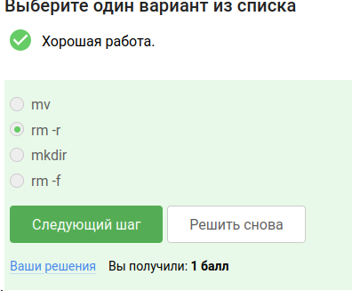{#fig:009 width=70%}
 
Если ввести в терминал команду firefox (для запуска одноименного браузера), а затем ввести туда же команду exit, то никчего не закроется (рис. [-@fig:010])

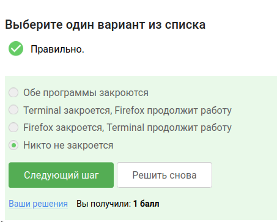{#fig:010 width=70%}

Запуск, Ctrl+Z, bg эквивалентен запуск программы с &.Ctrl+Z-останавливает, bg - переводит в фоновый режим.  (рис. [-@fig:011])

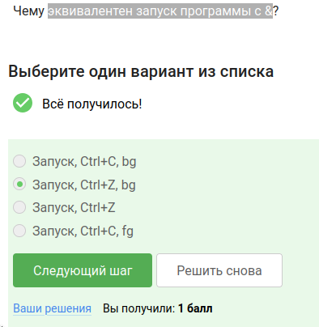{#fig:011 width=70%}

Нужно скачать файл с программой, сделать его исполняемым, запустить его и скопировать то, что выведется на экран (рис. [-@fig:012])

{#fig:012 width=70%}

Куда по умолчанию выводится поток ошибок из программы, запущенной в терминале? Ответ: на экран (рис. [-@fig:013])

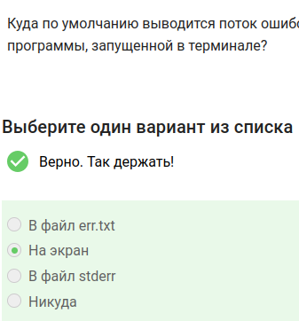{#fig:013 width=70%}

Какие (какая) из команд создадут файл file.txt и запишут в него поток ошибок программы program? Считайте, что в момент запуска программы файл file.txt не существует.(рис. [-@fig:014])

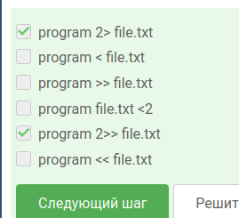{#fig:014 width=70%}

Куда деваются сообщения об ошибках (т.е. вывод в stderr) от тех программ, которые объединены в конвейер (pipe)?(рис. [-@fig:015])

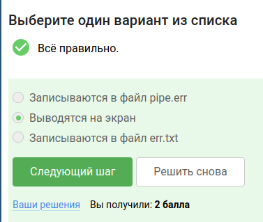{#fig:015 width=70%}

В каком файле на диске окажется картинка, если для её скачивания были выполнены следующие команды? cd /home/alex/
wget -P /home/alex/Pictures -O 1.jpg http://example.com example.jpg
(рис. [-@fig:016])

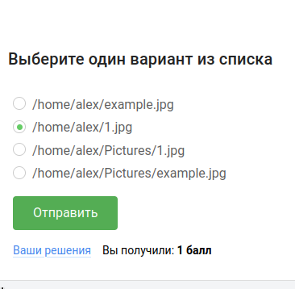{#fig:016 width=70%}

Какую опцию нужно указать команде wget, чтобы она не выводила никаких сообщений на экран (Resolving.., Connecting to.. и т.д.)?
(рис. [-@fig:017])

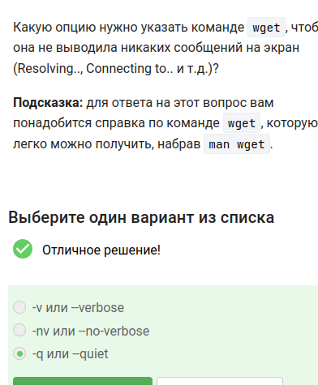{#fig:017 width=70%}

Пусть на некоторой web-странице есть ссылки на картинки в форматах png и jpg, а также ссылки на другие страницы сайта (обычные html файлы). Какие файлы будут скачаны на компьютер, если запустить wget -r -l 1 -A jpg и передать в качестве аргумента ссылку на эту web-страницу?  (рис. [-@fig:018])

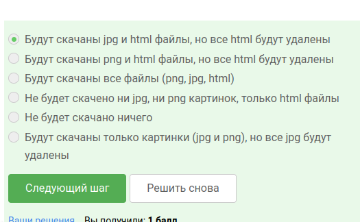{#fig:018 width=70%}

Чем отличаются архиваторы gzip и zip? (рис. [-@fig:019])

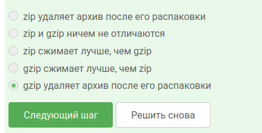{#fig:019 width=70%}

Какие из перечисленных программ-архиваторов могут создать архив из директории с файлами? (рис. [-@fig:020])

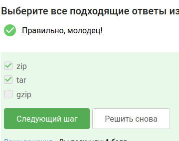{#fig:020 width=70%}

Какой набор опций нужно указать программе tar, чтобы запаковать файлы в my_archive.tar.bz2? (рис. [-@fig:021])

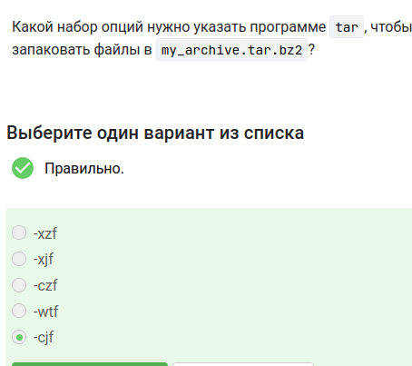{#fig:021 width=70%}

Какая маска команды find НЕ найдет файл Alexey.jpeg (рис. [-@fig:022])
 
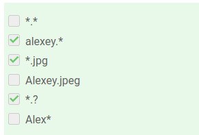{#fig:022 width=70%}

Предположим, что в файле  text.txt записаны строки, показанные среди вариантов ответа. Отметьте только те из них, которые выведет на экран команда  grep "world" text.txt. (рис. [-@fig:023])

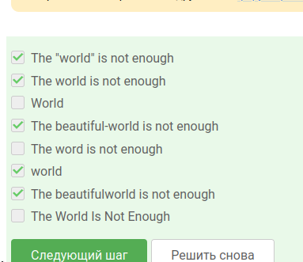{#fig:023 width=70%}

Нужно было скачать архив с произведениями Шекспира. Потом я сгенерировал файл, в котором будут все строчки из эхтих произведений, которые содержат love (рис. [-@fig:024])

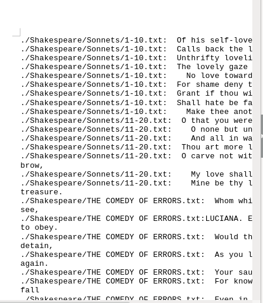{#fig:024 width=70%} 

# Выводы

В ходе выполнения первой части курса stepik я освоил базовые функции Linux.

