---
## Front matter
lang: ru-RU
title: Работа на сервере
subtitle: Часть 2
author:
  - Славинский В.В.
institute:
  - Российский университет дружбы народов, Москва, Россия Россия
date: 17 мая 2025

## i18n babel
babel-lang: russian
babel-otherlangs: english

## Formatting pdf
toc: false
toc-title: Содержание
slide_level: 2
aspectratio: 169
section-titles: true
theme: metropolis
header-includes:
 - \metroset{progressbar=frametitle,sectionpage=progressbar,numbering=fraction}
---

# Информация

## Докладчик

:::::::::::::: {.columns align=center}
::: {.column width="70%"}

  * Славинский Владислав Вадимович
  * Студент
  * Российский университет дружбы народов
  * [1132246169@pfur.ru]

:::
::: {.column width="30%"}

# Вводная часть

## Задание 1

Удаленный сервер можно использовать для: хыполнения сложных (затратных по памяти и времени) вычислений,
хранения общедоступных данных (например, доступных для всех пользователей интернета),
хранения конфиденциальных данных (т.е. доступ к ним должны иметь только ограниченный круг лиц),
хранения больших объемов данных 

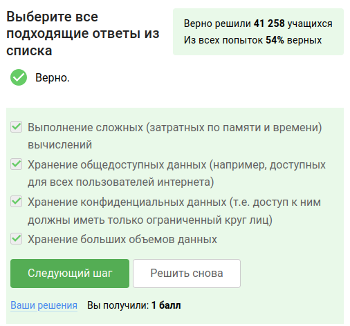

## Задание 2

Ключ id_rsa.pub можно без опаски пересылать по интернету.

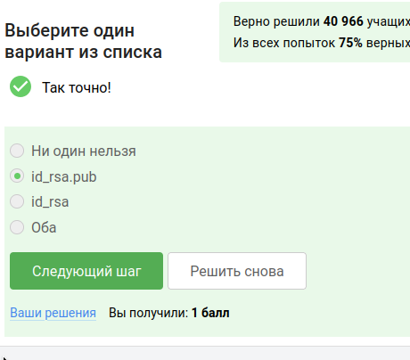

## Задание 3

Команда  scp -r stepic username@server:~/ скопирует на сервер (в домашнюю директорию) папку stepic вместе с содержимым ее самой и всех ее подпапок.

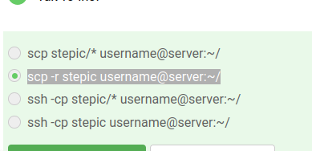

## Задание 4

Если терминал сообщает нам, что он не может найти и скачать установочный пакет, то мы выполняем  sudo apt-get update, проверку интернет соединения и его установка, если соединения нет.

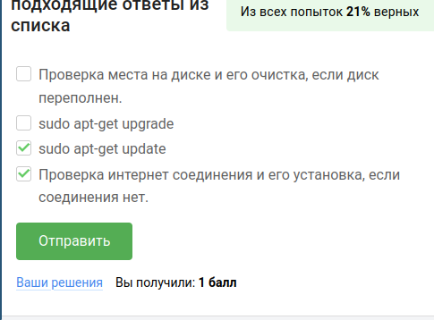

## Задание 5

Программу Filezilla можно использовать: для просмотра содержимого директорий на сервере, для копирования файлов со своего компьютера на сервер,
для просмотра содержимого директорий на своем компьютере, для копирования файлов с сервера на свой компьютер.

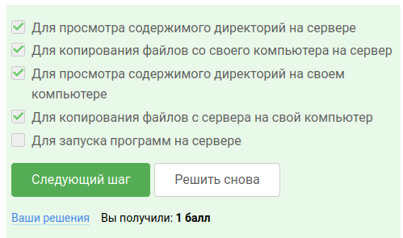

## Задание 6

Если требуется запустить на сервере программу, для работы которой нужен не терминал, а экран, то мы настраиваем сервер, чтобы он поддерживал вывод информации на экран компьютера и проверяем, есть ли другая версия этой программы (специально для терминала).

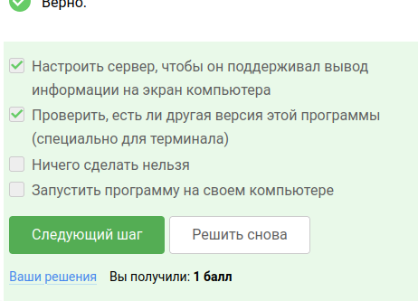

## Задание 7

С помощью  man program, help program, program --help обычно можно вызвать справочную информацию о программе program.

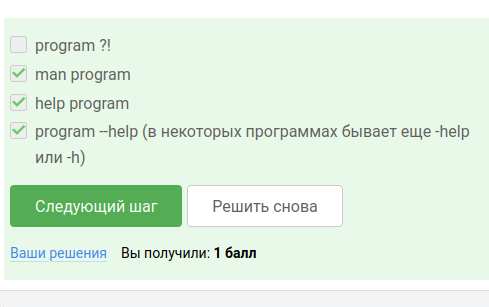

## Задание 8

FastQC может принимать bam, sam и fastq.

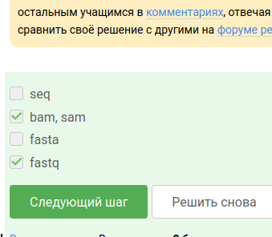

## Задание 9

Команда clustalw test.fasta -align запускает в терминале Clustal на файле test.fasta и выполняет множественное выравнивание.

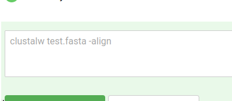

## Задание 10

Допустим мы запустили программы program1, program2 и program3 в фоновом режиме. После чего выполнилиfg %1, Ctrl+С, fg %2, Ctrl+Z, jobs. То информация будет показана при выполнении команды jobs только о program2 и program3.

## Задание 11

jobs, top и ps позволяют отслеживать работу запущенных в терминале программ.В каждой из этих трех утилит для каждой запущенной программы указывается число-идентификатор. Но одинаковые идентификаторы только у ps и top.

## Задание 12

С помощью команды  kill -9 можно мгновенно завершить остановленный процесс.

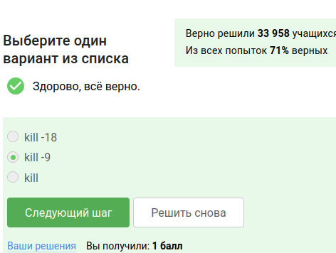

## Задание 13

Если использовать kill (без опций) по отношению к процессу, который был приостановлен при помощи Ctrl+Z, то процесс приступит к завершению, как только будет продолжен.

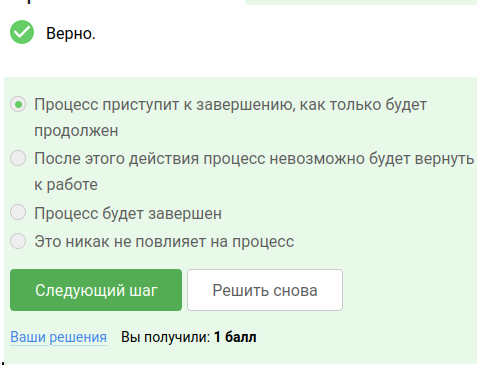

## Задание 14

0% вычислительных ресурсов центрального процессора (% CPU) использует остановленное (по Ctrl+Z) многопоточное приложение. 

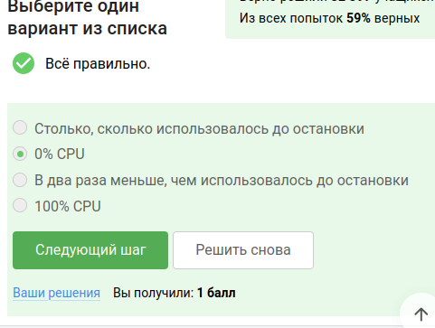

## Задание 15

Остановленное многопоточное приложение занимает столько, сколько оно потребляло в момент остановки.

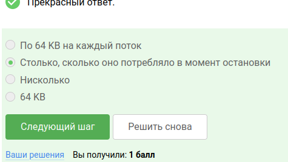

## Задание 16 

Принудительно завершить один из потоков запущенного многопоточного приложения НЕЛЬЗЯ

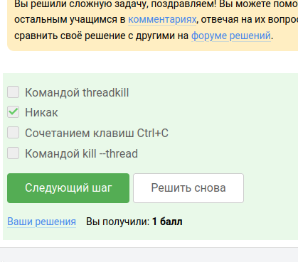

## Задание 17

bowtie2 или bowtie2-build можно выполнить в несколько потоков? ТОЛЬКО bowtie2.

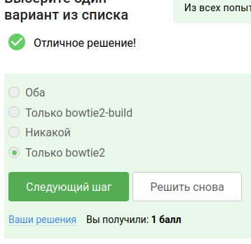

## Задание 18

Вывод stderr второго этапа (т.е. запуск подпрограммы bowtie2): .

## Задание 19

Если мы откроем две вкладки в терминале. В одной из них мы запустили процесс и приостановили его, и Переключившись во вторую вкладку и набрав fg, то терминал сообщит, что нет процесса для запуска в fg

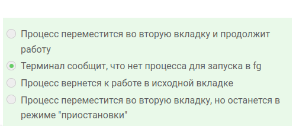

## Задание 20 

Если в tmux осталась последняя открытая вкладка, и мы введем в этой вкладке в командную строку команду exit, то  tmux завершит работу.

## Задание 21

Предположим, что мы открыли терминал, зашли в нем на сервер, запустили на этом сервере tmux и начали работу в нем. Но когда мы закроем терминал, то соединение с сервером прервется, но работа tmux продолжится.

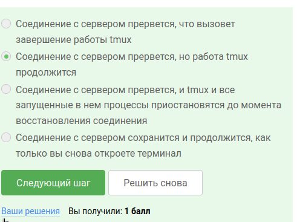

## Задание 22

Если запустить процесс в фоновом режиме в одной из вкладок tmux, а затем принудительно закрыть эту вкладку (Ctrl+B, X), то вкладка закроется, а вместе с ней пропадет и запущенный в ней процесс.

## Задание 23

Ctrl+B и , (запятая) отвечает за переименование текущей вкладки.

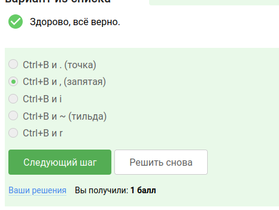

## Задание 24

Что можно еще в tmux? Если разделенную горизонтально вкладку разделить еще и вертикально (т.е. нажать один раз Ctrl+B и %), то получится 3 "части" -- две маленькие и одна большая.  Команды-"разделения" действуют только в текущей вкладке tmux, а не во всех вкладках одновременно.  По половинкам "разделенной" вкладки можно перемещаться при помощи (Ctrl+B и стрелочек).

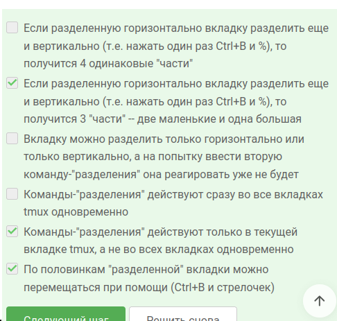

