---
## Front matter
title: "Прохождение 2-ого раздела курса stepik"
subtitle: "Отчет"
author: "Славинский Владислав Вадимович"

## Generic otions
lang: ru-RU
toc-title: "Содержание"

## Bibliography
bibliography: bib/cite.bib
csl: pandoc/csl/gost-r-7-0-5-2008-numeric.csl

## Pdf output format
toc: true # Table of contents
toc-depth: 2
lof: true # List of figures
lot: true # List of tables
fontsize: 12pt
linestretch: 1.5
papersize: a4
documentclass: scrreprt
## I18n polyglossia
polyglossia-lang:
  name: russian
  options:
	- spelling=modern
	- babelshorthands=true
polyglossia-otherlangs:
  name: english
## I18n babel
babel-lang: russian
babel-otherlangs: english
## Fonts
mainfont: IBM Plex Serif
romanfont: IBM Plex Serif
sansfont: IBM Plex Sans
monofont: IBM Plex Mono
mathfont: STIX Two Math
mainfontoptions: Ligatures=Common,Ligatures=TeX,Scale=0.94
romanfontoptions: Ligatures=Common,Ligatures=TeX,Scale=0.94
sansfontoptions: Ligatures=Common,Ligatures=TeX,Scale=MatchLowercase,Scale=0.94
monofontoptions: Scale=MatchLowercase,Scale=0.94,FakeStretch=0.9
mathfontoptions:
## Biblatex
biblatex: true
biblio-style: "gost-numeric"
biblatexoptions:
  - parentracker=true
  - backend=biber
  - hyperref=auto
  - language=auto
  - autolang=other*
  - citestyle=gost-numeric
## Pandoc-crossref LaTeX customization
figureTitle: "Рис."
tableTitle: "Таблица"
listingTitle: "Листинг"
lofTitle: "Список иллюстраций"
lotTitle: "Список таблиц"
lolTitle: "Листинги"
## Misc options
indent: true
header-includes:
  - \usepackage{indentfirst}
  - \usepackage{float} # keep figures where there are in the text
  - \floatplacement{figure}{H} # keep figures where there are in the text
---

# Цель работы

Целью данной работы является освоить Linux.

# Выполнение отчета

Для каких задач можно использовать удаленный сервер?(рис. [-@fig:001])

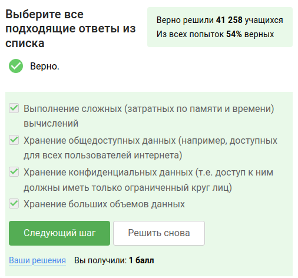{#fig:001 width=70%}

Предположим программа ssh-keygen создала вам два ключа: id_rsa и id_rsa.pub. Какой из этих ключей можно без опаски пересылать по интернету? Ответ: id_rsa.pub  (рис. [-@fig:002])

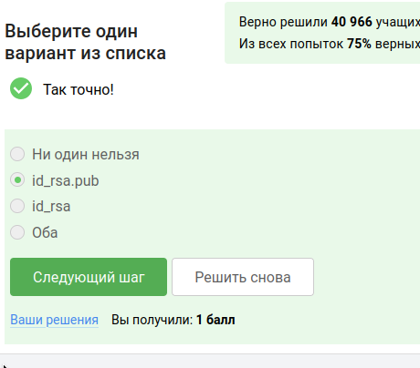{#fig:002 width=70%}

Какая команда скопирует на сервер (в домашнюю директорию) папку stepic вместе с содержимым ее самой и всех ее подпапок? Команда: scp -r stepic username@server:~/ (рис. [-@fig:003])

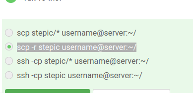{#fig:003 width=70%}

Предположим, что вы устанавливаете программу program на свой компьютер при помощи команды sudo apt-get install program. Терминал сообщает вам, что он не может найти и скачать установочный пакет. Какие действия могут устранить проблему? (рис. [-@fig:004])

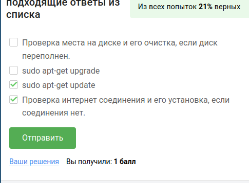{#fig:004 width=70%}

Программу Filezilla можно использовать для: (рис. [-@fig:005])

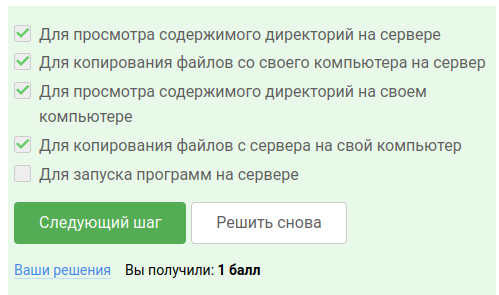{#fig:005 width=70%}

Если требуется запустить на сервере программу, для работы которой нужен экран, то можно:(рис. [-@fig:006])

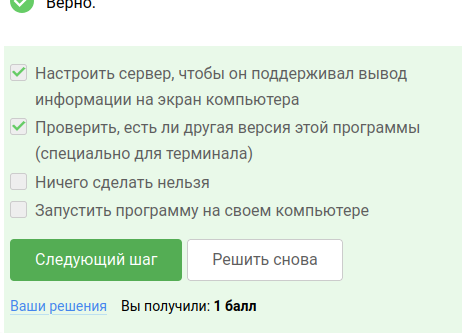{#fig:006 width=70%}

Справочную информацию о программе program можно вызвать через   (рис. [-@fig:007])

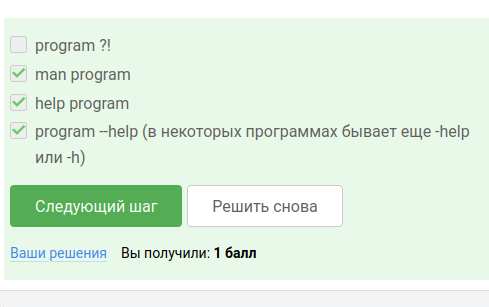{#fig:007 width=70%}

Какие форматы данных может принимать на вход FastQC: (рис. [-@fig:008])

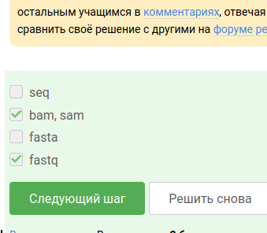{#fig:008 width=70%}

Команда, которая запускает в терминале Clustal на файле test.fasta и выполняет множественное выравнивание:  (рис. [-@fig:009])

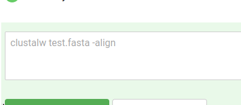{#fig:009 width=70%}
 

Предположим мы запустили программы program1, program2 и program3 в фоновом режиме. После этого мы выполнили следующие действия:fg %1 Ctrl+С fg %2 Ctrl+Z jobs

То,информация о каких программах будет показана при выполнении команды jobs будет только о program2 и program3 (рис. [-@fig:010])

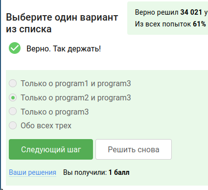{#fig:010 width=70%}

jobs, top и ps позволяют отслеживать работу запущенных в терминале программ. В каждой из этих трех утилит для каждой запущенной программы указывается число-идентификатор.Но одинаковые только у ps и top (рис. [-@fig:011])

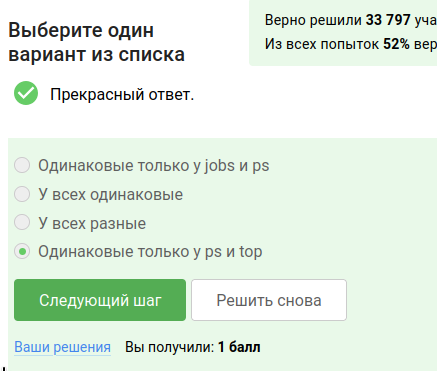{#fig:011 width=70%}

С помощью какой команды kill -9 можно мгновенно завершить остановленный процесс? (рис. [-@fig:012])

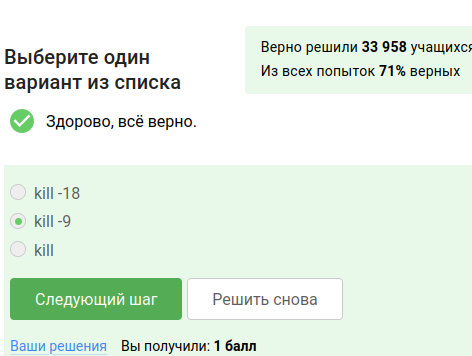{#fig:012 width=70%}

Если использовать kill (без опций) по отношению к процессу, который был приостановлен при помощи Ctrl+Z, то процесс приступит к завершению, как только будет продолжен. (рис. [-@fig:013])

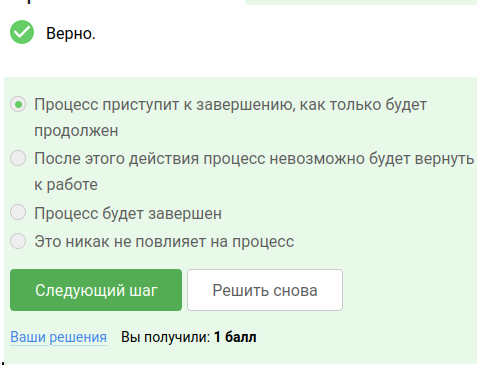{#fig:013 width=70%}

Остановленное многопоточное приложение использует 0 % CPU (вычислительных ресурсов центрального процессора).(рис. [-@fig:014])

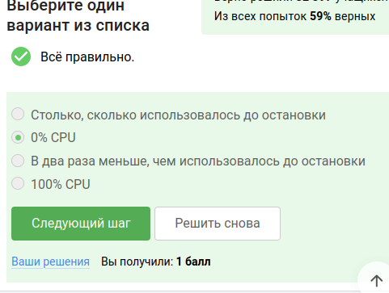{#fig:014 width=70%}

Сколько памяти занимает остановленное (по Ctrl+Z) многопоточное приложение? (рис. [-@fig:015])

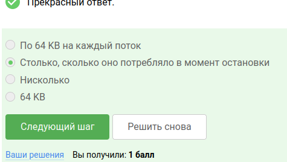{#fig:015 width=70%}

Как принудительно завершить один из потоков запущенного многопоточного приложения? Ответ: никак (рис. [-@fig:016])

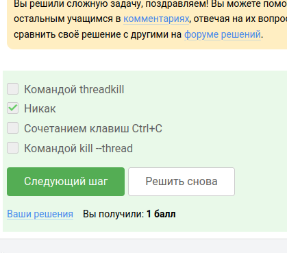{#fig:016 width=70%}

Только bowtie2 можно выполнить в несколько потоков. (рис. [-@fig:017])

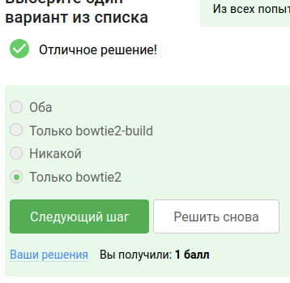{#fig:017 width=70%}

Вывод stderr второго этапа (рис. [-@fig:018])

{#fig:018 width=70%}

Вы открыли две вкладки в терминале. В одной из них вы запустили процесс и приостановили его. Переключившись во вторую вкладку и набрав fg, вы добьетесь следующего: (рис. [-@fig:019])

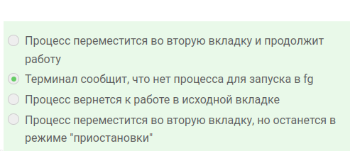{#fig:019 width=70%}

Предположим, что в tmux осталась последняя открытая вкладка. Что произойдет, если вы введете в этой вкладке в командную строку команду exit, то tmux завершит работу (рис. [-@fig:020])

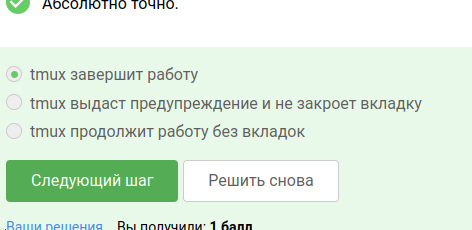{#fig:020 width=70%}

Предположим, что вы открыли терминал, зашли в нем на сервер, запустили на этом сервере tmux и начали работу в нем. Что произойдет, если вы теперь закроете терминал?(рис. [-@fig:021])

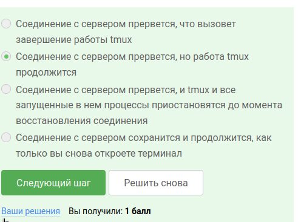{#fig:021 width=70%}

Что произойдет, если запустить процесс в фоновом режиме в одной из вкладок tmux, а затем принудительно закрыть эту вкладку (Ctrl+B, X)?(рис. [-@fig:022])
 
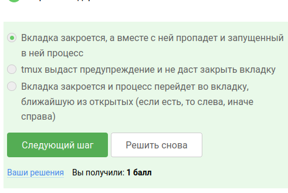{#fig:022 width=70%}

 Ctrl+B и , (запятая) отвечает за переименование текущей вкладки. (рис. [-@fig:023])

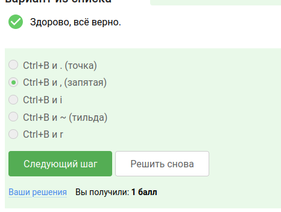{#fig:023 width=70%}

Дополнительные функции tmux:(рис. [-@fig:024])

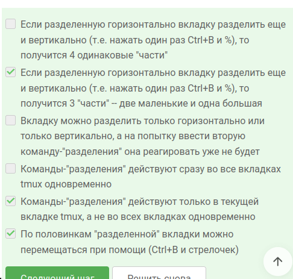{#fig:024 width=70%} 

